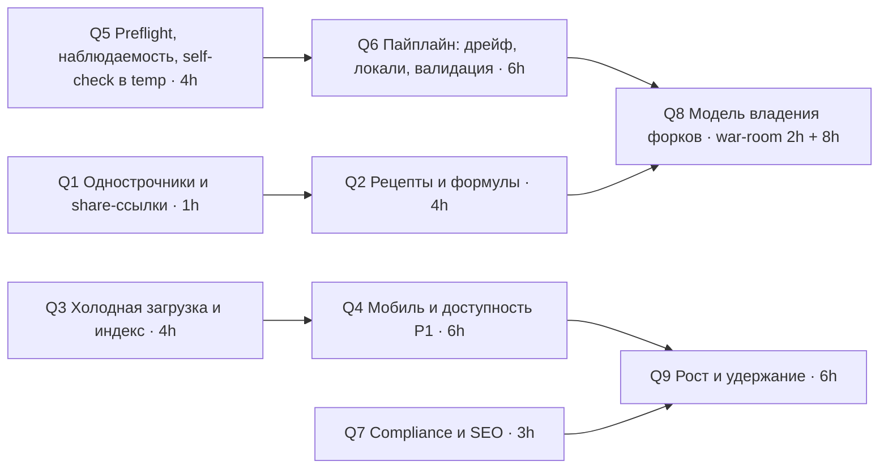

# ПОЛНЫЙ АУДИТ SS14 Chemistry Database (NanoTrasen ChemDB) — ФИНАЛЬНЫЙ ОТЧЁТ

**Дата**: 2026-09-11 (HEAD `e777079`, prod == HEAD)
**Режим**: full, `--auto` (по запросу «полный независимый от меня аудит» — без чекпоинтов и вопросов)
**Скоуп**: весь проект — данные-пайплайн, фронтенд, инфраструктура/деплой/PWA/SEO/право, UX всех 9 вкладок и режимов, мобиль
**Методология**: 4 технических агента (T1 адверсариальный DBA/пайплайн · T2 pentester + бизнес-логика · T3 SRE/инфраструктура · T4 кросс-слойный интегратор; двухосевой consensus-фрейминг risk-averse / first-principles / growth / systems) + 4 UX-агента (U1 нетерпеливый новичок · U2 WCAG 2.1 AA · U3 chaos monkey · U4 производительность/мобиль) + раунд R2 перекрёстной проверки UX + self-check оркестратора (29 spot-check'ов, 2 runtime-проверки на проде) + git/CI/prod-анализ
**Модели**: Fable 5.1 (T1, T2, T4, U3, оркестратор), Opus (T3, U1, U2, U4, R2)
**Стек**: статический SPA без сборки (HTML/CSS/JS, Canvas, PWA) · Python 3 пайплайн (pyyaml, pillow) → data.json 3.85 МБ + 114 карт + prices + ordnance JSON · GitHub Pages через Actions · Яндекс.Метрика
**Stack Checklists**: none (единственный доступный — supabase.md — не применим)
**Время выполнения**: 02:55 → 05:20 (агенты и сверка) + 10:00 → 10:40 (R2, сборка) по Москве; пауза 05:20–10:00 — лимит сессии
**Браузерный уровень**: Claude Browser pane (CDP: реальные клики/клавиши/скриншоты/консоль/сеть, эмуляция 360–1366 px) + Chrome DevTools MCP (Lighthouse, performance-трейсы на prod) + curl/api.github.com; локальное превью == prod, выборочно prod
**Companion Skills**: reverse-prompt — доступен, пропущен по `--auto` (допущения в Части VIII) · consensus — применён (framing diversity, стандартный режим) · war-room — доступен, авто-триггеры не сработали (Часть IX) · tasks — деградация: `.tasks/config.json` отсутствует, графом задач служит ROADMAP (Часть X)
**Чекпоинты**: CP-0…CP-4 пройдены автоматически, журнал — Часть VIII
**Consensus Mode**: standard (без R2 для технических агентов)
**Task Feature**: disabled → ROADMAP серия Q
**Приложения**: `docs/audit/2026-09-11/` — T1…T4, U1…U4, UX-R2, SELF-CHECK (полные отчёты агентов, локальные пути вычищены)

**Единая шкала приоритетов** (агенты оценивали по своим линзам; их исходная оценка сохранена в скобках): P0 — прод сломан для всех / порча данных / живая уязвимость; P1 — этот спринт (заблокирована когорта, неверные числа в «verified»-калькуляторе, compliance-риск, класс тихого отказа, который уже срабатывал); P2 — следующий спринт; P3 — бэклог.

---

# ЧАСТЬ 0: КРИТИЧЕСКИЕ НАХОДКИ (PRODUCTION)

## Состояние продакшена: здоров, P0 нет
**Статус**: FUNCTIONAL
- `https://mikameo.github.io/space-station-recipes/` отдаёт HEAD `e777079`: 85/85 деплоев success (20–27 с), все runtime-ассеты 200, gzip включён (data.json 3.69 МБ → 416 КБ), HSTS, консоль без ошибок на ~80 загрузках, 500+ запросов — 200.
- Данные детерминированы: полный regen в scratch-копии байт-в-байт равен коммиту; ссылочная целостность data.json без нарушений; эталон Ordnance 16/17 + 1 задокументированный дрейф; в 3.85 МБ данных и 243 135 именах предметов карт — ни одного HTML-payload'а; XSS через 9 полей и URL не проходит.
- **Ни одна находка не подпадает под P0.** Ниже — то, что требует внимания в первую очередь.

## 1. Уже случившийся тихий отказ PWA (93 минуты, 7 деплоев, 2026-09-10)
**Статус**: закрыто `6a6cde8`, класс проблемы открыт (B1, B20, C10, D1, D2)
- `316b2d5` добавил `ordnance.js` в index.html и PRECACHE, но не в cp-list деплоя → 404 → `caches.addAll` отверг установку SW у всех новых посетителей; ошибка проглочена `app.js:126`; все 7 билдов зелёные; ни одного сигнала.
- **Корневая причина**: четыре ручных инварианта (whitelist, `?v=`↔PRECACHE↔CACHE, track()↔реестр, meta↔данные) без автоматики; guard читает только `src/href` из index.html; нулевая наблюдаемость ошибок.
- **Рекомендация**: `scripts/preflight.py` в deploy.yml (прототип T3 ловит все 3 исторических инцидента) + `window.onerror`/`sw_install_fail` → Метрика + ежедневный smoke-curl (Sprint 1 п.12–13).

## 2. Плашка форка в Ordnance не скрывается — на проде, у всех
**Статус**: BROKEN P1 (C1; runtime на prod оркестратором; R2 воспроизвёл на локали и оценивает как P2 — оставлено P1 как повтор уже стрелявшего класса `[hidden]`-ловушки)
- `.ord-fork-note{display:flex}` (style.css:3107) побеждает `hidden=true` (ordnance.js:2288): на форке Space Stories пользователь видит «Цифры взяты из форка Space Stories … Переключить приложение на него», уже находясь на нём; та же ловушка — чипы масок (C12). Конвенция №5 задокументирована дважды в том же файле.
- **Рекомендация**: одна строка CSS `.ord-fork-note[hidden], .ord-mask-modes[hidden]{display:none!important}` + проверка `hidden`-тогглов в preflight.

## 3. Калькулятор считает по чужому форку в режиме «All» и с двумя разными рецептами на экране
**Статус**: BROKEN P1 (C2; исполнено в node на реальных данных)
- `getFilteredReactions` в «All» возвращает реакции по алфавиту id: Siderlac 10u = **62 шага / 600u Mercury** вместо 1 шага; Tricordrazine 20 шагов; 21 vanilla-реагент. Панель показывает `r.recipe`, дерево под ней — рецепт другого форка. Смежно: single-owner merge скрывает 55 реагентов/26 реакций от форков, которые их поставляют (C4), и молча подменяет рецепт Funky рецептом Goob — открытый issue #2 с 2026-05-08 (C5).
- **Рекомендация**: ранжирование по родословной в «All» (Sprint 1 п.2); модель владения — отдельное дизайн-решение (Часть IX).

## 4. Ordnance: JS-копия формулы расходится с игрой на округлении
**Статус**: BROKEN P1 (C3; 2 577 кейсов свипа)
- `Math.round` vs банковское округление .NET/Python: 85 кейсов, все — длина огненного луча 5 вместо 4 клеток на 80-мм миномётах; каталог и галерея наследуют; `--verify` проверяет только Python.
- **Рекомендация**: банковское округление в `ordnance.js:232` + JS-реплей эталона в CI.

## 5. Мобильные пользователи (29%) — холодная загрузка 24 с и обрезанная шапка
**Статус**: PARTIAL/BROKEN P1 (B31, B32, B38; трейс prod Slow 3G + 4× CPU)
- Трейс prod (Slow 3G, 4× CPU; абсолютные цифры частично завышены локальным HTTPS-прокси антивируса — порядок величины «десятки секунд» подтверждён кодом): LCP ≈11 с; `data.json` стартует на 14-й секунде (после DOMContentLoaded, который ждёт `ordnance.js`) и заканчивается на 24-й; шрифты `@import` — цепочка глубины 3 (−4.3 с по RenderBlocking); сортировка «Fewest Steps» блокирует поток на 12.2 с, смена форка — 0.9 с. Шапка 505 px без переноса + `overflow:hidden`: «?», Share, PiP недостижимы на всех телефонах, RU/EN обрезан при 375/360.
- **Рекомендация**: preload data.json + ленивые maps/ordnance + self-host шрифтов (−10 с), индекс продуктов реакций, `flex-wrap` шапки (Sprint 1 п.6–8).

## 6. Калькулятор и деревья недоступны с клавиатуры; контраст ниже AA из-за двух токенов
**Статус**: BROKEN/DEFECT P1 (B37, B40)
- Автодополнение — только `click`: Enter/стрелки/точное имя не принимаются, все действия гейтятся на click-выставленный id (WCAG 2.1.1 A). ~20 пар текста < 4.5:1 из `--text-ghost`/`--phosphor-dim`; дисклеймер безопасности 3.39:1, счётчик в antag-режиме 1.82:1.
- **Рекомендация**: клавиатурный combobox (Sprint 1 п.9) и два значения токенов (п.10).

## 7. Данные под «бессмертным» кэшем уже разошлись с апстримом
**Статус**: BROKEN P1 латентно (C6, B3, B14)
- vanilla `Hydroponics/seeds.yml` → HTTP 404 (семена стали entity в `plants.yml`); 23 манифестных пути отсутствуют, 413 изменились с 2026-07-11; regen с чистого клона молча даст 0 vanilla-растений и перекроит `forkStatus`. Слой эффектов уже дрейфнул (`ModifyBleed`, `effectProto` → 487 generic-фолбэков, 0 vanilla с тегом `bleed`). `meta.generated=2026-09-10` при снимке от 2026-07-11.
- **Рекомендация**: парсер растений на entity-схему, `audit_fork_manifests.py` перед каждым regen с abort при MISSING, различать 404 и сбой fetch, `meta.pipeline` с SHA снимков (Sprint 1 п.14).

## 8. Compliance: session-replay без согласия; NOTICES покрывает 8 форков из 21
**Статус**: BROKEN P1 (C9, B5) — решение владельца
- `webvisor:true, clickmap:true` включаются до взаимодействия, ~15% аудитории в ЕС, уведомление только в README на GitHub. 13 форков (включая misfits — №2 по вкладу — и Stories, чьи спрайты ксеносов шипятся) без атрибуции; спрайты объявлены MIT при типичном CC-BY-SA-3.0.
- **Рекомендация**: `webvisor:false` + строка Privacy в панели дисклеймера; NOTICES генерировать из `FORK_REGISTRY`.

## 9. Инцидент в ходе аудита: «read-only» self-check перезаписал отслеживаемые карты
**Статус**: BROKEN P1 (C7) — восстановлено оркестратором
- `python ss14_map_extractor.py --selfcheck` перепёк `maps/vanilla/Bagel.{json,png}` (−10 прототипов, PNG 11 849 → 12 367 Б); `git checkout --` вернул HEAD. Коммитнутая ванильная Bagel (2026-07-13) невоспроизводима из кэша 2026-07-23. `--verify` тоже пишет `ordnance/stories_cm.json` и `sprites/xenos/`.
- **Рекомендация**: self-check в temp-каталог с сравнением против коммита; `--verify` без записи (Sprint 1 п.11).

---

# ЧАСТЬ I: КЛАССИФИКАЦИЯ ФУНКЦИОНАЛА

Нумерация сквозная (A1–A51 без A49, B1–B79, C1–C21, D1–D18) и используется во всех остальных частях. «Консенсус» — какие агенты независимо пришли к выводу; `[DISPUTED → RESOLVED]` — расхождение снято в Phase 4; в скобках после приоритета — исходная оценка агента, если она отличалась от единой шкалы.

## A. ПОЛНОСТЬЮ ФУНКЦИОНАЛЬНЫЙ (50 пунктов — подтверждено code + runtime)

### A-Т. Данные, пайплайн, фронтенд-логика, инфраструктура — ПОЛНОСТЬЮ ФУНКЦИОНАЛЬНО
| # | Функционал | Уверенность | Консенсус | Runtime-подтверждение |
|---|------------|-------------|-----------|---------------------|
| A1 | Ссылочная целостность data.json: реактанты/катализаторы 1104 реакций, 47/47 мутаций растений, 21/21 стратегия, 86/86 ссылок на `sources`, `reagentCount` 21/21 форков | HIGH | T1 [скрипт] + T4 (13 вложенных ключей) | runtime (integrity.py) |
| A2 | Детерминизм regen: полный прогон в scratch-копии = коммит байт-в-байт (без `meta.generated`); ordnance JSON идентичен | HIGH | T1 | runtime (3 мин прогон) |
| A3 | Ordnance: эталон 16/17 + 1 задокументированный дрейф, 8/8 целей по урону; ядро формулы идентично в Python/JS/design-doc (12 констант) | HIGH | T1 + T2 (2 577 кейсов) + T4 [3/3] | runtime (--verify, node-харнесс) |
| A4 | Phase 4e (total-conversion): 20 переименований → 273–297 blocked на RMC-семействе, порог безопасен, misfits не тронут | HIGH | T1 | runtime |
| A5 | Наследование прототипов: защита от циклов, `abstract` не наследуется, 16 абстрактных баз исключены | HIGH | T1 | code + regen |
| A6 | Цены карт = зеркало `PricingSystem` (Crowbar 37, IngotGold1 75, IngotGold 2250); prices.json v3 читается maps.js корректно; индекс карт 114/114 без сирот | HIGH | T1 + T4 [2/2] | runtime |
| A7 | 60+ innerHTML-синков экранированы `esc()`; ordnance.js — свой esc с `'`; i18n.js пишет только nodeValue; в данных 0 живых payload'ов (3.85 МБ + 243 135 имён предметов карт) | HIGH | T2 [скан] + U3 (9 полей + `#q=`, 0 img/svg) [2/2] | runtime |
| A8 | URL-состояние: whitelist табов/сортировок/форков, `CSS.escape`, `r` по `DATA.reagents`; `map=` по индексу; `?lang=` коэрцится; malformed `%` не роняет init; `_blank` с noopener | HIGH | T2 + U3 [2/2] | runtime (garbage deep links) |
| A9 | Аналитический контракт: 50–52 goal-id из кода ⊆ 53 в реестре; единственный лишний — снятый `ordnance_pareto_use` | HIGH | T2 + T3 + T4 [3/3] | code (скрипт-дифф) |
| A10 | Дерево крафта (visited на путь, LOOP-метки, 13 циклов завершаются), `calculateIngredients`/`mergeSteps`, `planBatch`, `recipeSteps` (мемо), 6 сортировок, `healPerUnit` без деления на 0, `levenshtein` | HIGH | T2 [node-харнесс] | runtime (JS исполнен на реальных данных) |
| A11 | Сессия 12 ч: битый JSON/«garbage»/без `at`/истёкшая → чистый старт; `treeTarget` валидируется | HIGH | T2 + U3 [2/2] | runtime |
| A12 | Обработка ошибок загрузки: `loadData` 3 попытки с backoff + экран Retry; каждый runtime-JSON (index/map/prices/ordnance) имеет пользовательский путь отказа | HIGH | T2 + U1 (170/170 → 200) | runtime |
| A13 | Гигиена кода: нет `eval`/`new Function`/`postMessage`/`document.write`; `window.open` с константным URL; GitHub-префилл `encodeURIComponent`; 0 неиспользуемых функций; 1 мёртвый CSS-селектор | HIGH | T2 + T4 [2/2] | code |
| A14 | Деплой: prod == HEAD (cmp), 85/85 success за 20–27 с, `permissions` минимальны, `concurrency` корректна, whitelist покрывает все 8 runtime-путей, 8/8 тегов Actions существуют | HIGH | T3 + T4 [2/2] | http (api.github.com) |
| A15 | Секреты: `.env` игнорируется, 0 токенов в 230 ревизиях полного клона; JS-зависимостей 0 (vis-network удалён) | HIGH | T3 | code (git grep --all) |
| A16 | HSTS 1 год; gzip на data.json уже включён (3.69 МБ → 416 КБ, 8.9×); OG/Twitter/canonical полные; JSON-LD валиден | HIGH | T3 + U4 [2/2] | http (curl) |
| A17 | Service worker: регистрация с верным scope, PRECACHE == `?v=` index.html (6/6), `DATA_CACHE` отделён от shell-кэша (правильно), SWR для data.json; кэш ≈ 7.9 МБ после сессии | HIGH | T3 + T4 + U3 (caches.keys) [3/3] | runtime |
| A18 | Link-rot: таймауты считаются broken (fail-closed); шаблоны issue требуют источник; GPL-3.0 без сетевых обязательств; SPDX в 6/9 файлов | HIGH | T3 | code |
| A19 | Утверждения памяти проекта: `.maps-list-panel[hidden]` (style.css:2864), `if (out !== raw)` (i18n.js:681), `forks_meta` при `parent_fork`, Phase 10 ordnance, guard деплоя — все на месте | HIGH | T4 | code |
| A20 | Регистр форков ↔ экстракторы: 27/27 ключей манифеста потребляются; `SPRITE_MANIFEST` 15/15; `sprites/xenos` 119 = 17×7; `MAP_BLOCKLIST` согласован; `locale_files_ru` ↔ `nameRu` 755/1387 | HIGH | T4 | code (скрипт) |
| A21 | Локальный preview ↔ prod: все fetch относительные; абсолютные URL только для SEO; Python-синтаксис совместим с CI 3.11 | HIGH | T4 | code |
| A22 | Спот-чек эффектов Bicaridine/Epinephrine/Lexorin против vanilla YAML — совпадение по всем значениям | HIGH | T1 | runtime |
| A23 | Проверка чипов/бейджей на контраст: все семейства бейджей и effect-чипов ≥ 5.7:1; текст карточек 15.4:1; фокус-кольца 14.3:1 | HIGH | U2 | runtime |
| A24 | CLS = 0.00 на холодном мобильном трейсе prod; viewport meta разрешает зум; поиск 1.3 мс полезной работы | HIGH | U4 | runtime (DevTools trace) |

### A-U. UX / браузер — ПОЛНОСТЬЮ ФУНКЦИОНАЛЬНО (runtime, локальное превью == prod)
| # | Функционал | Уверенность | Консенсус | Runtime-подтверждение |
|---|------------|-------------|-----------|---------------------|
| A25 | Холодная загрузка (desktop, локально): grid 80 карточек за 353 мс, брендированный оверлей, 170/170 запросов 200, консоль пуста | HIGH | U1 + U3 (≈60 загрузок, 330+ запросов) [2/2] | runtime |
| A26 | Туториал: 7 шагов проходятся кликами и клавиатурой (←/→/Esc), фокус возвращается на «?», флаг seen пишется на Skip/Close, «?» всегда доступен; RU-версия полная | HIGH | U1 + U2 [2/2] | runtime |
| A27 | Поиск: опечатка «bicardine» → «Did you mean» + «Clear search»; whitespace/Unicode/RTL/emoji/SQL/regex/10 000 символов — честные пустые состояния, 0 ошибок; XSS-payload'ы в 9 полях + `#q=` экранируются, img/svg не создаются | HIGH | U1 + U3 [2/2] | runtime |
| A28 | Панель деталей: рецепт/эффекты/OD/источники/«Used In»/дерево, переходы по ссылкам, Back, Esc | HIGH | U1 | runtime |
| A29 | Sidebar-фильтры: форк (с поясняющей плашкой), категории, эффекты, счётчики, сброс; radio/checkbox нативные и клавиатурные | HIGH | U1 + U2 [2/2] | runtime |
| A30 | Калькулятор: одиночный рецепт (Bicaridine 90u → 2 шага), batch + 4 пресета (auto-plan), стакан (Potassium+Water → каскад), «What Can I Make?»; дабл-клик безопасен; 34 цели за 135 мс; 40 реагентов в стакане за 3 мс | HIGH | U1 + U3 [2/2] | runtime |
| A31 | Craft Trees: дерево, чек-лист «Collected N/M», галочки переживают смену количества и перезагрузку (сессия 12 ч); оговорка R2: отметка, поставленная на 10u, остаётся при росте требования до 15u (P3, B78) | HIGH | U1 + U3 (порча сессии ×3 → чистый старт) [2/2] | runtime |
| A32 | What Heals?: 20 типов урона, ранжирование меняется, строка → панель деталей; карточка физиологии Vox | HIGH | U1 | runtime |
| A33 | Botany: легенда, 30 цепочек эволюции с LOOP-метками, чипы, swab-гайд | HIGH | U1 | runtime |
| A34 | Maps: станция, поиск «crowbar» → маркеры + группы по маякам, клик по группе → зум; deep-link `map=../../etc/passwd` отбрасывается | HIGH | U1 + U3 [2/2] | runtime |
| A35 | Sell list: сортировки, фильтры, чипы классов, «Show on map» (49 предметов / 214 маркеров), закрытие проверено скриншотом (`[hidden]`-фикс работает) | HIGH | U1 + T4 (style.css:2864) [2/2] | runtime |
| A36 | Ordnance на ЧУЖОМ форке: таб виден, плашка «переключить» работает (по дизайну; на своём форке плашка не прячется — см. C1, подтверждено R2 в рантайме); сборщик смеси, живые статы, пустое состояние, каталог → загрузка смеси, поиск под задачу с честным «requirements not met»; граничные значения (1e9/−5/abc, смена корпуса, все реагенты исключены, маски 1e9/−1) — без NaN и ошибок | HIGH | U1 + U3 [2/2] | runtime |
| A37 | Fork Diff: Vanilla→Goob: 100/6/85/6/26 с объяснением изменений; From==To → подсказка | HIGH | U1 + U3 [2/2] | runtime |
| A38 | ANTAG-режим: тема, «Syndicate ChemDB», таб с 21 стратегией, фильтры, «Report inaccuracy» с корректным префиллом; выключение с таба антага — чистый фолбэк | HIGH | U1 | runtime |
| A39 | RU/EN: хром переведён (табы, sidebar, калькулятор, карты), `<html lang>`, кнопка с двуязычным aria-label, персистентность после перезагрузки; две вкладки — last-writer-wins по дизайну | HIGH | U1 + U2 + U3 [3/3] | runtime |
| A40 | Companion-режим `?mode=companion`: слим-бар, Filters, Collapse; deep-link на Ordnance внутри companion | HIGH | U1 + U3 [2/2] | runtime |
| A41 | Дисклеймер-бар (aria-expanded/`hidden` честные), логотип → home, ссылка Feedback (noopener), share → тост (при отказе clipboard — честный тост) | HIGH | U1 + U2 [2/2] | runtime |
| A42 | Deep-links — устойчивость к мусорным и враждебным значениям (обработка ЛЕГИТИМНЫХ значений сломана — см. C16/C17/B59): `#tab=stats/graph/zzz` → Reagents; `#r=DoesNotExist` тихо игнорируется; `#src=bogus` → all; хэш 5 016 символов и одиночный `%` не роняют init | HIGH | U3 (+T2 код) | runtime |
| A43 | Гонки: 24 переключения табов за 517 мс — консистентно; повторная навигация во время загрузки — чисто | HIGH | U3 | runtime |
| A44 | Устойчивость к порче хранилища: `ss14_session` garbage/без `at`/истёкшая, `chemdb-ord-masks` «[bad», `tutorial_seen`=«maybe», 12 МиБ мусора в localStorage — приложение стартует | HIGH | U3 + T2 (код) [2/2] | runtime |
| A45 | Пустые состояния: reagents (0 при комбинации фильтров), botany, fork diff, reverse lookup, antag, craft tree (Water/Healium → BASE), ordnance cleared — все с текстом и действием | HIGH | U3 | runtime |
| A46 | Клавиатура: табы — нативные кнопки с `aria-selected`; карточки `role=button`+Enter/Space; нет keyboard-trap; фокус-кольца 14.3:1 (переопределяют базовый `outline:none`) — кроме `.hint-chip` и `.empty-state-chip`, где `outline:none` стоит и на `:focus-visible` (B76) | HIGH | U2 (+R2) | runtime |
| A47 | Screen-reader: все иконочные кнопки шапки именованы; 20/20 полей калькулятора и 62/62 Ordnance с именами; alt на всех img (ксеносы: alt у первого кадра, `alt=""` у дубля); `#resultCount`/`#treeProgress` — live-регионы; таксономии (verified/partial/lore, tiers, форки) — текстом, не цветом | HIGH | U2 | runtime |
| A48 | `prefers-reduced-motion`: продуманный блок (scanlines, vignette, все бесконечные анимации выключены); reflow без потерь при 683×450 (200%) и 768 | HIGH (code) / HIGH | U2 | code + runtime |
| A50 | Core Web Vitals: CLS 0.00 на холодном мобильном трейсе prod; поиск — 1.3 мс полезной работы (150 мс debounce); viewport разрешает зум | HIGH | U4 (DevTools trace) | runtime (prod) |
| A51 | Service worker в бою: controller активен, `chemdb-data` держит data.json, `chemdb-v74` — shell + посещённые карты + спрайты (≈7.9 МБ); офлайн-фолбэк на index.html (код) | HIGH | U3 (+T3 код) | runtime |


---

## B. ЧАСТИЧНО ФУНКЦИОНАЛЬНЫЙ (78 пунктов)

### B-Т. Данные, пайплайн, логика, инфраструктура — ЧАСТИЧНО ФУНКЦИОНАЛЬНО
| # | Функционал | Уверенность | Консенсус | Что работает | Что НЕ работает | P |
|---|------------|-------------|-----------|-------------|-----------------|---|
| B1 | **Service worker при пропаже precache-ассета** | HIGH | T2 vs T3 [DISPUTED → RESOLVED] | Вернувшиеся пользователи держат старый SW | `addAll` атомарен → у новых посетителей SW не устанавливается; ошибка проглочена `app.js:126`; инцидент 7 деплоев/93 мин 2026-09-10 (`316b2d5..6a6cde8`); guard читает только index.html | P1 |
| B2 | **Google Fonts через `@import`** (`style.css:13`) | HIGH | T3 + T4 + U4 [3/3] | Шрифты подгружаются, `display=swap` | Render-blocking цепочка глубины 3 на критическом пути (prod Slow-3G: критический путь 14,2 с, −4,3 с FCP/LCP по RenderBlocking insight); не кэшируется SW → офлайн без шрифтов; IP уходит Google без раскрытия | P1 |
| B3 | **Сбои fetch в экстракторе неотличимы от удаления апстримом** (`ss14_chem_extractor.py:194-238, 178`) | HIGH | T1 | Ретраи, нет частичных записей | 404/403/таймаут/не-UTF-8 → `""` → Phase 4b блокирует все vanilla-реакции файла для форка; кэш бессмертен → потеря видна только на чистом клоне | P1 |
| B4 | **EN-локали**: 583 реагента с machine-split именем, 523 без описания | HIGH | T1 (+ орк. 523 подтверждено) | RU-форки 100% переведены; фолбэк не падает | `config.py:680` goob `locale_files: []` при 21 FTL-файле апстрима; Funky/Trauma/Omu наследуют дыру (98/100 Goob-реагентов без описания) | P1 |
| B5 | **NOTICES** — 8 форков из 21, спрайты объявлены MIT | HIGH | T3 + T4 [2/2] | Структура и 8 записей корректны | 13 форков без атрибуции (misfits — №2 по вкладу; stories_cm — спрайты ксеносов); SS14-текстуры обычно CC-BY-SA-3.0 | P1 |
| B6 | **Link-rot workflow** | HIGH | T3 + T4 [2/2] | Issue-body шаг работает, таймауты fail-closed | auto-commit `cache/link_health.json` — no-op 32 запуска (`cache/` в .gitignore); 4 дубля issue без dedupe; 3 forum-источника указывают на корень форума (`sources.py:261/270/279`) → проверка вакуумна; порог 10% на n=23 не сработает при 1–2 мёртвых ссылках; `contents: write` не нужен | P1 (источники) / P2 (остальное) |
| B7 | **Симулятор стакана** | HIGH | T2 [node + upstream C#] | Приоритеты, температурные гейты, mixer, катализаторы не расходуются, fixed-point с `truncated` | Требует `have ≥ amount` и floor: 1 Wine + 0.5 SulfuricAcid → «Nothing reacts» (в игре 1.5u AcidSpit); катализатор должен быть > 0, а не ≥ coef; нет `quantized` в данных; MAX_STEPS 30 vs 20 | P2 |
| B8 | **Калькулятор — катализаторы** | HIGH | T2 | Не-катализаторная арифметика верна | Список покупок без катализаторов, шаги масштабируют их по `runs` (30u Cryoxadone → нет Plasma в списке, «3.33 Plasma» в шаге) | P2 |
| B9 | **Форк-фильтр в рендер-путях** | HIGH | T2 (node) | Grid, medbay, botany, forkdiff, autocomplete, beaker — фильтруются | «What Can I Make?» без фильтра (5/11 чужих на vanilla); blocked-цели → «базовые покупки» (Med-Chem Starter на RMC14); `reagentInFork` по произвольному первому производителю (22 реагента на форк неверно); «Used In»/«+N alt» без фильтра | P2 |
| B10 | **Round-trip share-ссылки** (`encodeURLState`/`decodeURLState`) | HIGH | T2 + T4 + U3 [3/3] | tab/r/src/bt/taste/antag/cats/fx/af_*/map/item восстанавливаются | `sort=steps-asc` пишется, но не в whitelist; Ordnance/дерево/medbay/стакан не кодируются; `lang` не кодируется; `#tab=antag` без `antag=1` даёт скрытый таб | P2 |
| B11 | **Клиентская схема данных** | HIGH | T1 + T2 + T3 + T4 [4/4] | `init()` проверяет 5 ключей | Нет проверки `schemaVersion` ни в одном JS; SWR отдаст старый data.json новому app.js; схемо-несовместимый JSON → вечный спиннер без Retry (`app.js:131-188`) | P2 |
| B12 | **Мёртвый payload data.json** | HIGH | T1 + T4 [2/2] | Все читаемые ключи эмитятся | 433 КБ (11.3%) не читаются: `edges` 295 КБ (потребитель удалён в A1.1, но `init()` требует), `metabolismPaths`, `boilingPoint`/`meltingPoint`, `plants.growth/rsi`, `loreWarnings`, `authorityWeight`; ~20% удаляемо без потерь | P2 |
| B13 | **Кэширование карт в SW** (`sw.js:66-74`) | HIGH | T3 + U3 [2/2] | Посещённая карта доступна офлайн | В версионируемый кэш без лимита и `.catch` (Wendover.json 5.1 МБ, комментарий «~1MB»); стирается при каждом bump; `QuotaExceededError` необработан (iOS может снести `DATA_CACHE`); каждый уникальный query-string добавляет копию index.html (48 КБ) | P2 |
| B14 | **M1-дрейф слоя эффектов** (`ss14_chem_extractor.py:604-673, 1126-1188`) | HIGH | T1 | Health/thirst/hunger/temperature теги точны | `ModifyBleedAmount→ModifyBleed`, `effectProto` статусов → 0 vanilla-реагентов с тегом `bleed`, 56 статус-эффектов «Status: ModifyStatusEffect», 487 generic-фолбэков; детектируемости нет | P2 |
| B15 | **Форк-агностичные глобальные поля** (`recipe`, `obtainSources`, `accessibility`) | HIGH | T1 | Per-fork tier внутри `antagStrategies.byFork` верен | `recipe` — первая реакция по порядку слияния (41 vanilla-реагент с чужим рецептом; 96 пар (реагент, форк) с невидимым рецептом); `obtainSources` — объединение по всем форкам (Sunrise-вендоры у vanilla Cola); 39% базы «unobtainable/unknown» | P2 |
| B16 | **Удалённые форком vanilla-реагенты остаются видимыми**; **внучатые форки не наследуют диффы**; **теневые близнецы** `isDispenser` | HIGH | T1 | Реакции блокируются (Phase 4b); cmu↔rmc14 дифф верен | 196 пар реагентов без реагентного 4b; rucm не наследует 16 диффов cmu (`3018-3023`); 20 vanilla-двойников на RMC c `isDispenser: true` | P2 |
| B17 | **Единицы фазовых переходов** (`ss14_chem_extractor.py:1042-1044`) | HIGH | T1 | Сырые числа скопированы верно | °C подписаны как «K» в блоке «Verified in SS14 code»; 35 «отрицательных Кельвинов» | P2 |
| B18 | **Карты — свежесть и воспроизводимость** | HIGH | T1 | 15/15 форков, 114/114, prices v3 | Ванильная Bagel (2026-07-13) невоспроизводима из кэша 2026-07-23 (−10 прототипов); все карты ~7 недель; нет каденции и даты снимка в index.json | P2 |
| B19 | **Авторская `difficulty` стратегий** | HIGH | T1 | Computed-модель явная и per-fork | 16/21 расходятся с вычисленной (tear-gas-smoke medium→impossible: TearGas unobtainable — гранаты не в манифесте) | P2 |
| B20 | **Guard деплоя** (`deploy.yml:41-62`) | HIGH | T3 + T4 [2/2] | Ловит script/link-теги из index.html | 0 из 8 runtime-путей (data.json, sw.js, maps/, ordnance/, sprites/, og-image через абсолютный URL) не проверяются; нет `node --check`; `og-image.png` копируется с `|| true` | P2 |
| B21 | **Инварианты процесса без автоматики** (ROADMAP §0.2) | HIGH | T3 + T4 [2/2] | Сейчас всё синхронно | `?v=`↔PRECACHE↔CACHE, whitelist↔runtime fetch, track()↔реестр, meta-числа↔data.json — только прозой; §0.2 не упоминает sw.js; прототип `preflight.py` (~140 строк) собран T3 и ловит все 3 исторических инцидента | P1 |
| B22 | **PWA-манифест** | HIGH | T3 + U4 [2/2] | Иконки 192/512/SVG, standalone | `start_url`/`scope` абсолютные (локальный preview неустановим); нет `id`/`screenshots`/`shortcuts`/maskable; `skipWaiting+claim` без «доступна новая версия» | P2 |
| B23 | **Python-toolchain** | HIGH | T3 + T4 [2/2] | Две зависимости (pyyaml, pillow), синтаксис 3.11-совместим | Не закреплены, нет requirements.txt; CI 3.11 vs локально 3.14.3 — байт-идентичный regen невоспроизводим на другой машине; README `openpyxl` устарел | P2 |
| B24 | **Репо-гигиена** | HIGH | T3 + T4 [2/2] | Дерево чистое, `.env` игнорируется | 3 stale worktrees (1.3 ГБ копия cache_maps), 5 веток `claude/*`, `logo (1).png`, `promo/` untracked, 4 orphan-SVG (404 на prod), `.claude/launch.json` tracked в игнорируемой папке, `git gc` ни разу | P2 |
| B25 | **i18n-контракт** | HIGH | T4 + U2 [2/2 static+runtime] | Видимые подписи всех 9 табов, sidebar, сортировки, туториал — переведены | 21 aria-label Ordnance + 10 chrome-строк + 19 composite без перевода (runtime: 28 английских accessible names в RU); панель дисклеймера на английском; дубли `From`/`To` (Ordnance получает «Из»/«В»); два RU-словаря с 2 расхождениями; 10 мёртвых ключей + 3 RX; share-URL теряет `lang` | P1 (aria) / P3 (остальное) |
| B26 | **Docs ↔ code** (20 расхождений, T4 §5) | HIGH | T4 (+T3) | Таблица форков README, sell-list спека, decision RU — точны | README Architecture без 10 файлов, `openpyxl`, 20 имён из 21; CHANGELOG «~13 KB»/«Pareto»/нет O6–O19, ordnance `schema: 1` при 4 новых ключах; ROADMAP заголовок «3.4.2», A5 дважды, ревизии 1.5/1.7 дважды, E4 `[~]`, §0.2; design-doc п.5 не реализован, 4 комментария про скрытие таба; meta/JSON-LD ×4 устарели; `attribution.yml` → несуществующий `docs/attribution-ladder`; decision RMC «21» vs 20; legend карт 3/4 видов; `loreWarnings` заявлены — не рендерятся | P2 (meta/JSON-LD, CHANGELOG) / P3 |
| B27 | **Формулы за пределами ядра Ordnance** | HIGH | T4 (+T2) | Ядро идентично | `fire.bypass` игнорируется в Python; Kills в каталоге считаны по закрытому окну, показаны по пользовательскому; цвет пламени только в JS (инвариант №7 нетестируем) | P3 |
| B28 | **Робастность экстрактора** | HIGH | T1 | `abstract`/циклы/BOM/UTF-8 stdout | Неизвестный YAML-тег роняет весь файл (нет `IgnoreTagLoader`); 404 не кэшируются (7 повторных fetch каждый regen); warnings/provenance только в stdout (нет `meta.pipeline`, SHA снимка); regex-парсинг YAML в ordnance; `schema` vs `schemaVersion` — три конвенции | P2 |
| B29 | **Метрика — синхронизация целей на счётчике** | LOW (UNCERTAIN) | T4 | Реестр полный (53) | 14 `ordnance_*` целей добавлены 09-10/11 — прогонялся ли `create_metrika_goals.py` (токен владельца)? Прецедент — 16 дней слепоты Maps | P2 |
| B30 | **Metrika tag.js** — 97 КБ gz (19% первого визита), 18 сторонних cookie | HIGH | U4 + T3 [2/2] | Async, не блокирует рендер | Конкурирует с data.json за 3G-канал; webvisor/clickmap не отключаются при `saveData`/2g | P2 |

### B-U. UX / браузер — ЧАСТИЧНО ФУНКЦИОНАЛЬНО
| # | Функционал | Уверенность | Консенсус | Что работает | Что НЕ работает | P |
|---|------------|-------------|-----------|-------------|-----------------|---|
| B31 | **Холодная загрузка на телефоне (prod, Slow 3G + 4× CPU)** | HIGH | U4 (трейс DevTools на prod) | Оверлей держит CLS = 0; retry-логика | порядок величины — десятки секунд до первой сетки (трейс: LCP ≈11 с; абсолютные значения частично завышены локальным HTTPS-прокси антивируса на машине аудита — R2; причины подтверждены кодом): `data.json` (416 КБ gz) стартует только после DOMContentLoaded, который ждёт `tutorial.js`/`maps.js`/`ordnance.js` (`app.js:3346`, `index.html:760-762`) — в трейсе на 14-й секунде, заканчивается на 24-й; нет preload/preconnect (grep index.html пуст); шрифты `@import` — цепочка глубины 3 (см. B2); ни прогресса, ни объяснения ожидания | **P1** (агент P0) |
| B32 | **Сортировка «Fewest Steps» и смена форка** | HIGH | U4 (замер на prod) + T2 F3 (код) [DISPUTED → RESOLVED замером] | Тёплый вызов 64 мс; desktop 2.2 с / 75 мс | На 4× throttle: **12.2 с** заблокированного потока (нет индекса продуктов: `getFilteredReactions` сканирует 1104 реакции на каждый узел, `baseChemicals.includes` по 561), кэш инвалидируется на каждый форк (0.9 с/переключение на мобиле; R2 на десктопе: смена форка при активной сортировке — 708 мс против 75 мс при name-asc) — форк-фильтр = шаг 3 core loop | **P1** (агент P0/P1) |
| B33 | **«Load More»** (`app.js:817-834`) | HIGH | U4 + T2 F3 [2/2] | Первые 80 карточек | Полный ре-рендер всего набора на каждый клик (O(n²)): 17 кликов = 4.3 с на мобиле, 34 242 DOM-узла, 146 МБ heap, 71 783 px документа; 1.85 с forced layout | P1 |
| B34 | **Всегда загружаемые `maps.js` + `ordnance.js`** (41 КБ gz) | HIGH | U4 | Кэшируются SW | Ordnance — 1 форк из 21, а его 33 КБ парсятся на каждом визите и задерживают DOMContentLoaded → data.json | P1 |
| B35 | **Карты на телефоне** | HIGH | U4 (геометрия) | Кнопки зума именованы | `#mapsCanvas{touch-action:none}` на 66.6% панели — вертикальный свайп не скроллит, pinch нет (`maps.js:436-455`, `style.css:2836`); sell list 543 px в 309 px: **Price/Per slot/Total — за экраном**, а Total — колонка сортировки по умолчанию; 1 444 строки, 70 822 px | P1 |
| B36 | **Оболочка `100vh` без `dvh`** (`style.css:57-65, 1518`) | MEDIUM (эмуляция URL-бара невозможна) | U4 | Один скролл-контейнер — активная панель | При показанной адресной строке нижняя полоса 56–116 px недостижима (`body{overflow:hidden}`), бар не сворачивается (нет root-скролла) | P1 |
| B37 | **Автодополнение реагентов** (`app.js:2095-2157`) | HIGH | U2 + U3 [2/2] | Мышью — работает во всех 5 местах | Только `click`: Enter/стрелки/точное имя не принимаются; все действия гейтятся на click-выставленный id → Calculate/Add/Plan/Simulate с набранным именем — тихий no-op; для клавиатуры калькулятор, стакан, деревья, reverse lookup **непригодны** (WCAG 2.1.1 A) | **P1** (агент P0) |
| B38 | **Шапка на телефонах** (`style.css:164, 167, 2489-2490`) | HIGH | U2 + U4 [2/2, свип 360–540] | ≥ 525 px всё на месте | `.header-right` 505 px без `flex-wrap` + `body{overflow-x:hidden}`: «?»-туториал, Share, PiP недостижимы на всех телефонах, RU/EN обрезан на 375/360; pin-callout рекламирует недоступную кнопку | **P1** (агенты P0) |
| B39 | **Панель деталей — фокус и a11y-дерево** | HIGH | U2 + U1 [2/2] | Esc закрывает; контент богатый | Фокус не входит и не возвращается (`grep .focus()` пуст в app.js); закрытая панель остаётся в a11y-дереве с 798 символами и фокусируемой кнопкой (`right:-440px`, без `inert`); ×/Back уезжают при скролле (2 348 px), нет клика-вне | P1 (a11y) / P2 (UX) |
| B40 | **Контраст** | HIGH | U2 (WCAG-люминанс) + U4 (Lighthouse, те же узлы) [2/2] | Бейджи/чипы/карточки/фокус — ≥ 5.7:1 | ~20 пар < 4.5:1 из двух токенов: `--text-ghost #6b7a93` (4.38:1 — табы, заголовки sidebar, header meta, RU-кнопка, h4 деталей…) и `--phosphor-dim #1a7a42` (3.54:1 — счётчик, «?»; **дисклеймер 3.39:1**); `.btn-primary` 4.05:1; ANTAG-подпись 2.61:1; **счётчик в antag-режиме 1.82:1** | P1 |
| B41 | **Сворачиваемые секции** (9 × `[data-collapsible]`, `app.js:374-388`) | HIGH | U2 | Мышью, состояние в sessionStorage | `<h3>` без focus/role/aria-expanded/keydown → свёрнутое мышью нельзя развернуть с клавиатуры (паттерн есть рядом: `app.js:2244`) | P1 |
| B42 | **Sell list — таблица** (`maps.js:393, 400`) | HIGH | U2 | Сортировки мышью | `th` без `scope`/`aria-sort`/фокуса, 1 444 строки-кликабельных `tr`, 9 фокусируемых элементов на панель; Esc бросает фокус на `<body>` | P1 |
| B43 | **Состояние тумблеров** (ANTAG, heal-чипы, чипы классов карт, diff-чипы) | HIGH | U2 | Effect-чипы sidebar ставят `aria-pressed` (`app.js:580`) | Остальные семейства — только класс `active` (цвет): скринридер не знает, какие фильтры включены | P1 |
| B44 | **Имена полей** | HIGH | U2 | 82 поля именованы | `#mapsSearch`, `#mapsListFilter` — только placeholder (`index.html:431, 452`); `#companionCollapse` — имя «▁» | P1 / P2 |
| B45 | **Skip-link** | HIGH | U2 | — | Нет; до `Reagents` — **37 Tab** через весь sidebar | P1 (MISSING) |
| B46 | **Back-кнопка / URL как состояние** | HIGH | U1 + U3 + T2 D12 [3/3] | `encodeURLState` строит полный хэш по Share | История не пушится (`pushState`/`popstate` отсутствуют): Back уводит с сайта, Forward теряет открытый реагент; адресная строка никогда не отражает состояние → совет тоста «grab the URL from the address bar» неверен | P1 |
| B47 | **Кнопка Back в панели деталей** (`app.js:1307-1310`) | HIGH | U1 + оркестратор (код) | История внутри сессии панели | `closeDetail()` не сбрасывает `selectedReagentId` → первый открытый после закрытия реагент получает «← Back to 24 volt energy» (туториал открывает его) — каждый новичок | P1 (1 строка) |
| B48 | **Чипы видов в What Heals?** (`app.js:1654-1668, 1722-1726`) | HIGH | U1 + T1 (2 species curated) [2/2] | Vox → карточка физиологии | 17 чипов, физиология у 8, species-эффектов 21 на 1 387 реагентов → у 9 видов клик не даёт **ничего** | P1 |
| B49 | **Pin-callout** | HIGH | U1 (+код app.js:3274-3277 — намеренно) | Закрывается ×, флаг seen | z-index 10002 > туториала 9999: закрывает 40% последней карточки; никогда не исчезает сам; на телефоне 132 px за экраном | P1 (решение владельца) |
| B50 | **Companion / PiP** | HIGH / MEDIUM | U1 | Компакт-режим удобен | Обратного пути в полное приложение нет (шапка скрыта); PiP-кнопка в панели навигировала текущую вкладку в `?mode=companion` без сообщения (в реальном Chrome — вероятно PiP; но `window.open` null не проверяется, `app.js:3258-3271`); collapse+filters → пустой экран с 28×19 «▣». R2: сценарий «PiP заводит в companion» — артефакт панели (в Chrome `requestWindow`/`popup=yes` открывают отдельное окно); реальный дефект — непроверенный `window.open === null` | P2 (агент P1) |
| B51 | **Мобильная типографика и цели касания** | HIGH | U2 + U4 [2/2] | `.tab-btn` 44 px, `.detail-close` 44×44, `#helpBtn` 44 | Корневой шрифт 15 px на ≤768 → 1 221 элемент < 12 px (7.8 px нижняя граница); `#langToggle` 34×22 (ниже даже 24×24), `#searchInput` 130×30, Ordnance 62/62 и Fork Diff 332/332 контролов < 44 px | P2 |
| B52 | **Ordnance / Fork Diff / What Heals? при 375 px** | HIGH | U4 | Контент доступен горизонтальным скроллом | Ordnance: overflow 444/370, `#ordBlendB` 69 px за экраном, таблица 769 px, панель 6 080 px; Fork Diff: select «Fork B» 97 px за экраном без индикации; What Heals?: таблица 532 px — колонки heal/u и /s обрезаны | P2 |
| B53 | **Таб-бар на телефоне** | HIGH | U4 + U2 [2/2] | `overflow-x:auto`, доступно Tab'ом | 4 таба начинаются за экраном, пятый (Craft Trees) обрезан справа, без fade/стрелки (R2: измерено при 375 px) | P2 |
| B54 | **Туториал (детали)** | HIGH | U1 + U4 + T2 D17 [CROSS-DEPT RECONCILED] | Все таргеты существуют | Шаг 4 подсвечивает 8-px полоску закрытой панели; финал бросает на Calculator со stale-реагентом; мобильный override `max-width` перебит inline 380 px (`tutorial.js:291`, left = −13); диалог без focus-trap (`aria-modal` декларативный) | P2 |
| B55 | **Хинты «?»** (`style.css:1120-1149`) | HIGH | U1 + U2 [2/2] | Тултип по hover/focus | Обрезаются справа на 30% у 5 из 7 чипов (только `.hint-chip-left` у ANTAG); текст в `::after` не доступен AT, нет `aria-describedby`; `outline:none` на `:focus-visible` | P2 |
| B56 | **Язык частей** (английские `aria-label`/`title` в RU — отдельный P1, см. B25; R2 перепроверил: 24 значения только в `#tab-ordnance`) | HIGH | U2 (+T4 3.1, R2) | `<html lang>` переключается | Ни один `lang` на частях: RU-TTS читает английские id/дисклеймер, EN — русские имена форков; панель дисклеймера (юридический текст) на английском в RU; title не локализован | P2 |
| B57 | **Тост** (`index.html:747`) | HIGH | U2 | Виден | Без `role=status`/`aria-live` — «link copied» не объявляется | P2 |
| B58 | **Canvas'ы** (ordChart, ordHeat, mapsCanvas) | HIGH | U2 + U4 [2/2] | Список маяков — текстовая альтернатива результатов карт | Без role/name/fallback; «click a point to pin» без клавиатурного эквивалента; `#ordHeat` `touch-action:none` — та же ловушка скролла | P2 |
| B59 | **Deep-links — граничные** | HIGH | U3 + T2 [2/2 runtime confirms code] | Whitelist в целом | `#tab=antag` без `antag=1` → панель при скрытом табе (`app.js:3073-3077`); `#r=__proto__`/`constructor` → панель 459 КБ «+1103 alt recipes»; `#tab=maps&item=__proto__` → «Failed to load map» поверх отрисованной карты + `TypeError` на каждом draw; маска с `metric:'__proto__'` роняет flat-вид (`ordnance.js:1147`); `?lang=` сохраняется до нормализации | P2 |
| B60 | **Валидация числовых полей** | HIGH | U3 | Дерево/ordnance клампят | Калькулятор: `-5` → отрицательный список покупок, `0`/`abc`/пусто → молча 30u (`app.js:1972`); стакан: 0 K → 293 K молча, −100/1e9 K принимаются, лог не показывает температуру; batch: дубли цели ×5 через UI (программный путь дедупит) | P2 / P3 |
| B61 | **Maps игнорирует активный форк** (`maps.js`, нет `activeSource`) | HIGH | U3 | Все 114 карт доступны | Fish/Harmony (без карт) видят 114 чужих станций и vanilla/Bagel без пометки — непоследовательно с плашкой Ordnance | P2 |
| B62 | *(слито с C19 — гонка выбора карты; R2 снял дубль)* | — | — | — | см. C19 | — |
| B63 | **Batch planner — побочные эффекты** | HIGH | U1 + U3 [2/2] | План строится | «Plan Batch» стирает одиночный результат (`app.js:2463`); пустой Plan — no-op с устаревшим планом на экране; удаление всех чипов не очищает результат | P2 |
| B64 | **Релевантность и сортировка поиска** | HIGH | U1 | Фильтрация верна | Нет режима «Relevance»: «bicaridine» → Bicaridine 5-я (A→Z); дубли «Did you mean» (id + name); нет × в поле (`type=text`) | P2 |
| B65 | **What Heals? — ранжирование по умолчанию** | HIGH | U1 (+T1 1.13 — 39% unobtainable) | Ранжир корректен | Топ-5 для Brute — UNOBTAINABLE-химикаты Goob/Misfits; нет переключателя «только доступные» | P2 |
| B66 | **Botany — поиск** | HIGH | U1 | Фильтр работает | Результаты на 3 131 px ниже всегда развёрнутой схемы (2 858 px) — viewport не меняется, «поиск сломан» | P2 |
| B67 | **Craft Trees — первый экран** | HIGH | U1 | Работает после ввода | Пустая страница с одним полем: нет вводной строки/примеров (в отличие от 5 соседних табов) | P2 (MISSING) |
| B68 | **Персистентность форка** (`app.js:3188-3197`) | HIGH | U1 | Таб и дерево сохраняются | Source-фильтр сбрасывается в All при каждом визите (78% возвращающихся, один форк на игрока) | P2 |
| B69 | **Ordnance — IA и обратная связь** | HIGH | U1 | Всё функционально | «Ready recipes» на 2 334 px ниже анализа; клик по рецепту грузит смесь на 2 240 px выше без тоста/скролла; жаргон («radius ≤ 1: shrapnel and fire still fire», «cost 0 Phoron») | P2 |
| B70 | **Загрузка карт** | HIGH | U4 + T2 D20 [2/2] | Ленивая загрузка | Повторный выбор той же карты — повторный fetch (нет мемо); Wendover 5.1 МБ raw / 455 КБ gz за один тап без предупреждения; 114 карт плоским списком при «All» | P2 |
| B71 | **Индикация ожидания** | HIGH | U4 | Спиннер + бренд | 11–24 с без прогресса/объяснения на 3G; SW регистрируется в `init()` — ушедший на 15-й секунде не получает даже shell в кэш | P2 |
| B72 | **Header meta / счётчик** | HIGH | U1 + U3 [2/2] | Пишется на Reagents/Botany | «1387 reagents | 1104 reactions» не реагирует на форк (`app.js:185-186`); `#resultCount` держит текст предыдущего таба («0 botany chemicals» на What Heals?) | P2 / P3 |
| B73 | **«Used In» — неразличимые строки** | HIGH | U1 | Список полный | 4 × «1x → razorium» без тега форка у трёх | P2 |
| B74 | **Beaker-лог — словарь** | HIGH | U1 | Каскад верен | `PotassiumExplosion p20`, «⚠ High» без пояснения, «Nothing reacts at this temperature» и когда причина — количества | P2 / P3 |
| B75 | **RU — покрытие данных** | HIGH | U1 + U2 [2/2] | Хром и ~55% имён | Смешанная сетка (24 Volt Energy рядом с «Абсент»), рецепты/чипы/«Used in N recipes» на английском; «(plant) … (растение)» — переводится только последний сегмент; сдвиг кнопок шапки на 10 px при смене языка | P2 (известная фаза 2) / P3 |
| B76 | **Semantics/структура** | HIGH | U2 | `<main>` единственный | Два `banner` (дисклеймер `role=banner`), `nav#sidebar` без имени, нет `h2` вообще, `.detail-name` — `div`; таблицы без `caption`/`scope`; `title` страницы не меняется по табам; alt у delivery-спрайтов — сырые id; `target=_blank` не объявляется; loading-overlay `opacity:0` остаётся в a11y-дереве (z 10000); `outline:none` на `:focus-visible` у hint/empty-чипов; нет in-app «reduce effects»; sidebar-collapse без смены label/aria-expanded; два круглых «?» в шапке; feedback-иконка без aria-label | P3 |
| B77 | **Хранилище — мелочи** | HIGH | U3 (+T2) | Guards на quota | `at:"x"` обходит TTL (`app.js:37`); одна сессия на все вкладки — вторая вкладка стирает чек-лист первой; RU-тумблер — полная перезагрузка, набранный поиск теряется; цвет маски из localStorage → CSS-инъекция (self-inflicted, `ordnance.js:1228, 1308`); каждый уникальный query-string добавляет копию index.html в SW-кэш | P2 (маска) / P3 |
| B78 | **Мелкие UX-долги** | HIGH | U1 + U3 | — | Suggestion-строки карт с одинаковым «crowbar» ×4; «not found on this map» без подсказки; пустой body sell list без «no items»; Fork Diff по сырым id; Russian fork names в EN (дизайн-решение — зафиксировать); нет ссылки «сообщить об ошибке» в панели реагента (только на antag-картах); отметки чек-листа не сбрасываются при росте количества (U1-026); пустое состояние «0 по фильтрам» без кнопки сброса фильтров (U3-024); item-deep-link'и карт регистрозависимы и молча игнорируются (U3-012); дублирующий полный проход `filterReagents` через 1.4 с ради счётчика Метрики (U4-023, `app.js:708-724`); спрайты `app.js:2938, 2958` без `loading`/`decoding`/размеров — риск для CLS 0.00 (U4-026) | P3 |
| B79 | **Панель деталей при 375 px** | MEDIUM (возможен вклад эмуляции) | R2 (новая; U2-055/U4-025 были UNCERTAIN) | Панель доезжает до `right:0` (transition снят) | `position:fixed` панель считает `width: 515px`, крестик 44×44 на x=449 — за экраном; при погашенном переполнении шапки → 375 px и x=309: второе следствие корня B38 | P2 |


---

## C. НЕ ФУНКЦИОНАЛЬНЫЙ (21 проблема: 15 P1 + 5 P2 + 1 P3; P0 — нет)

### C-Т. Данные, пайплайн, логика, инфраструктура — НЕ ФУНКЦИОНАЛЬНО
#### P1
| # | Проблема | Уверенность | Консенсус | Детали | Файл |
|---|----------|-------------|-----------|--------|------|
| C1 | **Плашка форка в Ordnance не скрывается** (`[hidden]` vs `display:flex`) | HIGH | T4 + оркестратор (prod) [runtime] | На stories_cm `hidden=true`, computed `display:flex`, 43 px, видна («Цифры взяты из форка … Переключить приложение на него» при уже выбранном форке); после goob→stories_cm остаётся | `style.css:3107`, `ordnance.js:2288-2290` |
| C2 | **Выбор рецепта в режиме «All» — по алфавиту id среди 21 форка** | HIGH | T2 [node] (+T1 1.3 о поле `recipe`) | Siderlac 10u = 62 шага / 600u Mercury вместо 1 шага; Tricordrazine 20 шагов; Holywater 1333u DiseaseBloodFirst; 21 vanilla-реагент; панель деталей показывает `r.recipe`, дерево под ней — чужой рецепт | `app.js:1746-1748` (→ 760, 1776, 2023) |
| C3 | **Расхождение формулы огня JS vs Python/C#** (`Math.round` vs банковское округление) | HIGH | T2 + T4 [DISPUTED severity → RESOLVED] | 85/2 577 кейсов свипа (`reach` 4→5) на 80-мм миномётах при радиусе 3.0; каталог и галерея наследуют; `--verify` проверяет только Python | `ordnance.js:232` vs `ss14_ordnance.py:357` |
| C4 | **Single-owner merge скрывает контент от поставляющих его форков** | HIGH | T1 [скрипт] | 170 пар (форк, id): 55 реагентов + 26 реакций невидимы форку, который их содержит (`Necrosol`←carpmosia невидим на goob/funky/…; `Saxoite`/`CreateSoap*`←rmc14 по порядку харвеста); 22 пары с разным содержимым; маркеров нет | `ss14_chem_extractor.py:2883-2962` |
| C5 | **Issue #2 (2026-05-08): переопределения custom-слоя дочернего форка выбрасываются без пометки** | HIGH | T1 + оркестратор (data.json + cache) | Goob и Funky определяют `Oxandrolone` с разными рецептами; Funky-пользователь видит рецепт Goob, `forkStatus: None`; 12 таких случаев (funky ×6, rucm ×3 …); issue сформулирован инвертированно | `ss14_chem_extractor.py:2939-2962, 3011-3037` |
| C6 | **Upstream дрейф под «бессмертным» кэшем** | HIGH | T1 + оркестратор (curl 404) | vanilla `Hydroponics/seeds.yml` → 404 (семена стали entity в `plants.yml`); 23 манифестных пути отсутствуют, 413 изменились; чистый regen даст 0 vanilla-растений и перекроит `forkStatus`; `meta.generated` лжёт о свежести | `config.py:113`; `ss14_chem_extractor.py:196, 210-213, 1357-1438` |
| C7 | **`--selfcheck` и `--verify` пишут в отслеживаемые файлы** | HIGH | T1 + T4 + оркестратор (git status) | Воспроизведено в аудите: `maps/vanilla/Bagel.{json,png}` перезаписаны (восстановлено); `ordnance/stories_cm.json` перезаписан (идентично); 17 сетевых GET за спрайтами | `ss14_map_extractor.py:960, 969`; `ss14_ordnance.py:1328-1340` |
| C8 | **Латентный stored-XSS: 14 синков без экранирования сторонних строк** | HIGH | T2 (+U3: сегодня живого XSS нет) | `app.js:1222` имя продукта, mixer id ×4, категория ×2, теги, raw id в `onclick` ×4; весь таб Maps (`maps.js:186-187, 227-231, 326, 346-348`); экстракторы не санитизируют; один FTL-коммит любого из 21 форка + regen = выполнение у всех | `app.js`, `maps.js` |
| C9 | **Webvisor + clickmap без согласия и уведомления** | HIGH | T3 (BROKEN) vs T2 (UNCERTAIN) vs T4 (README) → compliance P1 | Session-replay включён до взаимодействия; ~15% EU; раскрытие только в README на GitHub; одно-флаговая митигация `webvisor:false` | `index.html:85` |
| C10 | **Нулевая наблюдаемость** | HIGH | T3 | Нет `onerror`/`unhandledrejection`, ни одной цели ошибок среди 56, ни uptime-проверки; 93-минутный отказ PWA не оставил следа; экран «Failed to load» не шлёт goal | `app.js:100, 126, 140-145` |
| C11 | **Meta/JSON-LD устарели в 4 местах** | HIGH | T3 + T4 [2/2] | «1369 реагентов, 1092 реакции, 20 форков» при 1387/1104/21; featureList содержит удалённый «Reaction lookup»; hreflang для 34% RU-аудитории отсутствует; sitemap — 1 URL с lastmod 2026-04-16 | `index.html:13, 20, 32, 49`; `sitemap.xml` |

#### P2
| # | Проблема | Уверенность | Консенсус | Детали | Файл |
|---|----------|-------------|-----------|--------|------|
| C12 | **Чипы режима масок видны при нуле масок** (`[hidden]` vs `display:flex`) | HIGH | T4 + оркестратор (prod) | Во flat-режиме без масок `hidden=true`, display:flex, 28 px, три чипа рядом с «+ Добавить маску» (вопреки O10) | `style.css:3154`, `ordnance.js:1219` |
| C13 | **Исключение реагента течёт через seed текущей смеси** | HIGH | T2 [node] | C4 с Octogen в корпусе + «Without Octogen» → ответ Octogen 180, вся лестница на Octogen | `ordnance.js:1853, 1934` |
| C14 | **Фантомные продукты** `BeastBlood`, `MilkChoco` | HIGH | T1 + оркестратор | Продукты реакций Goob, которых нет среди реагентов (файлы не в манифесте); нет post-merge assertion | `ss14_chem_extractor.py:2563-2576` |
| C15 | **`audit_dead_reactions.py` противоречит Phase 4e** | HIGH | T1 | 0–9 мёртвых реакций vs 274 blocked на rmc14; вводит в заблуждение | `scripts/audit_dead_reactions.py:70-100` |

### C-U. UX / браузер — НЕ ФУНКЦИОНАЛЬНО
#### P1
| # | Проблема | Уверенность | Консенсус | Детали | Файл |
|---|----------|-------------|-----------|--------|------|
| C16 | **Shared-ссылка `#q=` приходит без фильтрации** | HIGH | U3 + оркестратор (код) | `decodeURLState()` рендерит с запросом, затем `init()` вызывает `renderReagents()` без аргумента и перезаписывает сетку: URL говорит `q=bicaridine`, на экране 1 387 результатов | `app.js:179-181` |
| C17 | **Whitelist'ы декодера рассинхронизированы с энкодером**: `#tab=botany` (каждый Share с Botany открывает Reagents) и `#sort=steps-asc` (ссылка «Fewest Steps» приходит как Name A→Z) | HIGH | U3 + R2 (runtime ×2) + оркестратор (код; T4 10.6 пропустил) | `validTabs` из 8 значений при 9 `data-tab`; `validSort` без `steps-asc`, который пишет `encodeURLState` (app.js:3043); `restoreSession` пропускается, т.к. в хэше есть `tab=`. Фикс — строить оба списка из DOM | `app.js:3073, 3110` |
| C18 | **«What Can I Make?» — безымянные мёртвые строки** | HIGH | U1 + T1 1.2 [CROSS-DEPT: данные легитимны, UI сломан] | 144 из 1 104 реакций без продуктов → строка с пустым названием и `onclick="openDetail('undefined')"` (курсор pointer, ничего не происходит) | `app.js:2340-2348` |
| C19 | **Гонка выбора карты** — см. B62 (BROKEN при быстрой смене) | HIGH | U3 + T2 | Селект и содержимое расходятся до следующего выбора | `maps.js:71-105` |

#### P2
| # | Проблема | Уверенность | Консенсус | Детали | Файл |
|---|----------|-------------|-----------|--------|------|
| C20 | **Fork Diff при 375 px** — select «Fork B» за экраном без индикации | HIGH | U4 | 97 px за viewport, панель скроллится горизонтально, ничего не намекает | `style.css` (нет мобильного правила для `.forkdiff-controls`) |

#### P3
| # | Проблема | Уверенность | Консенсус | Детали | Файл |
|---|----------|-------------|-----------|--------|------|
| C21 | **Ordnance flat-вид с маской `metric:'__proto__'`** — TypeError, поверхность не перерисовывается | HIGH | U3 + T2 D24; R2: P2→P3 — достижимо только ручной правкой localStorage, кросс-вектора нет | Фильтр валидности — inherited-key lookup; запись возвращается на каждой загрузке; фикс — `Object.hasOwn` | `ordnance.js:1147, 493` |


---

## D. ОТСУТСТВУЕТ (18 пунктов)

### D-Т. ОТСУТСТВУЕТ — техническое
| # | Что отсутствует | P | Обоснование |
|---|-----------------|---|-------------|
| D1 | Автоматический preflight: `?v=`↔PRECACHE↔CACHE, whitelist↔runtime fetch, track()↔реестр, meta-числа↔data.json, `node --check` | P1 | Три исторических инцидента whitelist + 20 деплоев/день без гейта; прототип T3 (~140 строк) ловит все три |
| D2 | Трекинг ошибок (`window.onerror` → `track('js_error')`, `sw_install_fail`, `data_load_fail`) + ежедневный smoke-curl prod | P1 | Единственный способ узнать о «зелёном, но сломанном» деплое |
| D3 | Пост-merge валидация данных: products/reactants ∈ reagents, ключи манифеста ∈ KNOWN_KEYS, `OTHER_REAGENT_SOURCES`/`dispenser_chemicals` ids, `meta.pipeline` (fetched/missing/collisions/parseErrors/head SHA) | P2 | Silent-corruption класс уже реализовался дважды (эффекты, seeds) |
| D4 | Клиентская проверка `schemaVersion` + `expectSchema()` для 4 артефактов с 3 конвенциями | P2 | Блокирует удаление `edges` и любые breaking-изменения |
| D5 | Custom `404.html` (+ в cp-list) | P2 | Единственный канал привлечения (Steam-гайды) теряет посетителей на странице GitHub |
| D6 | `hreflang`/`og:locale:alternate` + генерируемый sitemap (табы × 2 языка + top-реагенты) + stamp meta-чисел при regen | P1 (RU) / P2 | 34% RU-аудитории невидимы краулерам |
| D7 | `requirements.txt` с пинами + версия Python в README; per-fork `{head_sha, fetched_at}` в `meta.forks` | P2 | Воспроизводимость regen и видимость свежести |
| D8 | JS-реплей эталона Ordnance (node-скрипт в CI) + цвет пламени в compute_stats | P2 | Инвариант №7 сейчас проверяется только для Python |
| D9 | Per-fork ownership model (`forks: [...]`/`alsoIn`/`recipeByFork`) — дизайн-решение | P1 (кластер) | 11 находок T1/T2; требует `/war-room` (Часть IX) |
| D10 | `docs/VISION.md` (gap иерархии, признан в ROADMAP с 2026-07-12) | P3 | Roadmap ссылается на README + SUMMARY как замену |

### D-U. ОТСУТСТВУЕТ — UX
| # | Что отсутствует | P | Обоснование |
|---|-----------------|---|-------------|
| D11 | Skip-to-content и клавиатурный путь к табам/автодополнению (roving tabindex, combobox) | P1 | 37 Tab до табов; калькулятор недоступен с клавиатуры |
| D12 | Обратная ссылка из companion-режима; проверка `window.open === null` с тостом | P2 (R2: P1→P2, см. B50) | Одностороння дверь, PiP-кнопка может завести в неё |
| D13 | История/URL-состояние (`replaceState` на каждое изменение, `pushState` для панели/таба + `popstate`) | P1 | Back уводит с сайта; адресная строка не шарится; мобильный жест «назад» = закрыть панель |
| D14 | Мобильная раскладка шапки (wrap / «⋯»-меню), `dvh`, `touch-action: pan-y` + pinch на картах, карточный sell list < 700 px, мобильный блок для Ordnance/Fork Diff/What Heals? | P1 / P2 | 29% пользователей — мобильные, 10% визитов: удержания нет |
| D15 | Индекс продуктов реакций + `Set` базовых химикатов (один проход в `buildSearchIndex`) | P1 | Снимает 12.2 с сортировки, 0.9 с форка, ускоряет деревья/стакан/medbay |
| D16 | Preload `data.json` (или inline-fetch в `<head>`) + ленивые `maps.js`/`ordnance.js` + self-hosted шрифты | P1 | −10 с до первой сетки на 3G |
| D17 | Режим «Relevance» в поиске, «только доступные» в What Heals?, персистентный форк, вводная в Craft Trees, прогресс загрузки | P2 | Core loop по Метрике: карточка → поиск → форк → калькулятор |
| D18 | `role/aria-label` на canvas'ах + клавиатурный pick; `lang` на частях; live-регион тоста; focus-trap туториала; `aria-pressed` у 4 семейств чипов | P1 / P2 | WCAG A/AA |


---

# ЧАСТЬ II: RUNTIME UX-ТЕСТ

**Цель**: локальное превью `http://localhost:64306/` (python http.server из корня репозитория; файлы байт-в-байт равны продакшену HEAD `e777079`) — все четыре UX-агента; продакшен `https://mikameo.github.io/space-station-recipes/` — холодные трейсы U4 (Slow 3G + 4× CPU), Lighthouse, curl-проверки T3/U3 и две runtime-проверки оркестратора.
**Инструменты**: Claude Browser pane (CDP: реальные клики, клавиши, скриншоты, консоль, сеть, эмуляция 360–1366 px, touch); Chrome DevTools MCP (отдельный профиль: `lighthouse_audit`, `performance_start_trace` на prod); curl.
**Ограничения харнесса** (зафиксированы агентами и учтены при классификации): скрытая панель → `requestAnimationFrame` не тикает, CSS-transition не завершаются (U2-055, U4 — FPS не измерен); скриншоты в мобильной эмуляции обрезаны и увеличены → все layout-выводы взяты из `getBoundingClientRect`/`getComputedStyle`; `computer key` не доставляет Enter/Backspace в поля (нативная активация `<button>` принята по конструкции); origin `127.0.0.1` не регистрирует SW (использован намеренно как «вечно холодный» первый визит); один prod-трейс загрязнён локальным антивирусным HTTPS-прокси (учтено, gzip перепроверен curl'ом).

## Протестировано
| Страница / поток | Кем | Статус | Находки (Часть I) |
|----------|--------|---------|---|
| Reagents: холодная загрузка, сетка, Load More, карточки | U1 U2 U3 U4 | OK / PARTIAL | A25, B33 (Load More O(n²)), B72 |
| Поиск (опечатки, Unicode, 10k символов, XSS, `#q=`) | U1 U3 U4 | OK / BROKEN | A27, C16 (`#q=` без фильтра), B64 |
| Панель деталей (навигация, Back, Esc, фокус, a11y-дерево) | U1 U2 | OK / PARTIAL | A28, B39, B47, B73 |
| Sidebar-фильтры (форк, категории, эффекты, сворачивание) | U1 U2 U4 | OK / PARTIAL | A29, B32 (0.9 с смена форка), B41, B68 |
| Калькулятор: одиночный рецепт, batch + пресеты, стакан, reverse lookup | U1 U2 U3 | OK / BROKEN | A30, B37 (только мышь), B60, B63, B74, C18 (мёртвые строки) |
| What Heals? (типы, виды, таблица) | U1 U2 U3 U4 | OK / PARTIAL | A32, B48 (чипы видов), B65, B52 (375 px) |
| Craft Trees (дерево, чек-лист, сессия) | U1 U2 U3 | OK | A31, B67 |
| Botany (эволюция, гайд, поиск) | U1 U2 U3 | OK / PARTIAL | A33, B66 |
| Maps (станция, поиск, маяки, deep-links, форк) | U1 U2 U3 U4 | OK / BROKEN | A34, B35 (мобиль), B61, B62/C19 (гонка), B70, B59 |
| Sell list (сортировки, фильтры, чипы, show-on-map, закрытие) | U1 U2 U3 U4 | OK / PARTIAL | A35, B42 (a11y), B35 (колонки за экраном) |
| Ordnance (плашка форка, сборщик, статы, кривые, 3D, маски, поиск, каталог, галерея, границы) | U1 U2 U3 U4 + оркестратор (prod) | OK / BROKEN | A36, C1 (плашка), C12 (чипы масок), B69, B52, C21 |
| Fork Diff | U1 U2 U3 U4 | OK / BROKEN(375) | A37, C20 |
| Antag-режим и таб | U1 U2 U3 | OK | A38, B43 (aria-pressed), B59 (`#tab=antag`) |
| Туториал (7 шагов, клавиши, фокус, мобиль) | U1 U2 U4 | OK / PARTIAL | A26, B49 (pin-callout), B54 |
| Companion-режим, PiP-кнопка | U1 U2 U3 | PARTIAL | A40, B50, B44 |
| RU/EN (хром, данные, aria, персистентность, две вкладки) | U1 U2 U3 | OK / PARTIAL | A39, B25, B56, B75 |
| Share, дисклеймер, логотип, feedback, sidebar-collapse | U1 U2 | OK / PARTIAL | A41, B46, B76 |
| Deep-links (17 вариантов мусора и легитимных) | U3 | OK / BROKEN | A42, C16, C17, B59 |
| Гонки (дабл-клик, 24 таба, смена карты, навигация при загрузке) | U3 | OK / BROKEN | A43, C19 |
| Порча хранилища (сессия ×4, язык, маски ×3, флаги, 12 МиБ) | U3 | OK / PARTIAL | A44, B77, C21 |
| Service worker и кэши (инспекция) | U3 | OK | A51, B13 |
| Клавиатурный тур, фокус, семантика, контраст (WCAG 2.1 AA) | U2 | PARTIAL | A46–A48, B37, B40–B45, B55–B58, B76 |
| Мобиль 360/375/412/480/540 (все табы), планшет 768, 200%-прокси | U2 U4 | PARTIAL | B38, B51, B52, B53, B36 |
| Холодная загрузка prod (Slow 3G + 4× CPU), CWV, Lighthouse | U4 | PARTIAL | B31, B32, B33, B34, A50 |
| 404 на prod и локально | T3 U3 | MISSING | D5 |

## Не протестировано
| Что | Причина |
|----------|---------|
| Реальное устройство (Android/iOS): URL-бар (`100vh`), pinch, PWA-установка, iOS-eviction | Эмуляция не воспроизводит; B36 и часть B22 — MEDIUM |
| Настоящий скринридер (NVDA/JAWS/VoiceOver) | Выводы из accessibility-дерева и вычисленных имён, не из речи |
| Реальный офлайн-режим и `QuotaExceededError` | Харнесс не отключает сеть; браузер принял 12 МиБ без ошибки — код проверен статически |
| Окно Document PiP | В панели не открывается (навигировало в companion) — нужна проверка в реальном Chrome |
| FPS при вращении 3D-поверхности и скролле сетки | rAF не тикает в скрытой панели; измерена синхронная стоимость `pointermove` (4.4 мс медиана desktop) |
| `prefers-reduced-motion`, forced-colors | Нет эмуляции медиа-фич; блок CSS проверен статически |
| RU-режим при 375 px, companion при 375 px | Не выполнено за бюджет; русские строки длиннее — мобильные находки вероятно хуже |
| Все 21 форк × 114 карт | Выборочно: vanilla/goob/fish/stories_cm/harmony; Bagel/Box/Marathon/Oasis/Wendover (размер) |
| Отправка GitHub-issue из префилла | Намеренно не нажималось; href проверен |

## API probing (runtime-эндпоинты статики)
| Endpoint | Статус | Результат |
|----------|--------|-----------|
| `/` (index.html) | 200 | HSTS max-age=31556952; Cache-Control max-age=600; gzip 12 346 Б; нет CSP/XFO (Pages) |
| `/data.json` | 200 | gzip 416 316 Б (identity 3 686 598 Б, 8.9×); `Vary: Accept-Encoding`; Brotli не отдаётся |
| `/sw.js` | 200 | `CACHE = chemdb-v74`, PRECACHE == `?v=` index.html (6/6) |
| `/manifest.json` | 200 | `start_url`/`scope` абсолютные `/space-station-recipes/` |
| `/maps/index.json`, `/maps/vanilla/Bagel.{json,png}`, `/maps/vanilla/prices.json` | 200 | 13 793 / 364 127 (53 317 gz) / 11 849 / 192 244 (36 618 gz) Б |
| `/ordnance/stories_cm.json` | 200 | 41 448 Б (документировано «~13 KB») |
| `/robots.txt`, `/sitemap.xml` (1 URL, lastmod 2026-04-16), `/og-image.png` | 200 | — |
| `/logo.svg`, `/logo-header.svg`, `/logo-antag.svg` (tracked, не в whitelist) | 404 | Никем не используются |
| `/definitely-not-a-real-path-xyz` | 404 | Дефолтная страница GitHub Pages, 9 379 Б, без навигации назад |
| `api.github.com` — 85 деплоев (все success, 20–27 с), 32 запуска link-rot (все success), 5 открытых issue (4 автодубля + #2 от пользователя без ответа с 2026-05-08) | 200 | — |
| upstream `raw.githubusercontent.com/space-wizards/space-station-14/master/Resources/Prototypes/Hydroponics/seeds.yml` | **404** | Манифестный путь экстрактора исчез (C6) |

---


---

# ЧАСТЬ III: ТЕХНИЧЕСКИЙ АУДИТ (детали по направлениям)

Приоритеты в этой части — уже согласованные (после Phase 4). Полные таблицы агентов — в приложениях A–D.

## 1. Данные и пайплайн (T1 — адверсариальный DBA, risk-averse)

### Реализовано и подтверждено
- **Ссылочная целостность data.json** (runtime, скрипт `integrity.py`): 0 неразрешённых реактантов/катализаторов в 1104 реакциях; 47/47 целей мутаций растений; 21/21 стратегия ссылается на существующие реагенты; 86/86 ссылок на `sources` разрешаются (нерешённые — фатальны, `ss14_chem_extractor.py:2731`); `meta.forks[*].reagentCount` совпадает с фактическим владением у всех 21 форков; таблица «Supported Forks» в README совпадает с данными строка в строку.
- **Детерминизм regen** (runtime): полный regen в scratch-копии (config, extractor, cache/, sprites/) дал `data.json`, байт-в-байт равный коммиту (без `meta.generated`), 3 845 416 Б; `ordnance/stories_cm.json` идентичен. Инвариант №6 выполняется.
- **Эталонный набор Ordnance**: `--verify` → 16/17 совпадений + 1 задокументированный дрейф (сварочное топливо), 8/8 целей по урону.
- **Phase 4e (мёртвые рецепты total-conversion)**: 20 переименований на rmc14 → 273/297/295/294 blocked на rmc14/cmu/rucm/stories_cm; порог 5 безопасен; misfits (2 коллизии) корректно не тронут.
- **Наследование прототипов**: защита от циклов, `abstract` не наследуется, 16 абстрактных баз исключены.
- **Цены карт** (`price()` vs `PricingSystem`): Crowbar 37, IngotGold1 75, IngotGold 2250 — сходятся с YAML в cache_maps; `prices.json` v3 с усечёнными хвостами `-1` читается корректно.
- **Индекс карт**: 15 форков / 114 карт = 114 JSON + 114 PNG, 0 сирот, 0 пропусков.
- Спот-чек эффектов Bicaridine / Epinephrine / Lexorin против vanilla YAML — совпадение по всем значениям.

### Проблемы
| P | Находка | Где | Суть |
|---|---|---|---|
| P1 | Single-owner merge скрывает контент от форков, которые его поставляют | `ss14_chem_extractor.py:2883-2962, 3011-3037` | 170 пар (форк, id): 55 реагентов и 26 реакций невидимы форку, который их сам содержит, потому что владелец (first-wins по порядку реестра) не в его родословной. `Necrosol` принадлежит carpmosia и невидим на goob/funky/trauma/omu/deltav/frontier; `Saxoite`, `JuicePotato`, `CreateSoap*` принадлежат rmc14 по порядку харвеста. Маркеров в данных нет. |
| P1 | Issue #2 (открыт с 2026-05-08): переопределения в custom-слое дочернего форка молча выбрасываются | `ss14_chem_extractor.py:2939-2962`; `cache/funky/.../medicine.yml:39`; `cache/goob/.../medicine.yml:310` | Goob и Funky оба определяют `Oxandrolone` с разными рецептами; Goob раньше в реестре → Funky-пользователь видит рецепт Goob без пометки «modified». Всего 12 таких выброшенных переопределений (funky ×6, rucm ×3 …). Формулировка issue инвертирована: Goob перекрывает Funky. |
| P1 | Upstream уже дрейфнул под «бессмертным» кэшем | `config.py:113`; `ss14_chem_extractor.py:196, 210-213, 1357-1438` | `Hydroponics/seeds.yml` в vanilla — HTTP 404 (семена стали entity-прототипами в `plants.yml`); 23 манифестных пути отсутствуют, 413 файлов изменились с момента кэша (793 файла от 2026-07-11). Regen с чистого клона молча даст 0 vanilla-растений и перекроит `forkStatus`. `meta.generated=2026-09-10` при снимке от 2026-07-11. |
| P1 | Сбой fetch неотличим от удаления файла апстримом | `ss14_chem_extractor.py:194-238, 178` | 404/403/таймаут×3/не-UTF-8 → `""` → файл «отсутствует» → Phase 4b блокирует ВСЕ vanilla-реакции этого файла для форка. Phase 4d имеет защиту (3060-3062), 4b — нет. |
| P1 | 42% реагентов без настоящих имён, 38% без описаний | `config.py:680` (goob `locale_files: []`), 1141, 1204, 1071, 1177 | 583 «prettified id» имён, 523 пустых описаний; у Goob 98/100 пустых при 21 доступном FTL-файле апстрима (`Resources/Locale/en-US/_Goobstation/`). Funky/Trauma/Omu наследуют дыру. |
| P1 | `--selfcheck` и `--verify` пишут в отслеживаемые файлы | `ss14_map_extractor.py:960, 969`; `ss14_ordnance.py:1328-1340, 1305, 595-660` | Воспроизведено в аудите: `maps/vanilla/Bagel.{json,png}` перезаписаны (−10 прототипов, −2 via, PNG 11 849→12 367 Б); восстановлено `git checkout --`. Коммитнутая ванильная Bagel (2026-07-13) невоспроизводима из текущего кэша (2026-07-23) — «дрейф ванильных карт» из ROADMAP реален. |
| P2 | M1-дрейф уже материализовался в слое эффектов | `ss14_chem_extractor.py:604-673, 1126-1188` | Апстрим переименовал `ModifyBleedAmount→ModifyBleed` и перевёл статус-эффекты на `effectProto` → 0 vanilla-реагентов с тегом `bleed`, 56 статус-эффектов рендерятся как «Status: ModifyStatusEffect», 487 generic-фолбэков. Детектируемость: ноль. |
| P2 | Единицы фазовых переходов | `ss14_chem_extractor.py:1042-1044` | Значения в °C (Water 0/100), подпись «K»; 35 реагентов с «отрицательными Кельвинами» в блоке «Verified in SS14 code». |
| P2 | Форк-агностичные глобальные поля | `ss14_chem_extractor.py:2388-2389, 1728-1768` | `recipe` — первая реакция по порядку слияния: 41 vanilla-реагент несёт рецепт чужого форка (Coffee←frontier, 16 соков←deltav); `obtainSources`/`accessibility` — объединение по всем форкам (vanilla Cola показывает вендор Sunrise «ВОДА»); 372 unobtainable + 174 unknown = 39% базы без пути получения. |
| P2 | Удалённые форком vanilla-реагенты остаются видимыми | `ss14_chem_extractor.py:3039-3072` | Phase 4b есть для реакций, для реагентов — нет: 196 пар (misfits 52, monolith 37, funky 17 …); Delta-V пометил `DexalinPlus` abstract — карточка остаётся. |
| P2 | Внучатые форки не наследуют диффы родителя | `ss14_chem_extractor.py:3018-3023` | rucm сравнивается с custom-парсом cmu (без `_RMC14`) → 5 blocked + 11 modified на cmu не помечены на rucm. |
| P2 | Теневые близнецы total-conversion экспортируются как диспенсерные | `ss14_chem_extractor.py:2296-2318, 2440-2441` | На RMC-семействе `Carbon/Fluorine/Oxygen…` с `isDispenser: true` рядом с `RMC*`-двойниками. |
| P2 | Фантомные продукты | `ss14_chem_extractor.py:2563-2576` | `BeastBlood`, `MilkChoco` (Goob) — продукты, которых нет среди реагентов; файлы Goob не в манифесте; 144 реакции с `products: {}` — легитимны. |
| P2 | Неизвестные YAML-теги роняют весь файл | `ss14_chem_extractor.py:302-331` | `SS14Loader` знает только `!type:`; `scripts/_ss14_yaml.py` имеет толерантный `IgnoreTagLoader`, но экстрактор его не использует. Латентно. |
| P2 | Нет машиночитаемых warnings и provenance | `ss14_chem_extractor.py:2334, 2962-2964` | 319 коллизий, 7 HTTP 404, 16/21 расхождений difficulty — только stdout; нет SHA/даты снимка на форк. |
| P2 | Карты устарели ~7 недель; нет каденции | `cache_maps/*/_tree.json` mtimes 2026-07-21..27 | Нет CI-перепечки и индикатора возраста. |
| P2 | Авторская `difficulty` расходится с вычисленной у 16/21 стратегий | `ss14_chem_extractor.py:1980-2058, 2607-2625` | tear-gas-smoke medium→impossible (TearGas unobtainable — гранаты не в манифесте). |
| P3 | `edges` (295 КБ) мёртв с A1.1; ~20% payload удаляемо; `schema` vs `schemaVersion` — три конвенции; `audit_dead_reactions.py` противоречит Phase 4e; ids, различающиеся регистром (DarkAndStormy/DarkandStormy, FrostOil/Frostoil, HolyWater/Holywater); устаревшие curated-id (`NukieCola`, 4 `RMC*` в dispenser_chemicals); regex-парсинг YAML в ordnance; пресеты не форк-aware (Med-Chem Starter целиком blocked на RMC/funky). |

## 2. Фронтенд-логика и безопасность (T2 — pentester, first-principles)

### Реализовано и подтверждено
- **60+ innerHTML-синков экранированы** через `esc()` (карточки, детали, medbay, botany, forkdiff, beaker, warnings, antag intel, источники, пресеты); ordnance.js имеет собственный `esc` (экранирует и `'`); i18n.js пишет только `nodeValue`/атрибуты.
- **В данных нет живого payload**: 0 вхождений `<`/`>`/`javascript:` в отображаемых строках data.json, 243 135 имён предметов карт, 2 516 via, всех beacon и ordnance JSON; все id соответствуют `^[A-Za-z0-9_.-]+$`; цвета форков `#rrggbb`; `safeColor` блокирует инъекцию в style.
- **URL-состояние**: `decodeURLState` — whitelist табов/сортировок, `CSS.escape` в селекторах, `r` валидируется по `DATA.reagents`; deep-links карт — whitelist по `allFiles`; `?lang=` коэрцится в en/ru; все `_blank` с `rel="noopener noreferrer"`.
- **Аналитический контракт**: 50/50 goal-id из кода зарегистрированы в `create_metrika_goals.py`; единственный лишний в реестре — `ordnance_pareto_use` (снят в O10, оставлен ради истории).
- **Логика** (исполнено в node-харнессе на реальных данных): дерево крафта (visited-копия на путь, LOOP-метки, 13 циклов в данных завершаются), `calculateIngredients`/`mergeSteps` (Cryoxadone 30 → Dexalin 10 → Oxygen 6.67), `planBatch`, `recipeSteps` (мемоизация `source:id`), 6 режимов сортировки, `healPerUnit`/`metabolismRate` (нет деления на 0), `levenshtein` (bicardine → Bicaridine), сессия (TTL 12 ч, битый JSON → `{}`), таргеты туториала существуют, i18n-инвариант `if (out !== raw)` на месте, `loadMasks` устойчив к мусору, `costOf` с `seen`.
- **Обработка ошибок**: `loadData` — 3 попытки с backoff 600·n мс и видимый экран Retry; каждый runtime-JSON (index/map/prices/ordnance) имеет пользовательский путь отказа; `JSON.parse` localStorage в try.
- **Гигиена**: нет `eval`/`new Function`/`postMessage`/`document.write`; `window.open` с константным URL; префилл GitHub-issue — `encodeURIComponent`.

### Проблемы
| P | Находка | Где | Суть |
|---|---|---|---|
| P1 | Выбор рецепта в режиме «All» — по алфавиту id среди 21 форка | `app.js:1746-1748` (потребители 760, 1776, 2023) | `Siderlac` 10u = **62 шага / 600u Mercury** вместо 1 шага (5 Aloe + 5 Stellibinin); Tricordrazine 20 шагов через Fentanyl monolith; Holywater 1333u DiseaseBloodFirst. 21 vanilla-реагент. Панель деталей показывает `r.recipe` (правильный), а дерево под ним — чужой. |
| P1 | Расхождение формулы огня: `Math.round` vs банковское округление | `ordnance.js:232` vs `ss14_ordnance.py:357` vs upstream `OrdnanceExplosionSystem.cs:203` | 85/2 577 кейсов свипа (все — `reach` 4→5) на 80-мм миномётах при радиусе огня 3.0; каталог и галерея наследуют. `--verify` проверяет только Python. Инвариант №7 нарушен. |
| P1 | Латентный stored-XSS: 14 синков без экранирования сторонних FTL/YAML-строк | `app.js:1222` (имя продукта), `1220/1806/2069/2514` (mixer id), `328-331/2133` (категория), `2236` (теги), raw id в `onclick` `1211/1254/1822/2348`; `maps.js:186-187, 227-231, 326, 346-348` (весь таб Maps) | Данные сегодня чисты; экстракторы не санитизируют; один FTL-коммит любого из 21 форка + regen = выполнение у каждого посетителя. maps.js вообще не имеет esc-хелпера. |
| P2 | Симулятор стакана отвергает дробные количества и недосчитывает катализаторы | `app.js:1433-1438` vs upstream `ChemicalReactionSystem.cs:139-161` | Движок реагирует при любом >0 (дробный `quantity/coefficient`, катализатор >0, если не `Quantized`); симулятор требует `have ≥ amount` и floor. 1 Wine + 0.5 SulfuricAcid → «Nothing reacts» (в игре 1.5u AcidSpit). В data.json нет поля `quantized`. MAX_STEPS 30 vs 20. |
| P2 | Список покупок без катализаторов, а шаги их масштабируют | `app.js:2031-2041` | 30u Cryoxadone → в списке нет Plasma, в шаге «3.33 Plasma». |
| P2 | Заблокированные в форке цели становятся «базовыми» | `app.js:2018-2021, 1772-1774, 2994-2997` | На rmc14 Med-Chem Starter выдаёт Bicaridine/Kelotane/Dylovene/Epinephrine как покупки без предупреждения. |
| P2 | «What Can I Make?» игнорирует форк и blocked | `app.js:2328-2332` | 5 из 11 результатов на vanilla — чужие форки. |
| P2 | `reagentInFork` проверяет блокировку по произвольному первому производителю | `app.js:1559-1562` | 22 vanilla-реагента неверно показаны/скрыты на каждом из 4 RMC-форков (Ash показан, Carbon скрыт). |
| P2 | «Used In» и «+N alt recipes» не фильтруются по форку | `app.js:1241-1243, 1280` | Water: 147 реакций, из них 31 blocked на rucm без пометки. |
| P2 | Round-trip share-ссылки неполон | `app.js:3044` vs `3110` | `sort=steps-asc` пишется, но не в whitelist → ссылка «Fewest Steps» откатывается к A→Z; Ordnance, дерево крафта, medbay, стакан не кодируются вовсе. |
| P2 | Исключение реагента в поиске под задачу течёт через seed текущей смеси | `ordnance.js:1853, 1934, 1786-1836` | C4 с Octogen в корпусе и Octogen в «Without» → ответ **Octogen 180**, вся лестница на Octogen. |
| P2 | Схемо-несовместимый data.json → вечный спиннер | `app.js:131-188, 3346` | try покрывает только `loadData`; исключение в `buildSearchIndex` — необработанный reject без сообщения и Retry. Нет проверки `schemaVersion` (нигде в JS). |
| P3 | `esc()` без `'`; 45 реагентов с именованными CSS-цветами рендерятся серым фолбэком; `href` источников без whitelist схемы; `ecommerce:"dataLayer"` мёртв; счётчик Метрики в 5 файлах; `#tab=antag` без `antag=1` даёт недостижимый таб; `__proto__` в `#r=`/`item=` (без RCE, но ломает UI); попап-блокировка PiP без тоста; `translating`-флаг в i18n мёртв; `getFilteredReactions` O(реакций) на узел, `innerHTML +=` двойной парсинг; pointermove без rAF на 3D-поверхности и карте; синхронный поиск ~190 мс; `setupControls` дублирует listeners при Retry. |

## 3. Инфраструктура, PWA, SEO, наблюдаемость, право (T3 — SRE, growth-oriented)

### Реализовано и подтверждено
- prod == HEAD (cmp index.html/sw.js/manifest.json идентичны); 85 деплоев, все success, 20-27 с; `permissions` минимальные; `concurrency` корректна; whitelist deploy.yml покрывает все 8 runtime-путей; guard ловит инциденты #2 и #3.
- Все 8 тегов GitHub Actions существуют (SHA перечислены); JS-зависимостей 0 (vis-network удалён); `.env` игнорируется и никогда не был в 230 ревизиях (полный клон проверен); токенов в истории нет.
- HSTS 1 год; gzip на data.json **уже включён** (3 686 598 → 416 316 Б, 8.9×); OG/Twitter/canonical полные; SW: `DATA_CACHE` отдельно от shell-кэша (правильно), PRECACHE синхронен с index.html (v56/26/33/3/16/41), CACHE `chemdb-v74`; регистрация SW с корректным scope.
- Link-rot: таймауты считаются broken (fail-closed); шаблоны issue требуют источник; GPL-3.0 без сетевых обязательств.

### Проблемы
| P | Находка | Где | Суть |
|---|---|---|---|
| P1 | 93-минутный молчаливый отказ PWA уже случился | `316b2d5..6a6cde8` (7 деплоев 2026-09-10 18:45→20:18); `sw.js:27-33`; `app.js:126` | `ordnance.js` был в index.html и PRECACHE, но не в deploy.yml → 404 → `addAll` reject → SW не устанавливался у новых посетителей; ошибка регистрации проглочена `.catch(() => {})`; все 7 билдов зелёные. Guard, добавленный после, читает только index.html и не увидит повтора для `data.json`/`sw.js`/`maps/`/`ordnance/`. |
| P1 | Webvisor + clickmap без согласия и без уведомления в приложении | `index.html:85`; `README.md:154-156` | Session-replay (DOM, мышь, ввод) включается до любого взаимодействия; ~15% DE/EU-пользователей; единственное раскрытие — README на GitHub. Одно-флаговое исправление `webvisor:false`. |
| P1 | Нулевая наблюдаемость ошибок | grep `onerror`/`unhandledrejection` → 0 | 5 649 строк JS без сборки/типов/синтакс-гейта, 20 деплоев в день, ни одной цели ошибок среди 56; экран «Failed to load» не шлёт goal. |
| P1 | NOTICES: 8 форков из 21, спрайты объявлены MIT | `NOTICES:11-29` | Не атрибутированы 13 форков (misfits — 151 реагент, №2 по вкладу; stories_cm, чьи спрайты ксеносов шипятся); SS14-текстуры обычно CC-BY-SA-3.0. |
| P1 | Link-rot — три «источника» указывают на корень форума | `sources.py:261, 270, 279` | Deep-link'и никогда не существовали (be7421e); HEAD на главную = 200 → цитаты antag-стратегий «здоровы» вакуумно. Порог 10% на n=23: две мёртвые ссылки никогда не сработают. |
| P1 | Нет автоматики для четырёх ручных инвариантов | ROADMAP §0.2; deploy.yml | `?v=`↔PRECACHE↔CACHE, whitelist↔runtime fetch, track()↔реестр целей, meta-числа↔data.json — только прозой. Прототип `preflight.py` (~140 строк, stdlib) собран и прогнан: ловит все три исторических инцидента. |
| P1 | `hreflang`/`og:locale` для RU нет; sitemap — 1 URL с `lastmod` 2026-04-16 | `index.html:17-28`; `sitemap.xml` | 34% RU-аудитории невидимы краулерам и unfurler'ам; шаринг `?lang=ru` превьюится по-английски. |
| P2 | Кастомного 404 нет | prod → GitHub-страница 9 379 Б | Каждая битая ссылка из Steam-гайдов (единственный канал) уводит на страницу GitHub без пути назад. |
| P2 | Meta/JSON-LD в 4 местах устарели | `index.html:13, 20, 32, 49` | «1369 реагентов, 1092 реакции, 20 форков» при 1387/1104/21; featureList содержит удалённый «Reaction lookup». |
| P2 | Google Fonts через `@import` | `style.css:13` | Render-blocking кросс-origin на критическом пути (29% мобилы), не кэшируется SW (офлайн — системные шрифты), IP уходит Google без раскрытия в README. |
| P2 | Карты кэшируются в версионируемый shell-кэш без лимита и без `.catch` | `sw.js:66-74` | 63.4 МБ JSON, крупнейший `misfits/Wendover.json` 5.1 МБ (комментарий говорит «~1MB»); стираются при каждом bump CACHE (20 раз за 10.09); `QuotaExceededError` необработан — на iOS может снести `DATA_CACHE` (симптом из `sw.js:7-10`). |
| P2 | Нет клиентской проверки `schemaVersion` | `app.js:110-136`; `sw.js:52-64` | SWR отдаёт старый data.json первому paint'у нового app.js после ломающего regen. |
| P2 | `skipWaiting`+`claim` без «доступна новая версия» | `sw.js:31, 41` | Version-skew mid-session (ленивые maps.js/ordnance.js новее app.js). |
| P2 | check-links: auto-commit — no-op 32 запуска; 4 дубля issue без dedupe/auto-close; `contents: write` без нужды | `check-links.yml:22, 44-48, 80-86` | `cache/` в .gitignore → `git status` пуст → action «clean». |
| P2 | Нет staging/тестов/`node --check`; `og-image.png` копируется условно (`|| true`) | `deploy.yml` | Синтаксическая ошибка в app.js уйдёт в прод с зелёным билдом. |
| P2 | Python-зависимости не закреплены; CI 3.11 vs локально 3.14.3 | нет requirements.txt; `check-links.yml:34` | Инвариант байт-идентичного regen невоспроизводим на другой машине. |
| P2 | `manifest.json` `start_url`/`scope` абсолютные; нет `id`/`screenshots`/`shortcuts` | `manifest.json:5-6` | Локальный preview неустановим; Android показывает минимальный install-бар. |
| P2 | Репо-гигиена | `.claude/worktrees` (1.3 ГБ копия cache_maps), 5 веток `claude/*`, `logo (1).png`, `promo/` 2.9 МБ untracked, 4 orphan-SVG логотипов (404 на prod), `.claude/launch.json` tracked в игнорируемой папке, `git gc` никогда не запускался (2 023 loose objects) | |
| P3 | README: `openpyxl` (удалён), 20 имён форков вместо 21; SPDX-заголовков нет в maps.js/tutorial.js/sw.js; Brotli не отдаётся Pages; iOS не проверен (UNCERTAIN); `--token` в argv. |

## 4. Кросс-слойные контракты (T4 — системный архитектор)

### Реализовано и подтверждено (скриптами)
- **Версионный контракт**: 6 `?v=` в index.html == PRECACHE; whitelist deploy.yml покрывает все runtime-fetch'и; PRECACHE без удалённых `libs/`.
- **Контракт данных**: 13 «подозрительных» вложенных ключей, читаемых JS, все эмитятся — ни одного `undefined` на рантайме; `maps/<Id>.json`, `index.json`, `prices.json` v3, ordnance JSON — все читаемые ключи существуют.
- **Аналитика**: 52 goal-id из кода ⊆ 53 в реестре; README Privacy соответствует init Метрики.
- **Реестр форков ↔ экстракторы**: 27/27 ключей манифеста потребляются; `SPRITE_MANIFEST` 15/15 + `sprites/xenos` 119 = 17×7 кадров; `MAP_BLOCKLIST` согласован с диском; `locale_files_ru` ↔ `nameRu`.
- **Мёртвый код**: 0 неиспользуемых функций в 5 JS-файлах; CSS — 1 мёртвый селектор `.badge-modified` (0.2%); туториал 7/7 таргетов; `EFFECT_COLLECTIONS` соответствует design-doc.
- **Утверждения памяти проекта**: `.maps-list-panel[hidden]` (style.css:2864) ✓, `if (out !== raw)` (i18n.js:681) ✓, `forks_meta` при `count>0 or parent_fork` ✓, Phase 10 ordnance ✓, guard деплоя ✓, whitelist табов ✓.
- **Паритет формулы взрыва**: 12 констант/веток идентичны в Python/JS/design-doc; скрытые модификаторы `IExplosionModifierEffect` запечены один раз.
- **Локаль ↔ прод**: все fetch относительные; абсолютные URL только где нужно SEO; Python-синтаксис совместим с 3.11.

### Проблемы
| P | Находка | Где | Суть |
|---|---|---|---|
| P1 | `.ord-fork-note{display:flex}` побеждает `note.hidden` | `style.css:3107` vs `ordnance.js:2288/2290` | Плашка «These numbers come from … Switch the app to it» не скрывается никогда: пустая янтарная полоса на stories_cm, устаревшая — после переключения форка. Конвенция №5 задокументирована дважды в том же файле (:2862, :3000) и пропущена на новейшем элементе. Runtime-проверка — см. Phase 4. |
| P2 | `.ord-mask-modes{display:flex}` побеждает `hidden` | `style.css:3154` vs `ordnance.js:1219` (коммит e777079) | Чипы «Masks off/Overlay/Intersection» видны при нуле масок во flat-режиме, вопреки O10. |
| P2 | 433 КБ (11.3%) data.json никогда не читаются | `edges` 295 КБ (потребитель удалён в A1.1, но `init()` требует, `app.js:150`), `metabolismPaths` 50 КБ, `boilingPoint`/`meltingPoint` 64 КБ, `plants.growth`, `plants.rsi`, `loreWarnings`, `authorityWeight`, `meta.*` | Экстрактор не может убрать `edges` без согласованной правки app.js. |
| P2 | Guard CI проверяет только `src|href` в index.html | `deploy.yml:44-46` | 0 из 8 runtime-путей (data.json, maps/, ordnance/, sprites/, sw.js). |
| P2 | Метрика: 14 `ordnance_*` целей добавлены в реестр 09-10/11 — прогонялся ли `create_metrika_goals.py`? | `create_metrika_goals.py` (mtime 2026-09-11 01:53) | UNCERTAIN (токен владельца). Прецедент — 16 дней слепоты Maps. |
| P2 | Расхождения формул за пределами ядра | `ss14_ordnance.py:873-877` vs `ordnance.js:2136-2138` (`fire.bypass`); `:919-940/1033` vs `:2225-2228` (окно горения при ранжировании vs показе); цвет пламени только в JS | Kills в каталоге — не те, по которым строка ранжирована; инвариант №7 не тестируем для цвета. |
| P3 | i18n: 34 HTML-строки (21 aria-label Ordnance) + 35 chrome-строк JS + 19 composite-шаблонов без перевода; 10 мёртвых ключей и 3 мёртвых RX (Stats/Reactions/Pareto); дубли `From`/`To` (Ordnance получает «Из»/«В»); два RU-словаря с 2 расхождениями; share-URL теряет `lang`. |
| P3 | Docs↔code: README Architecture без 10 файлов, `openpyxl`, 20 имён; CHANGELOG «~13 KB» (43.8), «Pareto» (удалён), нет записи O6–O19, ordnance `schema: 1` при 4 новых ключах; ROADMAP: заголовок «3.4.2», A5 дважды, ревизии 1.5/1.7 дважды, E4 `[~]` при 15 форках, §0.2 без sw.js; design-doc ordnance п.5 «Справка по механике» не реализован, 4 комментария описывают скрытие таба, которого нет; decision RMC «21» vs 20; attribution.yml ссылается на несуществующий `docs/attribution-ladder`; legend карт без 4-го вида маркера; `loreWarnings` заявлены в README, не рендерятся. |
| P3 | Ordnance-форк захардкожен (`ordnance.js:17`); `costBase` дублируется литералом; `fetch_file` скопирован в map-extractor; нет валидации ключей манифеста (опечатка = тихая потеря контента); отсутствие `reconfigure` stdout в map/ordnance-экстракторах (cp866-ловушка); `sw.js:4-5` комментарий про `?v=Date.now()` устарел. |

---

# ЧАСТЬ IV: GIT STATUS

## Стэш
Пуст.

## Ветки и worktrees
- `main` == `origin/main` == `e777079` (2026-09-11 02:43 +03:00), 221 коммит с 2026-04-15; последний деплой — этот же SHA, success.
- Локальные ветки без remote: `claude/cmu-on-main-b5fa94`, `claude/colonial-marines-universe-b5fa94`, `claude/d3-item-fill-on-main` (`[gone]`), `claude/ss14-resource-finder-b8159d`; на remote — `claude/substance-obtainability-items-ee9f02` (бэкап D3, по ROADMAP).
- 3 detached worktrees в `.claude/worktrees/` (colonial-marines-universe 15 МБ, substance-obtainability-items 15 МБ, **ss14-resource-finder 1.3 ГБ** — копия cache_maps) + пустой `sharp-borg`. Ни один не нужен: их работа давно на main (ROADMAP 1.7–1.8).
- `.git` 47 МБ, 2 023 loose objects, `in-pack: 0` — `git gc` не запускался ни разу.

## Рабочее дерево
- Untracked: `logo (1).png` (56 КБ, артефакт скачивания), `logo-steam.png` (34 КБ), `promo/` (2.9 МБ: 9 скриншотов, Steam-гайд RU в md и bbcode). Не деплоятся, но держат `git status` вечно «грязным» — при 3 параллельных сессиях это маскирует реальные правки.
- В ходе аудита `maps/vanilla/Bagel.{json,png}` были перезаписаны «read-only» self-check'ом и восстановлены до HEAD (см. Часть VIII).
- Tracked, но не деплоятся и нигде не используются: `logo.svg`, `logo-header.svg`, `logo-antag.svg`, `logo-header-antag.svg` (404 на prod).

## Подтверждённые регрессии (по истории)
- **2026-09-10 18:45–20:18** — 7 продакшен-деплоев с `ordnance.js` 404 → PWA не устанавливался у новых посетителей; закрыто `6a6cde8` (guard + whitelist). Регрессия того же класса, что `2c062f6` (sw.js/manifest) и `3408bcd` (i18n.js).
- Регрессий функциональности между `0f339f6` (28.07) и HEAD в данных не найдено: regen серии O чисто аддитивен (1369→1387), `data.json` байт-идентичен при повторе.

---

# ЧАСТЬ V: АРХИТЕКТУРНАЯ КАРТА

```
┌──────────────────────────── UPSTREAM (21 GitHub-репозиториев SS14-форков) ────────────────────────────┐
│ YAML prototypes (reagents/reactions/seeds/entities/maps) · FTL locales (en-US, ru-RU) · RSI sprites    │
└───────────────┬───────────────────────────────┬─────────────────────────────┬─────────────────────────┘
                │ raw.githubusercontent (cache/)│ (cache_maps/)               │ (_Stories/_RMC14 копии)
                ▼                               ▼                             ▼
┌──────────────────────┐   ┌─────────────────────────────┐   ┌──────────────────────────────┐
│ ss14_chem_extractor  │   │ ss14_map_extractor.py       │   │ ss14_ordnance.py             │
│ Phases 1→10          │   │ --all-forks / --prices      │   │ + ordnance_reference.py (17) │
│ config.py FORK_REG.  │   │ MAP_BLOCKLIST, cap 8/fork   │   │ --verify (ПИШЕТ JSON!)       │
│ sources.py catalog   │   │ --selfcheck (ПИШЕТ Bagel!)  │   │ compute_stats() ┐            │
│ first-wins merge ⚠   │   └──────────┬──────────────────┘   └──────┬──────────┼────────────┘
└──────────┬───────────┘              │                             │          │ паритет ⚠ (округление)
           ▼                          ▼                             ▼          │
   data.json 3.85 MB           maps/index.json (v2)          ordnance/stories_cm.json     │
   meta.schemaVersion 3.10.0   maps/<fork>/<Id>.{json,png}   (`schema: 1`, 34 реаг./10 корп.)│
   1387 reag · 1104 rx ·       ×114 (68 MB) · prices.json v3                              │
   152 plants · 21 forks       ×15                                                        │
           │                          │                             │                     │
═══════════╪══════════════════════════╪═════════════════════════════╪═════════ git commit ═╪═══════════
           ▼                          ▼                             ▼                     │
┌───────────────────────── GitHub Actions deploy.yml (push main → Pages, 24 c) ───────────┼───────────┐
│ cp-whitelist (ручной) → guard: только src/href из index.html ⚠ → upload → deploy       │           │
└─────────────────────────────────────┬───────────────────────────────────────────────────┼───────────┘
                                      ▼                                                   │
┌──────────────────── БРАУЗЕР: https://mikameo.github.io/space-station-recipes/ ─────────┼───────────┐
│ index.html (?v=) ── sw.js (PRECACHE ?v= · CACHE chemdb-v74 · DATA_CACHE SWR) ── manifest.json      │
│                                                                                          │           │
│ app.js 3346 ─ search index · forkVisible(ancestry) · calc/batch/beaker · trees · medbay ·│           │
│               botany · forkdiff · antag · URL state (#tab/r/src/…) · session 12h · PiP   │           │
│ maps.js 458 ─ canvas · маркеры · sell list (prices v3) ── fetch maps/*                   │           │
│ ordnance.js 2303 ─ computeStats() ◄── паритет ──────────────────────────────────────────┘           │
│               curves · heatmap/3D · masks(localStorage) · spec search · catalogue · xeno gallery      │
│ i18n.js 728 ─ ?lang= › localStorage › en · swap nameRu до индексации · DOM-словарь + MutationObserver │
│ tutorial.js 392 · style.css 3164 (CRT-тема, [hidden]-ловушка ⚠)                                      │
│ Внешние: mc.yandex.ru (Metrika 108585248, webvisor ⚠) · fonts.googleapis.com (@import ⚠)              │
└──────────────────────────────────────────────────────────────────────────────────────────────────────┘
                                      │ track() → 52 goals
                                      ▼
                  Яндекс.Метрика ◄── scripts/create_metrika_goals.py (реестр 53) / export_metrika_stats.py
                  GitHub Issues  ◄── check-links.yml (еженедельно, sources.py) · шаблоны attribution / strategy-inaccuracy
```
Слои без сервера, БД, авторизации и платежей. Единственные «API» — статические JSON-артефакты; их контракты (ключи/версии) проверяются только чтением кода (T4), клиентской проверки версий нет.


---

# ЧАСТЬ VI: РЕКОМЕНДАЦИИ ПО ПРИОРИТИЗАЦИИ

Нумерация ссылается на Часть I. Оценки HAE (часы фокусного внимания человека при AI-ассистировании) — по классу задачи; в скобках — файл, куда вносить правку. P0 нет — Sprint 1 собирает P1 по принципу «одна правка = один инцидент/когорта».

## Sprint 1: Стабилизация и корректность (P1, ~3 дня HAE)
1. **Однострочники дня** (0.5 h, `style.css`, `app.js`): `.ord-fork-note[hidden], .ord-mask-modes[hidden] { display:none !important }` (C1, C12); `selectedReagentId = null` в `closeDetail()` (B47); `'botany'` и `'steps-asc'` в whitelist'ы (C17, B10) — лучше строить их из DOM; `renderCurrentTab()` вместо `renderReagents()` после `decodeURLState()` (C16); `esc()` для имени продукта в `app.js:1222` и `'`→`&#39;` в `esc()` (C8).
2. **Рецепт в режиме «All»** (2 h, `app.js:1746`): ранжировать `rx.source === r.source` → `'vanilla'` → остальные, предпочитая реакцию из `r.recipe`; ту же выборку показывать в панели деталей (C2). Проверка: Siderlac 10u = 1 шаг.
3. **Округление луча огня** (1 h, `ordnance.js:232`): банковское округление + node-скрипт, реплеящий `ordnance_reference.py` через `computeStats()` в CI (C3, D8).
4. **Гонка выбора карты** (1 h, `maps.js:71`): `S.loadSeq` + bail-out после `await`; блокировать select на время загрузки (C19). Мемоизация 3 последних карт (B70).
5. **Reverse lookup** (1 h, `app.js:2340`): реакции без продуктов — либо подпись «effect only» без onclick, либо фильтр; плюс `reactionInFork` (C18, B9). `Object.hasOwn` в `openDetail`/`getFilteredReactions`/`maps.js:93`/`loadMasks` (B59, C21).
6. **Холодная загрузка** (3 h, `index.html`, `style.css:13`, `sw.js`): `<link rel="preload" as="fetch" href="data.json">` или inline-fetch в `<head>`; `maps.js`/`ordnance.js` — по первому клику на таб (остаются в PRECACHE); self-host трёх шрифтов в `fonts/` (+ cp-list, + PRECACHE, + bump CACHE) (B31, B34, B2, D16). Цель: −10 с на Slow 3G.
7. **Индекс продуктов** (2 h, `app.js:197 buildSearchIndex`): `byProduct: Map`, `baseChemicals: Set`; `renderBatch` → `insertAdjacentHTML('beforeend')` + делегированный listener на `#reagentGrid` (B32, B33, D15). Цель: «Fewest Steps» < 300 мс на 4× throttle.
8. **Шапка на телефоне** (1 h, `style.css:2489`): `.header-right{flex-wrap:wrap}` или «⋯»-меню для help/share/PiP; `#langToggle` всегда виден и ≥ 44 px; `#pipBtn` скрыт < 700 px (B38). `height:100dvh` дублем к `100vh` (B36).
9. **Автодополнение** (2 h, `app.js:2095`): Enter = первый вариант, точное имя при нажатии кнопки, стрелки/`aria-activedescendant`/`role=combobox`; тост «Pick a reagent from the list» (B37, D11).
10. **Контраст** (1 h, `style.css:24, 43`): `--text-ghost` → `#7b8aa6`, новый `--phosphor-text #2fa85f` для счётчика/дисклеймера/«?», `.btn-primary` тёмный текст на ярком фоне, ANTAG-подпись и antag-счётчик → `--red-alert` (B40).
11. **Self-check/verify — только в temp** (1 h, `ss14_map_extractor.py:864-1003`, `ss14_ordnance.py:1328`): `OUT_DIR` параметром, сравнение с коммитом; `--verify` читает on-disk JSON (C7).
12. **Наблюдаемость** (1 h, `app.js:100-126`, `create_metrika_goals.py`): `window.onerror`/`unhandledrejection` → `track('js_error')`; `sw_install_fail`, `data_load_fail`; `addAll` → per-URL `add().catch()`; ежедневный smoke-workflow (curl `/`, `/data.json` + `json.load`, `?v=` в index) с auto-issue (C10, B1, D2).
13. **Preflight** (3 h, `scripts/preflight.py` + шаг в `deploy.yml`): `?v=`↔PRECACHE↔CACHE, runtime-fetch'и ↔ cp-list, `track()`↔GOALS, meta-числа↔data.json, `node --check` ×6, `sw.js` PRECACHE ↔ `_site` (B20, B21, D1).
14. **Данные: дрейф апстрима** (4 h, `ss14_chem_extractor.py`): парсер растений на entity-схему (`plants.yml`), запуск `audit_fork_manifests.py` перед regen и abort при MISSING > 0; различать 404 и сбой fetch, Phase 4b пропускает не-fetched файлы; кэшировать 404 с датой (C6, B3).
15. **EN-локали** (1 h, `config.py:680, 1071, 1141, 1177, 1204`): `locale_files` для goob/trauma/monolith/carpmosia/harmony из upstream-дерева; печать prettified/empty per fork при regen (B4).
16. **Меты и SEO** (2 h, `index.html`, `sitemap.xml`, extractor): stamp чисел при regen; `hreflang` en/ru/x-default + `og:locale:alternate`; inline-скрипт `lang` в `<head>`; генерируемый sitemap (табы × 2 языка + top-200 реагентов) (C11, D6).
17. **Compliance** (1 h + решение владельца): `webvisor:false, clickmap:false` или opt-in баннер до `ym()`; строка Privacy в панели дисклеймера; NOTICES — блок форков генерировать из `FORK_REGISTRY`, спрайты — по `meta.json` апстрима (C9, B5).
18. **Link-rot честность** (1 h, `sources.py:261/270/279`, `check_sources.py:72`, `check-links.yml`): deep-links или `maintainer-knowledge` без URL; порог = любая мёртвая ссылка; один переиспользуемый issue + auto-close; удалить auto-commit и `contents: write` (B6).
19. **Дизайн-решение по модели владения форков** (war-room, 2 h + реализация 8 h): варианты в Части IX; до решения — эмитить `alsoIn`/`modifiedIn` и помечать переопределения дочерних форков как `modified` (C4, C5, D9); закрыть issue #2 с корректным объяснением.
20. **A11y-минимум** (3 h): skip-link; `<h3>` секций → `<button aria-expanded>`; `aria-pressed` на 4 семействах чипов; `aria-label` для `#mapsSearch`/`#mapsListFilter`/`#companionCollapse`; sell list: `th scope`+`aria-sort`+кнопки в строках; фокус в панель деталей и обратно, `inert` на закрытой; 28 aria-строк Ordnance/дерева/пресетов в `i18n.js` (B39, B41–B45, B25).
21. **URL как состояние** (2 h, `app.js:3036`): `replaceState(encodeURLState())` на каждое изменение, `pushState`/`popstate` для панели и табов; `lang` в хэше; Share-фолбэк показывает URL в поле (B46, D13).
22. **Companion** (1 h): ссылка «Open full version» в слим-баре; `if (!w) showToast(...)` после `window.open`; сворачивание закрывает фильтры (B50, D12). **Чипы видов**: рендерить только виды с данными или пустую карточку «no species-specific data» (B48). **Pin-callout**: показывать после туториала, авто-скрывать через 15 с (B49 — решение владельца).

## Sprint 2: Безопасность, право, доступность, корректность расчётов (P1-хвост + P2, ~3 дня HAE)
1. Экранирование 13 оставшихся синков (mixer ×4, категории ×2, теги, raw id в onclick ×4 → `data-id` + делегирование; `esc` в `maps.js` ×5) + meta-CSP (`script-src 'self' https://mc.yandex.ru …`, `object-src 'none'`, `base-uri 'self'`) (C8, T3 3.2).
2. Клиентская проверка `meta.schemaVersion` + принудительный refetch при major-mismatch; try/catch вокруг пост-загрузочного init с Retry-оверлеем; `edges` — из required-полей, затем из экспорта (schema minor bump, CHANGELOG); нулевые скаляры не эмитить (B11, B12).
3. SW: карты в свой невурсионируемый кэш с LRU-капом, `put().catch()` на quota; навигации кэшировать по `pathname`; тост «Доступна новая версия» из `activate` (B13, B22).
4. Симулятор стакана — дробные кратные (`quantity/coefficient`), катализатор > 0, поле `quantized` из экстрактора; калькулятор — катализаторы в список покупок без масштабирования; blocked-цели → явный «нет рецепта в форке» вместо BASE; «What Can I Make?» и «Used In» с фильтром форка; `reagentInFork` по `r.recipe` (B7, B8, B9).
5. Валидация чисел (калькулятор ≥ 0.5 с тостом; стакан `Number.isFinite && > 0`, эхо температуры в логе; дедуп целей batch) (B60); `#tab=antag` → `activateAntagMode()`; `?lang=` нормализовать до `setItem` (B59).
6. Данные: `bleed`/`effectProto`/`ModifyKnockdown` в теги (B14); °C-подпись (B17); `recipe`/`obtainSources` по родословной реагента (B15); реагентный Phase 4b + наследование диффов внукам + `shadowedReagents` (B16); `IgnoreTagLoader` в экстракторе, `meta.pipeline` с counters/SHA, assertion products∈reagents, KNOWN_KEYS манифеста, валидация curated-id (B28, C14, D3); `audit_dead_reactions.py` — свернуть в Phase 4e или удалить (C15); re-author/удалить 16 расходящихся `difficulty` (B19).
7. Мобиль: `touch-action: pan-y` + pinch на картах, `pointercancel`; карточный sell list < 700 px с Total/Price первыми, лимит 100 строк; мобильный блок для Ordnance/Fork Diff/What Heals? (stack, `overflow-x:auto` для таблиц, min-height 44 px); корневой шрифт 16 px и floor 11 px; таб-бар с градиентом среза (B35, B51, B52, B53, C20).
8. A11y P2: roving tabindex на табах; focus-trap туториала + `inert`; live-регион тоста; `lang` на частях (панель дисклеймера — перевести); canvas `role=img`/`aria-label` + клавиатурный pick; `aria-describedby` для хинтов + `hint-chip-left` на 5 чипах; фокус после закрытия sell list (B54–B58, D18).
9. Туториал: `maxWidth = min(380, vw-16)`, шаг 4 открывает панель или без spotlight, финал возвращает таб (B54).
10. Toolchain: `requirements.txt` с пинами + версии в `meta`; CI Python = локальному; ordnance `schema`→`schemaVersion: 2` + CHANGELOG O6–O19; README (architecture, `openpyxl`, 21 форк, шаги regen карт/ordnance); ROADMAP (заголовок, A5→A6, ревизии, §0.2 с sw.js, E4); design-doc ordnance п.5; `attribution.yml` ссылка; legend карт (B23, B26).
11. Meta-CSP и `ym-disable-keys` на поисковых полях; `saveData`/2g → без webvisor; отложить `tag.js` до `data.json` (B30, T2 B1).
12. Владельцу: прогнать `create_metrika_goals.py` (14 `ordnance_*` целей) и подтвердить `missing=[]` (B29).

## Sprint 3: Рост и удержание (P2, ~2 дня HAE)
1. `404.html` брендированный с поиском и ссылкой на `./` (+ cp-list) (D5).
2. `manifest.json`: `id`, `screenshots` (из `promo/`), `shortcuts`, maskable-иконка, относительные `start_url`/`scope` (B22).
3. Режим «Relevance» по умолчанию при непустом поиске; `type=search`/×; дедуп «Did you mean» (B64). Персистентный форк в сессии (B68). «Только доступные» в What Heals? + UNOBTAINABLE вниз (B65). Botany: схема свёрнута по умолчанию / автоскролл при поиске (B66). Вводная и примеры в Craft Trees (B67). Ordnance: «Ready recipes» под сборщик, тост/скролл при загрузке рецепта (B69). Прогресс загрузки data.json по `Content-Length` (B71). Header meta по форку; счётчик прячется на чужих табах (B72). Строки «Used In» с форком (B73). Легенда beaker-лога (B74). Maps по активному форку с плашкой (B61); подсказка «not found» (B78); «no items» в sell list (B78).
4. Карты: снимок `{head_sha, fetched_at}` в `index.json`, ежемесячный `--all-forks` бейк в CI, дата снимка в UI; предупреждение о размере карт > 1 МБ; thin-out Wendover (B18, B70).
5. Репо-гигиена: `git worktree remove` ×3 + `sharp-borg`, удалить 4 ветки, `git gc --aggressive`; `promo/` закоммитить, `logo (1).png` удалить, orphan-SVG удалить или в whitelist; `!.claude/launch.json` в .gitignore; SPDX в maps.js/tutorial.js/sw.js (B24).
6. RU фаза 2 (по ROADMAP): микро-строки карточек (`Used in N recipes`, `Thirst`, `Vending`), composite-шаблоны через `<span>`, дедуп словарей (B75, B25).

## Backlog (P3)
- Дубли i18n-ключей `From`/`To`, мёртвые ключи/RX, `translating`-флаг, share без `lang`; `fire.bypass` в Python, Kills по одному окну, цвет пламени в `compute_stats`; `costBase` из JSON, ordnance-форк не хардкодить, `fetch_file` импортировать в map-extractor, `reconfigure` stdout в двух экстракторах; ids, различающиеся регистром; `NukieCola`/4 `RMC*` в curated; `ecommerce:"dataLayer"`; счётчик Метрики в 5 файлах; 45 именованных CSS-цветов → серый фолбэк; `#r=nonexistent` без тоста; `at:"x"` в сессии; общая сессия на вкладки; RU-тумблер теряет поиск; SW-копии index на query-string; `--token` в argv; `.badge-modified`; два «?» в шапке; sidebar-collapse label; feedback aria-label; заголовки/landmarks/captions/title по табам; `outline:none` на hint-чипах; alt delivery-спрайтов; «Reduce effects» тумблер; `loading=lazy` на sprite-img; дубликат фильтра для счётчика аналитики; Brotli (не управляем); VISION.md; iOS-проверка PWA.


---

# ЧАСТЬ VII: ИТОГО

| Категория | Количество |
|-----------|-----------|
| Полностью функциональный | **50** (A1–A51; A49 после R2 переведён в B79) |
| Частично функциональный | **78** (B1–B79; B62 слит с C19) |
| Не функциональный (баги) | **21** (15 P1 + 5 P2 + 1 P3) |
| Отсутствует | **18** (11 P1 + 6 P2 + 1 P3) |
| **Всего сведённых пунктов** | **167** из 474 сырых строк восьми агентов (дедупликация + переоценка по единой шкале + 13 правок R2) |
| Приоритеты среди 117 нефункциональных | **P0: 0 · P1: 52 · P2: 59 · P3: 6** (P3-строки — пакеты по 5–15 мелочей) |

**Покрытие аудита:**
| Покрытие | Файлы | «Роуты» (runtime-эндпоинты) | Страницы/режимы |
|----------|-------|-------|----------|
| Проверено | 45/45 = **100%** (каждый рукописный файл процитирован ≥1 агентом; app.js/ordnance.js/i18n.js/maps.js/tutorial.js/sw.js прочитаны целиком T2, экстракторы целиком T1) | 6/6 = **100%** (data.json, maps/index.json, per-map JSON+PNG, prices.json, ordnance JSON, sw.js — на локали и на prod) | 11/11 = **100%** (9 вкладок + companion + туториал) × 7 viewport'ов (360/375/412/480/540/683/768/1366) + prod-трейсы |
| Пропущено (легитимно) | 0% (research/* и promo/* — не исходники; прочитаны для контекста) | 0% | 0% |
| Упущено (заполнено Phase 4) | 0% файлов; 3 пробела чек-листов закрыты соседними агентами: клавиатурная операбельность (T2 → U2), `botany` в whitelist (T4 → U3), гонка карты (T2 предсказал → U3 воспроизвёл) | — | — |

**Уровни уверенности:**
| Уверенность | HIGH | MEDIUM | LOW |
|-------------|------|--------|-----|
| Количество пунктов | 163 | 3 (B79 панель на мобиле — возможен вклад эмуляции; B36 `100vh` — нет эмуляции URL-бара; B50 PiP — поведение панели ≠ Chrome) | 1 (B29 — прогнан ли `create_metrika_goals.py`; токен владельца) |

**Spot-check оркестратора**: 29 заявлений агентов перепроверены по цитируемым строкам/командам — 29/29 подтверждены (0% расхождений; порог качества отчёта < 20%). Две находки дополнительно воспроизведены на продакшене (C1, C12). **R2** (перекрёстная проверка UX): 8 повторных тестов, 13 правок к сведённому списку — 2 ужесточения (C1 подтверждён с UX-стороны; новая B79), 3 смягчения (C21 → P3, B50/D12 → P2, цифры 3G-трейса → порядок величины из-за локального антивирусного прокси), 1 слитый дубль, 4 возвращённых P3. Расхождения между агентами (11) разрешены в Phase 4 — ни одно не потребовало war-room.

**Общая оценка**: **зрелый продукт с чистым продом и сильной инженерной дисциплиной в данных** (детерминизм, эталоны, провенанс источников, честные бейджи), но с тремя системными слепыми зонами: (1) **тихие отказы** — пайплайн не замечает дрейф апстрима, деплой не проверяет runtime-ассеты, клиент не сообщает об ошибках; (2) **модель форков** — first-wins merge и режим «All» показывают чужие рецепты (issue #2 открыт 4 месяца); (3) **мобиль и доступность** — 29% пользователей получают 24-секундную загрузку, обрезанную шапку и заморозки, а клавиатурные пользователи — недоступный калькулятор. Всё это исправляется небольшими, локальными правками: Sprint 1 (Часть VI) укладывается в ~3 дня HAE и закрывает 45+ P1-пунктов.

**Главные риски**:
1. Следующий regen с чистого клона (или после чистки кэша) молча потеряет ботанику и перекроит блокировки форков (C6, B3) — без единого warning'а в артефактах.
2. Любой FTL/YAML-коммит в одном из 21 форков + regen = stored-XSS у всех посетителей через 14 неэкранированных синков (C8); сегодня данные чисты.
3. Повтор whitelist-инцидента для `data.json`/`sw.js`/`maps/`/`ordnance/` пройдёт зелёным билдом (B20) и останется невидимым (C10).
4. Ломающее изменение схемы data.json одновременно ударит по клиенту (нет `schemaVersion`-проверки, SWR отдаёт старые данные новому коду — B11) и по 433 КБ мёртвого payload'а, который нельзя удалить без согласованной правки (B12).
5. Юридический: session-replay без согласия для аудитории ЕС и неполная атрибуция MIT/CC-BY-SA (C9, B5).
6. Продуктовый: мобильная когорта не удерживается (10% визитов при 29% пользователей) — измеренные причины в B31–B38, B51–B53.

**Подтверждённые регрессии**: одна историческая (PWA-отказ 2026-09-10 18:45–20:18, закрыта `6a6cde8`); регрессий функциональности между `0f339f6` (28.07) и HEAD не найдено — regen серии O чисто аддитивен. Инцидент аудита с `Bagel.*` устранён до записи отчёта.

---


---

# ЧАСТЬ VIII: ЖУРНАЛ ЧЕКПОИНТОВ

Режим `--auto` (запрос пользователя: «полный независимый от меня аудит»): все пять чекпоинтов пройдены без остановки, допущения зафиксированы ниже вместо ответов пользователя.

## CP-0: Scoping (reverse-prompt)
**Время**: 2026-09-11 02:55 (+03:00) · **Статус**: SKIPPED (auto) — вопросы заменены допущениями по умолчанию
| # | Вопрос, который был бы задан | Принятое допущение | Влияние на аудит |
|---|---|---|---|
| 1 | Полный аудит или конкретный модуль? | Полный: данные-пайплайн + фронтенд + инфраструктура + UX всех 9 вкладок и режимов | Максимальный скоуп: 4 технических + 4 UX-агента |
| 2 | Главная цель — регрессии / безопасность / готовность к запуску / производительность / общий обзор? | Общий обзор с упором на корректность данных (продукт — справочник) и цепочку деплоя (три исторических инцидента whitelist) | T1/T4 получили расширенные чек-листы по контрактам данных |
| 3 | Известные проблемные места? | Из памяти проекта и ROADMAP: whitelist деплоя, `[hidden]`-ловушка, синхронизация целей Метрики, single-owner merge, cache-bust | Каждый пункт проверен явно (все, кроме whitelist-полноты, подтвердились как живые проблемы) |
| 4 | Состояние продакшена — live / staging / dev? | Live (GitHub Pages), prod == HEAD e777079 (сверено curl'ом до старта) | UX-тесты на локальном превью тех же файлов + выборочная проверка на проде |
| 5 | Есть ли предыдущий AUDIT.md для дельты? | Нет (в репо нет; апрельский аудит оставил только коммит d658d5b) | Delta-режим отключён; этот отчёт — базовая линия для следующих |

## CP-1: Post-Discovery
**Время**: 03:05 · **Статус**: SKIPPED (auto)
Манифест: статический SPA без сервера/БД/auth, Python-пайплайн, GitHub Pages, Метрика. 45 рукописных файлов, ~21 тыс. строк. Размер по файлам «small», по сложности «medium» → решение оркестратора: **N_TECH = 4** (T4 добавлен из-за истории кросс-слойных багов), **N_UX = 4** (U4 добавлен: 3.85 МБ данных, 29% мобильных пользователей). Stack-checklists: не применимы (единственный доступный — supabase.md). Companion skills: reverse-prompt — доступен, не использован (auto); consensus — применён (framing diversity, стандартный режим без R2); war-room — доступен, авто-триггеры оценены в Phase 4; tasks — деградация (нет `.tasks/config.json`; ROADMAP выступает графом задач по памяти проекта).
Мини-reverse-prompt не потребовался: неоднозначностей стека нет.

## CP-2: Critical Findings Preview
**Время**: 03:50 (T-агенты) / после U-раундов · **Статус**: SKIPPED (auto)
P0 — 0. Целевые вопросы, которые были бы заданы владельцу («это баг или фича?»):
- Ordnance-таб виден на всех форках (docs/ROADMAP говорят «скрыт») — по коду и комментарию ordnance.js:2280 это осознанное изменение; в отчёте классифицировано как устаревшая документация, не баг.
- Pin-callout поверх туториала — по комментарию app.js:3274 осознанно; классифицировано как UX-дефект (major), решение за владельцем.
- Webvisor без согласия — политика владельца (README раскрывает); классифицировано как compliance-риск P1 с одно-флаговой митигацией.
- Ответы не получены → сохранены классификации по умолчанию, помечены «решение владельца».
- Раунд R2 (после паузы 05:20–10:00 из-за лимита сессии; первый запуск упал на лимите до вывода): 13 challenge, 8 ре-тестов на локали, 15 дельт применены к Части I; сводный список устоял на 47/60 строк.

## CP-3: War-Room
**Статус**: NOT TRIGGERED (см. Часть IX).

## CP-4: Final Report Review
**Статус**: SKIPPED (auto). Отчёт записан в `AUDIT.md`, приложения — `docs/audit/2026-09-11/`. Sprint-план — Часть VI; предложение по графу задач — Часть X (ROADMAP как замена /tasks).

## Инциденты в ходе аудита
- **03:21:47** — агент T1 запустил `python ss14_map_extractor.py --selfcheck` (в правилах аудита числился read-only) → перезаписаны `maps/vanilla/Bagel.json` и `Bagel.png`. Обнаружено независимо T3 и T4; T1 сам сообщил. **04:05** — оркестратор сверил список изменённых файлов (ровно эти два) и восстановил их `git checkout --`. Дерево = HEAD + 3 исходных untracked. Сама находка (self-check пишет в отслеживаемые артефакты) — P1 в Части I.
- `python ss14_ordnance.py --verify` перезаписал `ordnance/stories_cm.json` байт-идентично (дерево чистое) и сделал 17 сетевых GET за meta.json спрайтов.
- Никаких других изменений в репозитории аудит не производил до записи отчёта.

---

# ЧАСТЬ IX: РЕШЕНИЯ WAR-ROOM

**Тригер**: не сработал. Оценка по протоколу Phase 4, шаг 7:
| Тригер | Условие | Результат |
|---|---|---|
| A. CROSS_DEPT_CRITICAL | Tech=FUNCTIONAL vs UX=BROKEN на P0 | P0-находок нет → не применимо |
| B. ARCHITECTURAL_CLUSTER | ≥3 P0 в одном модуле с дизайн-решением | P0 нет; **но существует P1-кластер** из 11 находок вокруг single-owner fork-merge (T1 2.2/2.3/2.4/2.5/2.6/1.3/1.13 + T2 D1/D4/D5/D6) — одно дизайн-решение с несколькими валидными подходами |
| C. PERSISTENT_DISAGREEMENT | Неразрешённый спор агентов на P0/P1 | Все 11 расхождений разрешены оркестратором (Часть VII / self-check) |
| D. FORCED | `--war-room` | не задан |

**Рекомендация**: кластер B — типовой Tier-2 вопрос по глобальным правилам проекта (кросс-модульная архитектура, изменение схемы данных). Перед реализацией провести отдельную сессию `/war-room` с брифингом из Части III §1 (варианты: (1) `forks: [...]`-множество принадлежности на реагент/реакцию + `forkVisible` по членству; (2) сохранить single-owner, но эмитить `alsoIn`/`modifiedIn` и per-fork `recipeByFork`; (3) per-fork snapshots data.json). Результат зафиксировать в `docs/decisions/YYYY-MM-DD_fork-membership-model.md`. В этом аудите решение не принималось.

**VETO**: нет. **Переклассификации по war-room**: нет.


---

# ЧАСТЬ X: ГРАФ ЗАДАЧ

**Feature ID**: disabled (`.tasks/config.json` отсутствует; по памяти проекта графом задач служит ROADMAP.md — добавлена **серия Q** перед Backlog, с `зависит от`, HAE и DoD на инкремент)
**Всего задач**: 9 инкрементов (Q1–Q9) покрывают все 52 P1 и большинство P2; хвост P2/P3 — текстом в Части VI
**По приоритету**: critical: 0 · high (P1): 52 · medium (P2): 59 · low (P3): 6

## Sprint-раскладка
| Sprint | Инкременты | Приоритет | Ключевые задачи |
|--------|-------|-----------|----------------|
| Sprint 1: Стабилизация и корректность | Q1, Q2, Q3, Q5 | P1 | однострочники + share-ссылки; рецепт в «All» + округление; холодная загрузка + индекс; preflight + наблюдаемость + self-check в temp |
| Sprint 2: Compliance, данные, a11y/мобиль | Q4, Q6, Q7 | P1 → P2 | шапка/клавиатура/контраст/фокус; дрейф апстрима + локали + валидация; webvisor/NOTICES/hreflang/404 |
| Sprint 3: Модель форков и рост | Q8, Q9 | P1 (решение) / P2 | war-room по владению форков; relevance/persist/mobile-таблицы/manifest/карты |
| Backlog | — | P3 | Часть VI «Backlog» |

## Dependency граф


**Critical path**: Q5 → Q6 → Q8 (≈ 20 h HAE); параллельно Q1 → Q2 и Q3 → Q4 → Q9. Итого ≈ 42 h HAE без бэклога.

Для управления задачами: ROADMAP.md, серия Q (замена `/tasks board`).

---

# ПРИЛОЖЕНИЯ: ДЕТАЛЬНЫЕ ОТЧЁТЫ АГЕНТОВ

Полные отчёты (таблицы по каждому пункту чек-листов, «Files examined», счётчики) вынесены отдельными файлами — по правилу «документы не сливаются в один»:

| Приложение | Файл | Агент / роль | Строк находок |
|---|---|---|---|
| A | [docs/audit/2026-09-11/T1.md](docs/audit/2026-09-11/T1.md) | T1 — данные и пайплайн (адверсариальный DBA, risk-averse) | 68 |
| B | [docs/audit/2026-09-11/T2.md](docs/audit/2026-09-11/T2.md) | T2 — фронтенд-логика и безопасность (pentester, first-principles) | 71 |
| C | [docs/audit/2026-09-11/T3.md](docs/audit/2026-09-11/T3.md) | T3 — инфраструктура, PWA, SEO, право (SRE, growth) | 60 |
| D | [docs/audit/2026-09-11/T4.md](docs/audit/2026-09-11/T4.md) | T4 — кросс-слойные контракты (системный архитектор) | 85 |
| E | [docs/audit/2026-09-11/U1.md](docs/audit/2026-09-11/U1.md) | U1 — нетерпеливый новичок (браузер) | 61 |
| F | [docs/audit/2026-09-11/U2.md](docs/audit/2026-09-11/U2.md) | U2 — WCAG 2.1 AA (браузер) | 55 |
| G | [docs/audit/2026-09-11/U3.md](docs/audit/2026-09-11/U3.md) | U3 — chaos monkey (браузер) | 47 |
| H | [docs/audit/2026-09-11/U4.md](docs/audit/2026-09-11/U4.md) | U4 — производительность и мобиль (браузер + DevTools на prod) | 27 |
| I | [docs/audit/2026-09-11/UX-R2.md](docs/audit/2026-09-11/UX-R2.md) | Раунд 2 — перекрёстная проверка UX (13 challenge, 8 ре-тестов) | 15 дельт |
| J | [docs/audit/2026-09-11/SELF-CHECK.md](docs/audit/2026-09-11/SELF-CHECK.md) | Phase 4 — покрытие, spot-check, сверка департаментов, оценка war-room | — |

Скрипты агентов (integrity.py, ownership.py, contract_check.py, i18n_check.py, preflight_proto.py, node-харнессы T2) остались в scratch-каталоге сессии и в репозиторий не вносились; их выводы процитированы в приложениях.
