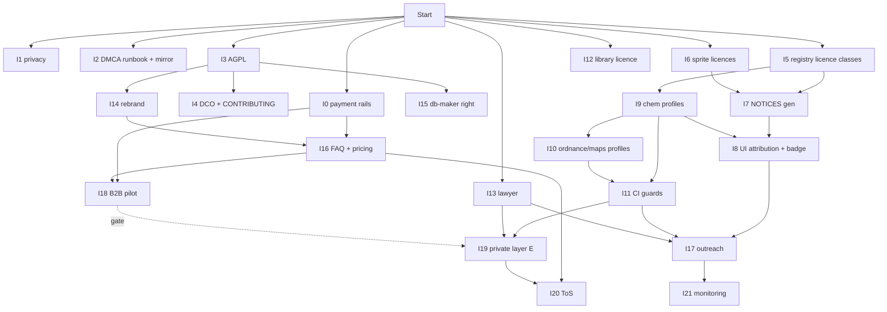

# Decision: License and IP strategy for future commercialization

**Date:** 2026-09-12
**Tier:** 2 (Vision-level: licence of the public repo, open-core topology, data pipeline profiles, contributor policy, brand)
**Status:** accepted — owner checkpoint passed, R3 sign-off «YES WITH FIXES» from all five experts, fixes folded in below. Implementation = ROADMAP «Серия I».
**Method:** `/war-room deep` — 5 real agents (IP Counsel, Business Strategist, Community Expert, System Architect, Devil's Advocate): R1 positions → R2 cross-examination → opus synthesis → owner checkpoint → R3 fatal-flaw review. Experts produce strategy, not legal advice; the lawyer consultation is task I13.

## Context

Owner (2026-09-12): «Я думаю в будущем коммерциализировать наш проект. Надо бы подумать над актуальной лицензией и защитой для проекта.» Scope confirmed by owner: optimize all four lanes (donations, pro-convenience, B2B for servers, paid data/API); protect against competitor clones, copy-as-a-service, loss of brand control; fork rights-holder claims are a precondition, not a priority.

Verified facts (2026-09-12, GitHub API + LICENSE files + sprite `meta.json`):

| Fact | Value |
|---|---|
| Current licence | GPL-3.0-only, © 2025 MikameO, relicensed from MIT 2026-04-16; SPDX/GPL headers in 19 source and notice files |
| Chain of title | 244 commits, single author, 0 external PRs — relicensing window open until the first merged external PR |
| Hosting constraint | Repo stays public on GitHub Pages (decision 2026-07-28, not revisited) |
| NOTICES | Claims «all forks MIT», covers 8/21 forks, declares sprites MIT — false (audit 2026-09-11, P1) |
| MIT forks | vanilla 407, RMC14 113, Starlight 27, Carpmosia 12, Corvax 8, ADT 100 → ~667 reagents |
| AGPL-3.0(-or-later) forks | Goob 100 (YAML carries `SPDX-License-Identifier: AGPL-3.0-or-later`), Funky 103 (`AGPL-3.0-or-later AND MIT`, also CC-BY-NC-SA-3.0 in LICENSES/), Delta-V 124, Misfits 151, Trauma 44, Frontier 33, Monolith 28, Omu 20, Harmony 8, CMU 22, RuCM 0 → ~633 reagents |
| Proprietary EULA forks (non-commercial) | Sunrise 37 + Fish 10 (makura-games: personal non-commercial only, commercial use only with prior explicit permission, unmarked files fall under the EULA); Dead Space 22 («expressly prohibits commercial use, public hosting»); Space Stories 18 + the whole ordnance layer («Commercial Use… derived from the proprietary components», «Fragmentation/Cloning: extracting unique proprietary mechanics… for external projects… intended for public distribution», «Presumption of Proprietary Ownership»; CC-BY-SA/NC assets exempted) → ~87 reagents + Sunrise/Fish RU locales + ordnance formulas (12 constants, 17 targets) |
| Sprites in `sprites/` | 21 RSI of ~34 checked — all CC-BY-SA-3.0 (cev-eris, tgstation, vgstation, cmss13); 13 unchecked; no attribution anywhere |
| Curated layer | ANTAG_DATA, strategies, presets, tips, `sources.py` — owner's original authorship |
| library/ | 1 player-written document, no licence from the author, takedown offer only |
| Brand | «NanoTrasen ChemDB» — NanoTrasen is a fictional corporation from SS13/SS14 lore, not the owner's mark; the Steam guide draft (promo/) already promises «open-source (GPL)» |
| Analytics | Yandex.Metrika 108585248 with webvisor/clickmap without consent (audit P1) |
| Audience | 1605 visits / 364 users per quarter, 78% returning, 34% RU |
| Money in the ecosystem | RU hosts on Boosty with 30–45k ₽/month budgets (9+ servers); players do not pay for tools; «paywall on the reference = failure» (research 2026-07-12) |

Options evaluated: A keep GPL-3.0-only · B AGPL-3.0 · C dual AGPL + commercial (CLA) · D source-available (BSL/FSL/PolyForm-NC) · E open core. Protection measures P1–P8 (see task table).

---

# War Room Decision: Лицензия и защита IP для коммерциализации
Date: 2026-09-12
Experts: IP Counsel, Business Strategist, Community Expert, System Architect, Devil's Advocate

## Decisions

### Decision 1: Лицензия публичного репозитория — AGPL-3.0-or-later, тихо, с carve-out для данных
**Chosen**: Заменить LICENSE GPL-3.0-only на AGPL-3.0-or-later, © 2025 MikameO, пока окно открыто (244 коммита одного автора, 0 внешних PR). Перед коммитом — git-tag `pre-agpl`. SPDX-заголовки во всех 19 файлах (app.js, config.py, i18n.js, index.html, library.html, library.js, ordnance.js, sources.py, ss14_chem_extractor.py, style.css, scripts/*.py, LICENSE, NOTICES, README) меняются той же правкой. В LICENSE/README — явный carve-out (R3 Counsel): код и компиляция — AGPL-3.0-or-later в части прав владельца; каждая запись data.json сохраняет лицензию источника по `data.forks[].license` и NOTICES. Смена делается тихо: коммит + строка в CHANGELOG + абзац в README/FAQ, без анонса-поста (R3 Devil: анонс = триггер клона 7/10 → 4/10). Steam-гайд и README говорят «open-source (AGPL-3.0)». В футере — явная ссылка «Source (AGPL-3.0)» для §13.
**Rationale**: Counsel B=8 (§13 закрывает модифицированный SaaS), Community B=9 — 11 из 21 форков уже AGPL-3.0-or-later, совместимость с Goob YAML перестаёт быть вопросом. Architect: 1 файл + sweep, 2 часа. Devil: AGPL не останавливает identical re-host статики — против него работают атрибуция (GPL §5 / CC-BY-SA), свежесть данных и бренд, не лицензия.
**Rejected**: A (GPL-3.0-only) — не покрывает копию-как-сервис. D (BSL/FSL/PolyForm-NC) — тройное вето: нельзя перелицензировать ~633 AGPL-verbatim и ~87 proprietary записей, которыми владелец не распоряжается; противоречит обещанию «open-source» в Steam-гайде.
**Conditions to revisit**: слияние внешнего PR без DCO; отказ форка-донора от совместимости.
**Confidence**: high

### Decision 2: Dual licensing C — отложено до триггера
**Chosen**: Не вводить сейчас. Триггеры: (1) первый внешний PR — активирует DCO, не CLA; (2) первый запрос white-label — тогда assignment-CLA только для закрытого слоя. Коммерческая лицензия покрывает исключительно own-контент (ANTAG_DATA, стратегии, пресеты, sources.py, код) и MIT-форки (~667 реагентов), никогда AGPL-слой (~633) и никогда proprietary.
**Rejected**: C сейчас — Architect: 4-6 ч CLA-процесса при 0 контрибьюторов; Community: слово «CLA» без FAQ даёт Redis/Elastic-рефлекс; Devil: продажа лицензии на контент с Stories/Sunrise-производными — буквальный запрещённый сценарий их EULA.
**Conditions to revisit**: любой из двух триггеров.
**Confidence**: high

### Decision 3: Open core E — отдельный репо и домен; сначала проверить B2B-спрос, потом строить
**Chosen**: Публичное ядро (данные, JSON, UI, локали) остаётся в space-station-recipes под AGPL. Закрытый слой — новый приватный репо, отдельный домен и отдельный процесс (Cloudflare Workers + KV/D1), НЕ `<script src>` в том же DOM. Минимум бэкенда: Worker + KV для ключей/тарифов + статический pro-UI. Первый продукт внутри E — Pro-lane (сохранённые пресеты, синхронизация, удобство), данные не гейтятся никогда. Но инфраструктура E (I19, 8 ч + эксплуатация) строится только после дешёвой проверки спроса: питч 3 хостам (I18, 4 ч) — гейт «≥1 заинтересованный ответ» либо явное «go» владельца на Pro (R3 Business).
**Rationale**: Business E=9 — единственная опция под все 4 lane; Counsel: только отдельный процесс/домен проходит GPL FAQ aggregation test — conf 7/10, **требует подтверждения юристом** (вопрос 1). Business R2: при открытом ядре B2B-чек держат support/SLA/бренд, не данные (2-5k ₽/мес вместо 5-15k).
**Rejected**: seam через `<script src>` + feature flag в одном DOM — риск производности pro-слоя от AGPL-ядра. Строить E до питча — часы в непроверенный lane, когда единственный lane с подтверждённым бюджетом (30–45k ₽/мес у хостов) не имеет задачи питча.
**Conditions to revisit**: юрист признаёт разделение недостаточным; 0 ответов на питч и нет «go» на Pro.
**Confidence**: medium

### Decision 4: Proprietary-контент — политика прозы по форкам, единый бейдж статуса, Dead Space как есть (решение владельца)
**Chosen**: В `FORK_REGISTRY` каждый форк получает `license` (mit | agpl | proprietary) и `prose` (verbatim | facts-only). Публичная сборка: **Sunrise (37), Fish (10), Space Stories (18)** — facts-only: числа и названия реагентов остаются (короткие названия не охраняются как произведения; UI уже умеет пустые описания), дословные описания и RU-проза исключаются на входе пайплайна; **Dead Space (22)** — по решению владельца на чекпойнте «оставить как есть с пометками на будущее»: verbatim, флаг `proprietary`, пометка в реестре и NOTICES, пересмотр после вопроса 4 юристу; **ordnance-слой** (12 констант, 17 целей, CC-BY-SA спрайты) — по решению владельца остаётся в бесплатной сборке (механики и константы — идеи, ст. 1259 п. 5 ГК РФ; спрайты с атрибуцией), вопрос 2 юристу. Коммерческие сборки (`--profile licensed`): все четыре proprietary-форка и весь ordnance-слой в denylist, CI-assertion «0 записей». На КАЖДОЙ карточке/фильтре форка — единый бейдж лицензионного статуса с критерием в FAQ/CONTRIBUTING (R3 Community: разное обращение без публичного критерия читается как фаворитизм): Sunrise/Fish/Stories — «описание скрыто по лицензии форка, цифры и названия сохранены, источник: ссылка»; Dead Space — «статус на проверке у юриста».
**Rationale**: Devil: платящий клиент — улика; DMCA по Stories снимает репо и Pages разом (6/10 → 4/10 после denylist). Counsel: функциональный тест «unique proprietary mechanics» бьёт даже без копирования C# (conf 3/10 что safe — **требует подтверждения юристом**). Business принял цену: B2B-потолок 100-500k → 20-120k ₽, суммарный потолок 24 мес ~1.1M → ~650-700k ₽, пол ~85k ₽.
**Rejected**: удалить Dead Space немедленно (синтез) — владелец: фраза «public hosting» стоит в контексте хостинга игрового Build, числа — факты; удаление только по ответу юриста. (iii) письменное разрешение как предусловие — блокирует запуск на срок переговоров. Пост-хок вычистка RU-словаря по флагу — R3 Architect: словарь плоский по ключу, Sunrise вендорит vanilla FTL с теми же msg-id, вычистка снесёт валидный ss14-ru перевод или пропустит проприетарный; вместо этого public-профиль пересобирает merge серии L без FTL-файлов facts-only форков.
**Conditions to revisit**: письменный grant от Space Stories возвращает ordnance в коммерческий профиль; ответ юриста по Dead Space.
**Confidence**: medium

### Decision 5: Contributor policy — DCO сегодня, CLA только в закрытом слое
**Chosen**: Строка DCO (Signed-off-by, модель Linux/Docker/CNCF) в CONTRIBUTING.md до любого PR; шаблон PR с чекбоксом. Там же раздел «что и как мы берём у форков» (факты vs дословное, классы лицензий, атрибуция, критерий бейджа). Assignment-CLA — только для контрибьюторов закрытого слоя.
**Rationale**: Community сменил позицию в R2: стигма Redis/Elastic — стигма copyright-assignment, не DCO. Architect частично отозвал вето: 0.5 ч на строку принимает. Devil: риск merge до DCO 4/10 → 3/10.
**Rejected**: «CLA при первом клиенте» — читается как «продали доступ».
**Confidence**: high

### Decision 6: Бренд — ребрендинг ДО публикации Steam-гайда, ТМ отложен
**Chosen**: Уйти от «NanoTrasen ChemDB» к собственному имени; перед выбором — clearance (Роспатент, USPTO/EUIPO, Steam, домен, R3 Counsel, 1 ч). Ребрендинг выполняется до публикации гайда «Химия без альт-таба» (R3 Community: гайд под именем, которое проект сам признает проблемным, бьёт по доверию дважды; URL не меняется). Регистрацию ТМ отложить до первого B2B-контракта.
**Rationale**: Все пятеро: ребренд 3-4 ч, ТМ отложить. Devil: против passing-off работают бренд и свежесть данных, не AGPL.
**Rejected**: сохранить имя — нельзя строить ТМ на чужом лоре.
**Confidence**: high

### Decision 7: Compliance-пакет до первого рубля — рельсы, privacy, DMCA-runbook, NOTICES, атрибуция, library/, ToS
**Chosen**: Порядок: (0) платёжные рельсы и статус (R3 Business): НПД «самозанятый» через «Мой налог» (лимит 2.4 M ₽/год покрывает потолок ~700k ₽/24 мес; работа с юрлицами-хостами разрешена; чек 54-ФЗ формирует приложение), выплаты Boosty (донат) и Prodamus/ЮKassa (подписки) — Stripe/PayPal/Ko-fi для резидента РФ недоступны; шаблон акта для B2B-оплаты; (1) P8: webvisor/clickmap off либо согласие до `ym()`, страница privacy (152-ФЗ/GDPR); (2) DMCA-runbook (R3 Devil): зеркало на Cloudflare Pages из того же Actions, бэкап, черновик counter-notice с оговоркой о согласии на юрисдикцию США для резидента РФ, приоритет снятия (Dead Space → ordnance → Sunrise/Fish → спрайты); (3) P1: NOTICES 21/21 из FORK_REGISTRY, `data.forks[].license` + `origin` на записях, атрибуция CC-BY-SA-3.0 спрайтов в UI; (4) P6: лицензия для library/; (5) P7: ToS/API terms — до первого платного тарифа. Все новые страницы — в cp-list deploy.yml и PRECACHE sw.js.
**Rationale**: Counsel — 152-ФЗ/GDPR нарушены уже сейчас; Business — без статуса плательщика Boosty/Prodamus не подключают выплаты, первый рубль заблокирован буквально; Devil — единая точка хостинга: один DMCA-нотис по Dead Space или Stories валит витрину целиком. Текущий NOTICES ложен: «все форки MIT» покрывает 8 из 21 и объявляет CC-BY-SA-3.0 спрайты «MIT».
**Rejected**: (R3 Devil) «generic NOTICES без имён форков до outreach» — OVERRIDDEN: README «Supported Forks» и публичный config.py уже называют все 21 форк с URL репозиториев, NOTICES не добавляет правообладателям новой карты, а атрибуция MIT/CC-BY-SA — обязанность, не опция.
**Confidence**: high

### Decision 8: Донаты — привязка только к труду и хостингу
**Chosen**: Boosty/донат формулируется как поддержка мейнтейнера и хостинга; ни один tier не даёт доступа к данным, ordnance или proprietary-производным. Донат-сборка = публичная сборка. P5 (право изготовителя БД, ст. 1334 ГК РФ + © кураторского слоя) декларируется в README; датированный след вложений — git-история, CHANGELOG, ROADMAP; депонирование не нужно (ст. 1259 п. 4).
**Rationale**: Counsel — донат сам по себе вероятно не «Commercial Use» по Stories (conf 5/10 — **требует подтверждения юристом**, вопрос 3). Devil: правообладателю достаточно факта дохода на репо с их контентом — потому донат не привязан к контенту.
**Rejected**: донат-tier с эксклюзивным контентом — превращает донат в улику commercial use.
**Confidence**: medium

### Decision 9: Outreach к proprietary-форкам — после приведения сборки в порядок и после юриста, письмом коллеги
**Chosen**: После I8/I11 и консультации (I13) написать Space Stories, makura-games (Sunrise/Fish), Dead Space: что уже сделано (дословное исключено, остались числа + ссылка, бейдж статуса), и запрос — письменный grant на ordnance/прозу с атрибуцией и бесплатной интеграцией. Принимается только записанный grant.
**Rationale**: Community: тон коллеги-мейнтейнера, ≤1 ч. Devil: неформальное «ок» — отложенная катастрофа; письменный отказ — след «знал и продолжил», поэтому outreach идёт после порядка в сборке и после юриста.
**Confidence**: medium

### Decision 10: Вопросы юристу (одна консультация, РФ + IP), задача I13, до строительства E
1. Aggregation test: достаточно ли отдельного процесса/домена Cloudflare Worker, чтобы pro-слой не стал производным от AGPL-ядра (Counsel 7/10)?
2. Ordnance: подпадают ли 12 констант и 17 целей под «unique proprietary mechanics» Stories EULA без копирования C# (Counsel 3/10)? Каков реалистичный вектор — суд или DMCA-нотис GitHub, и как строить counter-notice резиденту РФ?
3. Донат: считается ли поддержка на Boosty «Commercial Use… derived from the proprietary components» (Counsel 5/10)?
4. Dead Space «public hosting»: нарушает ли публикация 22 реагентов на Pages запрет, если фраза стоит в контексте хостинга игрового Build (Counsel 4/10)?
5. API поверх AGPL-данных: обязывает ли §13 раскрывать pro-слой, если он лишь читает опубликованный data.json (Counsel 6/10, ст. 1260 ГК РФ)?
6. Достаточно ли ст. 1334 ГК РФ (право изготовителя БД) против identical re-host из-за рубежа?
7. Достаточно ли blanket-нотиса AGPL с carve-out по `data.forks[].license`, или компиляция нуждается в отдельной data-лицензии (R3 Counsel)?

## Vetoes Raised & Resolution
| Expert | Target | Reason | Resolution |
|---|---|---|---|
| Counsel, Business, Community | D (BSL/FSL/PolyForm-NC) | Нельзя перелицензировать чужой AGPL/proprietary контент; противоречит обещанию «open-source» в Steam-гайде | UPHELD — D исключён |
| Architect | C (полная CLA-инфраструктура) | 4-6 ч процесса при 0 контрибьюторов = sunk hours | RESOLVED BY Decision 5: DCO сегодня, assignment-CLA реактивно |
| Devil | C сейчас | Premature hardening — сам риск | RESOLVED BY отложенным триггером в Decision 2 |
| Architect | E (условно FATAL без P2(iv)) | Emergency takedown под давлением правообладателя | RESOLVED BY Decision 4: два build-профиля, denylist, CI-assertion |
| Business | P2(iv) как HURTS_SERIOUSLY | Срезает B2B 100-500k → 20-120k ₽ | OVERRIDDEN BECAUSE платящий клиент превращает EULA-нарушение в улику; Business принял цену в R2 |
| Synthesis | Удалить Dead Space немедленно | «public hosting» | OVERRIDDEN BY OWNER на чекпойнте: как есть с пометками, пересмотр после вопроса 4 |
| Devil (R3) | NOTICES 21/21 до outreach | Поимённый список — карта для правообладателей | OVERRIDDEN BECAUSE README и config.py уже публично называют все 21 форк; атрибуция — обязанность |
| Business (R3) | Pro-lane первой без проверки спроса | Часы в непроверенный lane | RESOLVED BY гейтом I18 → I19 в Decision 3 |

## System Description
Публичный репо `space-station-recipes` под AGPL-3.0-or-later на GitHub Pages отдаёт `index.html`, `app.js`, `i18n.js`, `maps.js`, `ordnance.js`, `library.js`, `sw.js`, `data.json`, плюс новые страницы privacy, FAQ, ToS (в cp-list и PRECACHE). Тот же Actions публикует зеркало на Cloudflare Pages — вторая точка хостинга на случай DMCA-нотиса. Python-пайплайн (`ss14_chem_extractor.py`, `config.py`) держит в `FORK_REGISTRY` поле `license` (mit | agpl | proprietary) и `prose` (verbatim | facts-only) на каждый из 21 форка; экстрактор сохраняет `license`/`copyright` из `meta.json` каждого спрайта и генерирует `NOTICES` на 21 запись автоматически; `data.json` несёт `data.forks[].license` и `origin` на записях (схема 3.11.0, аддитивно; CHANGELOG). Флаг `--profile public|licensed` (chem, ordnance, maps): `public` пересобирает merge локалей серии L без FTL-файлов facts-only форков и опускает их дословные описания; `licensed` — hardcoded denylist proprietary + ordnance. `data-licensed.json` никогда не попадает в публичный репо: `.gitignore` + CI-guard «0 tracked / 0 в _site», сборка только в CI приватного репо; jq-assertion «0 proprietary-записей» там же — платная B2B/API-сборка физически не может содержать чужой EULA-контент. Байт-в-байт детерминизм публичного `data.json` не затрагивается. Закрытый слой живёт в отдельном приватном репо на своём домене, Cloudflare Worker + KV; ядро и pro-слой общаются HTTP-запросом, не общим DOM. Атрибуция CC-BY-SA-3.0 (cev-eris, tgstation, vgstation, cmss13) выводится в UI рядом со спрайтом и в NOTICES; на каждой карточке форка — бейдж лицензионного статуса с критерием в FAQ/CONTRIBUTING. DCO — в `CONTRIBUTING.md` и шаблоне PR. README, Steam-гайд и FAQ показывают две колонки: «бесплатно навсегда» — данные, JSON, локали, вики; «платно» — SLA, white-label, приоритетная поддержка. Деньги принимаются как самозанятый: Boosty (донат), Prodamus/ЮKassa (подписки), акт для хостов-юрлиц.

## Open Risks
| Risk | Severity | Mitigation | Status |
|---|---|---|---|
| DMCA от Dead Space (verbatim по решению владельца), ~6/10 по R3 Devil | high | DMCA-runbook + зеркало (I2); вопрос 4 юристу; бейдж «на проверке» | ACCEPTED by owner until I13 |
| DMCA от Space Stories за ordnance (4/10 после denylist) | high | denylist + CI-assertion; grant через outreach; вопрос 2 юристу | MITIGATED |
| Клон конкурента после смены лицензии (7/10 → 4/10 при тихой смене) | medium | Без анонса-поста; свежесть данных как moat; бренд; мониторинг I21 | ACCEPTED |
| RU-сервер встроит данные бесплатно (7/10) | low | Реакция: благодарность + просьба атрибуции (GPL §5 / CC-BY-SA как отдельный claim) | ACCEPTED |
| makura-games претензия по Sunrise/Fish (5/10) | medium | facts-only в public, denylist в licensed, бейдж | MITIGATED |
| Лицензии 13 непроверенных RSI из ~34 неизвестны | medium | I6 — проверить и занести; не предполагать CC-BY-SA | NEEDS_SPIKE |
| Burnout соло-мейнтейнера (6/10 после override'ов) | medium | Серия I — инкременты ≤ 4 ч, четыре независимых трека, гейт перед E | ACCEPTED |
| Aggregation test для pro-слоя (Counsel 7/10) | high | Отдельный процесс + домен; вопрос 1 юристу до I19 | NEEDS_SPIKE |
| Blanket AGPL над смешанной компиляцией (R3 Counsel) | medium | Carve-out в LICENSE/README; вопрос 7 юристу | MITIGATED |
| `data-licensed.json` в истории публичного репо | high | .gitignore + CI-guard; сборка только в приватном CI | MITIGATED |

## R3 sign-off
| Expert | Verdict | Fixes folded in |
|---|---|---|
| IP Counsel | YES WITH FIXES | carve-out для данных в LICENSE/README; SPDX-sweep 19 файлов; ссылка Source (§13) в футере; name clearance до ребренда; вопрос 7 |
| Business | YES WITH FIXES | I0 рельсы (НПД, Boosty, Prodamus/ЮKassa, акт); питч 3 хостам как гейт перед E; FAQ/прайс-страница |
| Community | YES WITH FIXES | единый бейдж статуса на всех форках + критерий; ребренд до Steam-гайда; раздел CONTRIBUTING о форках; смена лицензии видна в CHANGELOG/README |
| Architect | YES WITH FIXES | I9 = профильный re-merge локалей, не пост-хок вычистка; `data.forks[].license` + `origin` вместо per-entry строки; licensed-артефакт только в приватном CI + .gitignore + guard; `--profile` для ordnance/maps; cp-list/sw.js для новых страниц |
| Devil's Advocate | YES WITH FIXES | DMCA-runbook + зеркало; tag `pre-agpl`; тихая смена лицензии; порядок NOTICES/outreach — overridden (см. Decision 7) |

## Task Decomposition

### Серия I — «Лицензия и защита IP» (HAE, единицы 0.5/1/2/4/8; [pipeline] = без правок app.js)

| # | Task | Type | Priority | Depends On | HAE (h) | DoD |
|---|------|------|----------|------------|---------|-----|
| I0 | Платёжные рельсы: НПД в «Мой налог», выплаты Boosty (донат) + Prodamus/ЮKassa (подписки), шаблон акта для хоста-юрлица | legal/ops | high | — | 4 | Статус НПД активен; Boosty-страница принимает тестовый платёж; чек 54-ФЗ сформирован |
| I1 | Privacy: webvisor/clickmap off (или согласие до `ym()`), страница privacy 152-ФЗ/GDPR, cp-list + sw.js | ops | high | — | 2 | Метрика без webvisor; privacy-страница 200 на проде; SW ставится |
| I2 | DMCA-runbook + зеркало: Cloudflare Pages из того же Actions, бэкап, черновик counter-notice, приоритет снятия | ops/legal | high | — | 4 | Зеркало отдаёт тот же билд (200); runbook в docs/ |
| I3 | Перелицензирование: tag `pre-agpl`, LICENSE AGPL-3.0-or-later, SPDX-sweep 19 файлов, carve-out для данных, CHANGELOG/README, футер «Source (AGPL-3.0)» | legal | high | — | 2 | `grep GPL-3.0-only` = 0 вне истории/аудита; футер-ссылка на источник |
| I4 | CONTRIBUTING: DCO Signed-off-by + PR-шаблон + раздел «что и как мы берём у форков» | docs | high | I3 | 2 | Шаблон PR требует sign-off; раздел с критерием бейджа |
| I5 | Реестр: `license` + `prose` на 21 форк (Sunrise/Fish/Stories facts-only; Dead Space verbatim + пометка) → `data.forks[].license`, `origin` на записях; схема 3.11.0 + CHANGELOG | architecture | high | — | 4 | 21/21 форков с классами; regen детерминирован; схема аддитивна [pipeline] |
| I6 | Спрайты: проверить 13 непроверенных RSI; экстракторы сохраняют `license`/`copyright` из meta.json в индекс спрайтов | research/task | high | — | 2 | Для каждого RSI записан SPDX-id или спрайт удалён [pipeline] |
| I7 | Генератор NOTICES 21/21 из FORK_REGISTRY + атрибуции спрайтов; ручной NOTICES заменён | task | high | I5, I6 | 4 | NOTICES генерируется, 21 форк + все спрайты с копирайтами [pipeline] |
| I8 | UI: атрибуция CC-BY-SA у спрайтов + единый бейдж лицензионного статуса на карточках/фильтрах форков с текстами по классу | task | high | I7, I9 | 4 | Скриншот: атрибуция и бейдж видны; Sunrise-карточка — числа + названия + пометка [app.js] |
| I9 | `--profile public\|licensed` в chem-экстракторе: public = re-merge локалей L без FTL facts-only форков + без их desc; licensed = denylist proprietary + ordnance | architecture | high | I5 | 4 | Два артефакта одной командой; vanilla ss14-ru переводы не потеряны (спот-чек 5 ключей) [pipeline] |
| I10 | `--profile` для ss14_ordnance.py и ss14_map_extractor.py | task | high | I9 | 2 | licensed-профиль без ordnance и без карт proprietary-форков [pipeline] |
| I11 | CI-guards: `.gitignore` на `*-licensed*.json`; fail при tracked/_site; assertion «0 proprietary-записей» для приватного CI | task | high | I9, I10 | 2 | Подложенный licensed-файл валит CI; подложенная proprietary-запись валит assertion [CI] |
| I12 | library/: поле `license` в index.json, запрос автору доктрины на CC BY 4.0; согласие при приёме новых документов | legal | medium | — | 0.5 | Согласие в repo или документ снят |
| I13 | Консультация юриста (РФ + IP) по 7 вопросам Decision 10 + вектор DMCA/counter-notice | legal | high | — | 4 | Письменные ответы → addendum в docs/decisions/; D4 по Dead Space пересмотрен |
| I14 | Ребрендинг: name clearance (Роспатент/USPTO/Steam/домен) + новое имя в title/og/manifest/sw/README/promo — ДО публикации Steam-гайда | task | high | I3 | 4 | 0 вхождений старого имени; черновик гайда обновлён |
| I15 | README: ст. 1334 ГК РФ + © кураторского слоя + датированный след вложений | legal | medium | I3 | 1 | Абзац в README |
| I16 | FAQ + прайс: две колонки «бесплатно навсегда / платно», текст доната, цена Pro, суть B2B-оффера; cp-list + sw.js | docs/frontend | medium | I0, I14 | 4 | Страница на проде; ссылка в футере; SW ставится |
| I17 | Outreach: письмо коллеги в Stories, makura-games, Dead Space — что сделано + запрос письменного grant | legal | medium | I8, I11, I13 | 1 | 3 письма отправлены; ответы подшиты в docs/decisions/ |
| I18 | B2B-пилот: текст оффера (support/SLA/white-label per-fork виджет, не данные) + шорт-лист 3 из 9 RU-хостов + питч | business | medium | I0, I16 | 4 | 3 питча отправлены; ответы зафиксированы; гейт для I19 |
| I19 | Закрытый слой E: приватный репо + CI (`--profile licensed`), отдельный домен, Cloudflare Workers + KV, Pro v1 | architecture | medium | I11, I13; гейт: ≥1 ответ из I18 или «go» владельца | 8 | Pro-UI отвечает со своего домена; ядро не изменено |
| I20 | ToS/API terms до первого платного тарифа | legal | low | I16, I19 | 2 | ToS на проде, ссылка в футере |
| I21 | Ежемесячный мониторинг: всплески forks/stars, упоминания в Discord makura-games/Dead Space/Stories, verbatim-копии ordnance/RU-локалей | research | low | I17 | 0.5 | Чеклист в ROADMAP; первый прогон выполнен |

Dependency graph:


Critical path: I5 → I9 → I10 → I11 → I19 → I20 = 4 + 4 + 2 + 2 + 8 + 2 = **22 ч** (I13 4 ч идёт параллельно и должен завершиться до I19). Вся серия I0–I21 = **65.5 ч**. Четыре независимых трека для параллельных сессий: (A) без зависимостей и дёшево — I0, I1, I2, I3, I12, I13; (B) пайплайн — I5 → I9 → I10 → I11, I6 → I7 → I8; (C) бренд и тексты — I3 → I4, I14 → I16 → I18; (D) продукт — I19 → I20 после гейта.

Machine-readable:
```json
{
  "feature": {"title": "Серия I — Лицензия и защита IP", "description": "AGPL-3.0-or-later с carve-out для данных, классы лицензий и политика прозы по форкам, два build-профиля с denylist proprietary+ordnance, DCO, DMCA-runbook и зеркало, платёжные рельсы самозанятого, ребрендинг до Steam-гайда, FAQ/прайс, B2B-пилот как гейт перед закрытым слоем."},
  "tasks": [
    {"id": "I0", "title": "Платёжные рельсы: НПД + Boosty + Prodamus/ЮKassa + акт", "type": "legal", "priority": "high", "hae": 4, "rationale": "Без статуса плательщика выплаты не подключаются; Stripe/PayPal/Ko-fi недоступны резиденту РФ"},
    {"id": "I1", "title": "Webvisor off + privacy policy", "type": "task", "priority": "high", "hae": 2, "rationale": "Действующее нарушение 152-ФЗ/GDPR на счётчике 108585248"},
    {"id": "I2", "title": "DMCA-runbook + зеркало Cloudflare Pages", "type": "task", "priority": "high", "hae": 4, "rationale": "Единая точка хостинга; counter-notice резидента РФ требует согласия на юрисдикцию США"},
    {"id": "I3", "title": "LICENSE -> AGPL-3.0-or-later, SPDX-sweep, carve-out, тихо", "type": "legal", "priority": "high", "hae": 2, "rationale": "Окно перелицензирования открыто: 244 коммита одного автора, 0 внешних PR"},
    {"id": "I4", "title": "DCO + CONTRIBUTING «что берём у форков»", "type": "docs", "priority": "high", "hae": 2, "rationale": "До первого внешнего PR; DCO community-safe в отличие от assignment-CLA"},
    {"id": "I5", "title": "license + prose в FORK_REGISTRY, data.forks[].license, origin, схема 3.11.0", "type": "architecture", "priority": "high", "hae": 4, "rationale": "Основа профилей, NOTICES 21/21 и бейджа [pipeline]"},
    {"id": "I6", "title": "13 непроверенных RSI + сохранение meta.json license/copyright", "type": "research", "priority": "high", "hae": 2, "rationale": "Лицензии неизвестны; атрибуция CC-BY-SA обязательна"},
    {"id": "I7", "title": "Генератор NOTICES 21/21", "type": "task", "priority": "high", "hae": 4, "rationale": "Текущий NOTICES ложен: 8 из 21 форка, спрайты «MIT» [pipeline]"},
    {"id": "I8", "title": "Атрибуция спрайтов + единый бейдж статуса в UI", "type": "task", "priority": "high", "hae": 4, "rationale": "Разное обращение с форками без публичного критерия читается как фаворитизм [app.js]"},
    {"id": "I9", "title": "extractor --profile public|licensed (chem)", "type": "architecture", "priority": "high", "hae": 4, "rationale": "Профильный re-merge локалей вместо пост-хок вычистки; denylist proprietary + ordnance [pipeline]"},
    {"id": "I10", "title": "--profile для ordnance и maps", "type": "task", "priority": "high", "hae": 2, "rationale": "Ordnance и карты proprietary-форков тоже в denylist [pipeline]"},
    {"id": "I11", "title": "CI-guards: licensed-артефакт вне публичного репо + 0 proprietary", "type": "task", "priority": "high", "hae": 2, "rationale": "data-licensed.json в истории публичного репо ломает модель E необратимо [CI]"},
    {"id": "I12", "title": "Лицензия для library/", "type": "legal", "priority": "medium", "hae": 0.5, "rationale": "1 документ игрока без лицензии, ст. 1270 ГК РФ"},
    {"id": "I13", "title": "Консультация юриста по 7 вопросам", "type": "legal", "priority": "high", "hae": 4, "rationale": "Все вопросы с confidence <= 7/10; до строительства E"},
    {"id": "I14", "title": "Ребрендинг с name clearance до Steam-гайда", "type": "task", "priority": "high", "hae": 4, "rationale": "NanoTrasen — вымышленная корпорация лора; гайд под старым именем бьёт по доверию дважды"},
    {"id": "I15", "title": "ст. 1334 ГК РФ + © кураторского слоя в README", "type": "legal", "priority": "medium", "hae": 1, "rationale": "Право изготовителя БД; депонирование не нужно"},
    {"id": "I16", "title": "FAQ две колонки + прайс + текст доната", "type": "docs", "priority": "medium", "hae": 4, "rationale": "Без страницы нечего продавать; ответ на вопросы читателей гайда до их появления"},
    {"id": "I17", "title": "Outreach к Stories, makura-games, Dead Space", "type": "legal", "priority": "medium", "hae": 1, "rationale": "Письменный grant; только после порядка в сборке и юриста"},
    {"id": "I18", "title": "B2B-пилот: оффер + 3 хоста + питч", "type": "research", "priority": "medium", "hae": 4, "rationale": "Единственный lane с подтверждённым бюджетом; гейт перед инфраструктурой E"},
    {"id": "I19", "title": "Приватный репо E + Worker-домен + Pro v1", "type": "architecture", "priority": "medium", "hae": 8, "rationale": "Отдельный процесс и домен вместо script src в общем DOM"},
    {"id": "I20", "title": "ToS/API terms", "type": "legal", "priority": "low", "hae": 2, "rationale": "До первого платного тарифа"},
    {"id": "I21", "title": "Ежемесячный мониторинг", "type": "research", "priority": "low", "hae": 0.5, "rationale": "Индикатор Devil: всплески forks/stars, упоминания у правообладателей, verbatim-копии"}
  ],
  "edges": [
    {"from": "I3", "to": "I4", "type": "blocks"},
    {"from": "I3", "to": "I14", "type": "blocks"},
    {"from": "I3", "to": "I15", "type": "follows"},
    {"from": "I5", "to": "I7", "type": "blocks"},
    {"from": "I6", "to": "I7", "type": "blocks"},
    {"from": "I5", "to": "I9", "type": "blocks"},
    {"from": "I9", "to": "I10", "type": "blocks"},
    {"from": "I9", "to": "I11", "type": "blocks"},
    {"from": "I10", "to": "I11", "type": "blocks"},
    {"from": "I7", "to": "I8", "type": "blocks"},
    {"from": "I9", "to": "I8", "type": "blocks"},
    {"from": "I0", "to": "I16", "type": "blocks"},
    {"from": "I14", "to": "I16", "type": "blocks"},
    {"from": "I8", "to": "I17", "type": "blocks"},
    {"from": "I11", "to": "I17", "type": "blocks"},
    {"from": "I13", "to": "I17", "type": "blocks"},
    {"from": "I0", "to": "I18", "type": "blocks"},
    {"from": "I16", "to": "I18", "type": "blocks"},
    {"from": "I11", "to": "I19", "type": "blocks"},
    {"from": "I13", "to": "I19", "type": "blocks"},
    {"from": "I18", "to": "I19", "type": "follows"},
    {"from": "I16", "to": "I20", "type": "blocks"},
    {"from": "I19", "to": "I20", "type": "blocks"},
    {"from": "I17", "to": "I21", "type": "follows"}
  ]
}
```

## Owner checkpoint (2026-09-12)
- Dead Space: «Оставим как есть с пометками на будущее» → Decision 4.
- Ordnance in the free build: «Оставить в бесплатной» → Decision 4.
- Everything else: «R3 как есть» → R3 fixes folded in above; series I approved for the ROADMAP.

## What must NOT be re-raised
- Source-available licences (BSL/FSL/PolyForm-NC): vetoed by three experts, excluded.
- Privatizing the repo or moving off GitHub Pages: decided 2026-07-28, unchanged.
- Removing Dead Space before the lawyer answers question 4: owner's call.
