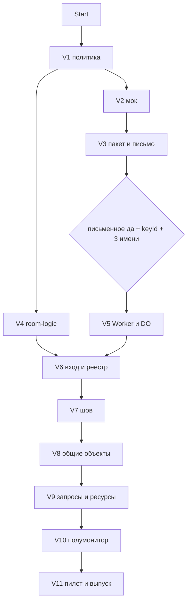

# War Room Decision: Командный планшет (серия V)

**Date:** 2026-09-13
**Tier:** 2 (новый бэкенд Cloudflare Durable Objects, интеграция с администрациями серверов, шов с серией T, ставка Vision B3)
**Status:** accepted — war-room 2026-09-13, затем решения владельца в тот же вечер (раздел «Owner overrides»): блокировка по простою 8 минут, потолок комнат в сутки выше бесплатного тарифа, сборка серии целиком без ворот «до письменного „да“». Правки спеки — [docs/design/2026-09-13-tactical-tablet.md](../design/2026-09-13-tactical-tablet.md), раздел «Поправки по итогам war-room»
**Method:** семь экспертов на Opus (Security Engineer, System Architect, Platform Engineer, UX Designer, Domain Expert — офицер RMC14/Stories и правила серверов, Product Manager, Devil's Advocate), два раунда: позиции с оценками и вето, затем перекрёстный допрос с угрозами по метрике каждого; синтез — Decision Architect на Opus. Эксперты читали спеку, код `tactical/*`, Worker и документацию Cloudflare сами. Одиннадцать вето (семь в первом раунде, четыре во втором), шесть смен позиций во втором раунде.
**Experts:** Security Engineer, System Architect, Platform Engineer, UX Designer, Domain Expert (офицер RMC14/Stories, правила серверов), Product Manager, Devil's Advocate — все на Opus; синтез — Decision Architect

## Decisions

### Decision 1: Транспорт и журнал операций — Durable Object + HTTP-опрос `?since=seq`, без серверных таймеров
**Chosen**: один DO на комнату, журнал `ops(seq…)` в SQLite объекта; клиент опрашивает `GET /room/<code>/ops?since=<seq>` с секретом в заголовке `X-Room-Session`, сервер отвечает `Retry-After: 2` при живом запросе и `Retry-After: 10` в покое. Каждый кадр несёт `serverNow`; клиент держит смещение часов, измеренное на `hello` как RTT/2, и рисует `deadlineAt − serverNowEst`. Переходы состояний запроса — CAS по `expectedStatus`; отказ приходит в подтверждении пакета как `{error: "status", status}` при ответе 200 и не пишет строк. Повторяющихся таймеров нет: сервер отдаёт `deadlineAt`, один alarm ставится однократно на срок жизни комнаты. WebSocket — backlog, открывается при третьей одновременной комнате.
**Rationale**: Platform — фиксированный опрос 2 с даёт 21 600 запросов на комнату (4,6 комнаты в сутки), адаптивный `Retry-After` — 4 300–8 600 (11+ комнат); Platform подтвердил по документации, что alarm и `setInterval` будят объект и биллятся, поэтому такт в DO стоил бы ≈21 600 GB·s на комнату; Architect — `?since=seq` убирает гибернацию, ресинк и backoff как три источника багов; Devil — LWW роняет пару accept 812 / deny 813 в карточку огня, `expectedStatus` закрывает это тремя строками.
**Rejected**: Supabase Realtime — публичный anon-ключ без аккаунтов открывает чтение комнат посторонним (вето Security); Yjs — непрозрачные update'ы, сервер не может применить политику (вето Architect); KV-опрос — eventual consistency и квота записи (вето Platform); WS первым срезом — гибернация плюс autoResponse до первого пилота.
**Conditions to revisit**: три одновременные комнаты в одном раунде, либо медиана «запрос → принят» выше 60 с из-за опроса.
**Confidence**: high

### Decision 2: Вход и удостоверение — одноразовый код должности плюс клик живого участника
**Chosen**: на брифинге печатается лист: код комнаты и по одному коду должности на отряд. Код должности одноразовый: первое предъявление связывает его с `sessionId` и текущим `epoch`, ставит `usedAt`, выселяет прежнюю сессию этой должности и пишет в журнал «должность перезашла». Код сам по себе комнату не открывает — вход завершает клик любого подтверждённого участника (не только штаба). Резервный путь — слово подтверждения по рации; выбор из трёх слов появляется только когда в очереди «стука» два и более кандидата, иначе одна кнопка. TTL слова — 5 минут от последнего использования кода, не по стенным часам. «Сменить код» = `epoch++` в DO: все сессии получают 401 одновременно, новый код комнаты виден только на экране того штабного, кто нажал, и уходит в IC голосом. Выбывший: авто-снятие через 10 минут без операций, плюс «Выбыл» одним тапом по чужой строке; метки снятой должности сереют в «не подтверждено», не удаляются. Строка реестра гаснет через 90 с без heartbeat и получает кнопку «Занять».
**Rationale**: UX — код с листа занимает <15 с против минуты эфира на шесть подтверждений словом, а подтверждающий и есть самый занятый человек (R7); Domain — бумага без подтверждения живого человека фатальна, код переживает смерть офицера; Security — `epoch` внутри каждого токена отзывает всё одним инкрементом, лимитеры insider'а с валидным секретом не ловят; Devil — отделить мёртвого, перезашедшего ксеносом, технически нельзя, поэтому новый код не показывается никому, кроме ротирующего.
**Rejected**: вечный код должности — многоразовый секрет, снятый с трупа, без отзыва (вето Security); бумага без клика — Domain fatal; только слово — 4/10 по UX, алфавит B/C/D/E/G/P/T/V/Z/3 неразличим голосом; позывной как идентичность — не проверяется.
**Conditions to revisit**: администрация Stories потребует именного удостоверения.
**Confidence**: high

### Decision 3: Ворота санкции — серверный ключ с `keyId`, политика из Worker, стоп-флаг ≤60 с
**Chosen**: `POST /room` принимает токен, подписанный HMAC администрации; `keyId` в заголовке, ключ живёт в переменных Worker и в реестровом DO, не в файле политики. Поле `server` от клиента не используется — форк и сервер берутся из токена; без токена комната помечается «без санкции» и интерфейс комнаты скрыт. Проверки хеша политики нет: страница берёт `GET /policy/<fork>` как единственный источник. Отзыв: стоп-флаг в реестровом DO, роутер Worker кеширует его 60 с на изолят, комната перечитывает флаг на alarm'е и на каждой 30-й операции. Переменная `ROOMS_ENABLED=0` в дашборде — глобальный backstop, не «их» рубильник.
**Rationale**: Devil — клиент, объявляющий `server` сам, отправляет игрока Corvax в комнату «Stories Core», скриншот отзывает пилот (вето на политику как единственные ворота); Architect — DO не доверяет полю, токен решает вопрос без второй копии политики; Devil — политика без хеша не доходит до живой комнаты, стоп-флаг с 60 с доходит; Security — безопасный дефолт до ответа владельца: наблюдатель и экспорт выключены.
**Rejected**: только переменные окружения — клиент объявляет сервер сам; сверка хеша политики — глушит комнату посреди раунда на косметической правке (R13).
**Conditions to revisit**: администрация откажется держать ключ — тогда ключ у нас, им именная ссылка «отключить нас», это прямо записано в условии (д).
**Confidence**: high

### Decision 4: Лимиты — ≤2 строки на операцию, байтовый бюджет, потолок в переменных, деградация без тишины
**Chosen**: `INSERT ops` + `UPSERT objects` без дополнительных индексов = ≤2 строки на операцию → 8 комнат в сутки на Free. Потолок читается при создании комнаты: `ROOMS_MAX_CONCURRENT=3`, `ROOMS_MAX_DAILY=6`, реестровый DO ведёт счётчики и `GET /health` (только числа, никогда список). Лимитер считает по источнику входа (адрес + `sessionId`), никогда по коду комнаты. Байтовый бюджет комнаты 2 МБ и 2000 объектов — исполнимая форма потолка; снимок отдаётся пачками по 200. Деградация: при потолке отказывают **новые** комнаты текстом, активная комната не трогается никогда; жёсткий отказ (бюджет, kill) переводит её в «Радиомолчание» — баннер над картой и «данные заморожены с 14:32» на каждой карточке.
**Rationale**: Platform — снятие таймеров переносит узкое место с GB-s на строки записи; Devil — «20 неудачных входов в час на код комнаты» превращает печатный код в кнопку убийства комнаты (вето); PM — 6 комнат в сутки против порога 6 за четыре недели даёт 28-кратный запас; Devil — тихий read-only заставляет штаб работать по мёртвой карте.
**Rejected**: буферизация flush+alarm ради ≤2 строк — дублирует журнал `seq` (Architect); платный план Workers — 28-кратного запаса хватает.
**Conditions to revisit**: два раунда подряд упираются в `ROOMS_MAX_CONCURRENT`.
**Confidence**: high

### Decision 5: Шов — хук `TacRoom.attach` и контракт «слой переживает перерисовку»
**Chosen**: `view.addLayer` (публичный, `mapview.js:119`) получает в контракте письменную гарантию: слой переживает смену уровня и зума, тест закрывает два уровня × два зума. `view` перестаёт быть локальной IIFE-переменной (`tactical.js:561`) и экспортируется. Слот панели комнаты ставится **вне** `#tacPanel`, потому что `els.panel.innerHTML = …` (`tactical.js:1964`) переписывает `aside` на каждом `renderPanel()`. API: `attach({view, getContext, takeTarget})` плюс пять уведомлений — `addMarker`, `finishShape`, `itemDelete`, `recordShot` (`fired`, 2179–2186), `setTarget` (2029), ≈15 строк. Guard-тест ищет строку `TacRoom.attach` в трёх точках `tactical.js` и падает при пропаже. Запасной путь при отказе мейнтейнера серии T: `window.__tacView = view` одной строкой и явный форк `drawShape`/`markTile`/`drawText` (927/941/1305) в `room.js`, 60 строк с комментарием.
**Rationale**: Architect — оверлей дублирует `worldToScreen`, зум, hit-test и DPR, а пиксельный тест становится вечным долгом CI; Devil — ломает хук не трансформация, а жизненный цикл: перерисовка при смене уровня в T10/T11 молча стирает чужой слой, поэтому контракт и тест на два уровня переводят хук из 5 в 7; Architect — `mapview.js` (232 строки) не трогается вовсе.
**Rejected**: оверлей поверх холста — вторая копия геометрии; правка `renderPanel()` или перехват делегата `data-action` (2410) — сигнал остановки по определению.
**Conditions to revisit**: T-мейнтейнер отказывает в экспорте `view` — включается форк на 60 строк.
**Confidence**: medium-high

### Decision 6: Формулировка для администрации и порядок обращения
**Chosen**: одно письмо, в нём «да» и `keyId` вместе. Предлагаемый текст исключения к правилу 3:

> «Разрешено использование внешнего командного планшета, внесённого администрацией в список разрешённых инструментов, при соблюдении условий: (а) инструмент ничего не читает из игры — всё вводится руками; (б) в него попадает только то, что уже было сказано по внутриигровой связи; (в) доступ есть только у живых игроков на командных должностях текущего раунда; (г) работа прекращается вместе с потерей связи — режим „Радиомолчание“ виден в экспорте; (д) администрация получает ссылку наблюдателя, полный экспорт и собственный ключ отключения, действующий без нашего деплоя.»

Три обещания письма: умирает вместе с рацией, мёртвые молчат, рубильник у администрации. Порядок показа: первым — страница «чего инструмент не делает», вторым — их рубильник и `keyId`, третьим — ссылка наблюдателя; архитектура не показывается. Обращение идёт после волны серии J тем же контактом. Честная оговорка про смерть: «инструмент не знает о смерти персонажа, поэтому снятие идёт по бездействию и рукой любого офицера».
**Rationale**: Domain — холодный питч по правилу 3 клеймит нас авторами читов, репутация гайда открывает дверь; Domain — честность про смерть продаётся лучше обещания, которое нельзя выполнить; PM — два обращения стоят по неделе и половину вероятности ответа каждое (вето); Domain — политика с сервера продаёт условие (д): клиент не может соврать о политике.
**Rejected**: питч до волны J; текст без (г) — «Радиомолчание» единственное демонстрируемое условие.
**Conditions to revisit**: «да с условиями», запрещающее запись на уровне отряда — это kill, см. Decision 7.
**Confidence**: medium

### Decision 7: Метрики пилота и порог отмены
**Chosen**: успех пилота = опубликованный текст исключения в правилах Stories и ноль тикетов по правилу 3 за четыре недели. Счётчик комнат — вторичный порог KT-B: за четыре недели ≥6 полезных комнат (≥3 подтверждённые должности, ≥1 запрос доведён до «выполнен», ≥10 операций от ≥3 клиентов), из них ≥3 с разными создателями и минимум одна вовсе без владельца в реестре; ≥5 офицеров в ≥2 раундах; guardrail — медиана «запрос → принят» <60 с. Источник чисел — журнал экспорта, не Метрика; четыре цели (`room_create`, `room_confirm`, `room_request_done`, `room_export`) регистрируются только по «ок» владельца. Когорта: три именованных офицера пилотного сервера письменно до V5, владелец в тройку не входит; нет трёх имён за 7 дней — сборка дальше V4 не идёт. Нет письменного «да» за три недели после письма — серия замораживается на V3.
**Rationale**: PM — прецедент Ordnance (одно органическое открытие на 1300+ хитов) показывает, что Метрика не измеряет узкую аудиторию; Devil — «≥2 комнат без владельца» мало, порог иначе меряет доступность владельца (R14); Domain — когорта из круга владельца читается администрацией за минуту (R11); PM — отказ никогда не приходит в идущий раунд.
**Rejected**: порог по числу комнат без требования разных создателей — самотесты; Метрика как источник — цели не различают полезную комнату.
**Conditions to revisit**: администрация даёт «да» с тактом общего слоя — порог пересчитывается, такт включается по Decision 12.
**Confidence**: medium

### Decision 8: Полумонитор — бюджет высот и точка излома 1100
**Chosen**: собственный `@media (max-width: 1100px)` в `room.css`; `@media 900px` из `tactical.css:416–419` не переиспользуется. Бюджет высоты узкой раскладки: шапка 36 + чипы ресурсов 28 (одна строка, горизонтальный скролл) + карта 500 + лента запросов 64 (три карточки по 280) + панель 300 с собственным скроллом; подвал скрыт. Узкая панель = две вкладки, «Запросы» и «Ресурсы»; реестр и слои уезжают на полку-чип «Реестр 7/12» поверх карты. Цели нажатия 44 px (сейчас `.btn-small` ≈21 px). Полка открывается и закрывается из JS, не из container query.
**Rationale**: UX — `tactical.css:419` снимает `max-height` у панели и включает скролл страницы посреди боя, а `min-height: 60vh` карты не даёт панели встать (вето на переиспользование); UX — без однострочного входа по коду и 44 px раскладка умирает, эти два пункта уходят в пилот, полировка остальных — после KT-B.
**Rejected**: третья раскладка; container query для полки — сетка в CSS, полка в JS.
**Confidence**: high

### Decision 9: Срок жизни комнаты — раунд, не шесть часов
**Chosen**: жёсткий потолок 3 часа от создания; за 20 минут до него в ленте (не модальным окном) появляется «продлить на час», доступное штабу один раз — абсолютный предел 4 часа. Блокировка по бездействию: 3 минуты без операций → плашка «новый раунд?» с одной кнопкой. После блокировки операции запрещены, экспорт живёт ещё час, затем DO удаляет себя. `roomIdleSec` 21600 из спеки заменяется на `roomMaxSec: 10800`, `roomIdleLockSec: 180`, `exportGraceSec: 3600`.
**Rationale**: Domain — комната, пережившая раунд, и есть тот перенос знания, который правила запрещают, а раунды Stories длятся 1,5–3 часа; Devil — шесть часов покрывают три раунда; UX — диалог посреди боя недопустим, поэтому только простой и плашка в ленте; Platform — жёсткий потолок комнато-часов держит GB-s.
**Rejected**: 6 часов из спеки; автолок в 2 часа — режет живой трёхчасовой раунд.
**Confidence**: high

### Decision 10: Поток запроса — карточка огня внутри запроса
**Chosen**: карточка огня серии T (~180 px) монтируется внутрь раскрытого запроса, отдельного переключения «Комната → Огонь» для исполнения нет. Состояния запроса: `requested → accepted → loaded → firing → done | denied`, переходы через `expectedStatus`; новое значение `loaded` даёт ОБ две строки владельцев — «Заряжено» (OT) и «Выстрел» (SO), автор строки берётся из автора операции, новых скаляров нет. Маяк поставки — элемент массива `flags: ["beacon"]` на запросе, чтобы следующий признак не требовал миграции снимка; всё прочее («чем заряжено», примечания) — в `notes`. Отозванный штабом запрос показывает «отозвано штабом», а не исчезает. Под каждой новой меткой противника подпись «не передано», которую снимает одним кликом любой в комнате. Ресурсы — `claimable`: подтверждённый участник берёт «Расчёт» на конкретный миномёт, и право `acceptRequest` действует только на этот ресурс. Звук — только владельцу ресурса, один раз.
**Rationale**: UX — у ОБ два владельца, одна строка состояния лжёт; Architect — каждый новый скаляр в объекте = миграция снимка, `notes` и `flags` этого не требуют; Devil — карточка внутри запроса убирает расхождение LWW между целью и запросом; Domain — «не передано» честно показывает, что комната не заменяет рацию (R10).
**Rejected**: переход «взял цель → переключись на панель огня» — 3/10 у UX; отдельные поля `loadedBy`, `beacon` — миграции.
**Confidence**: high

### Decision 11: Реестр — должности отдельно, функции ярлыками
**Chosen**: должности (дают права): `co`, `xo`, `so`, `ot` (техник вооружения — новая), `sl` и `ftl` (по отрядам), `pilot`, `ro` (снабжение и квартирмейстер), `cmo`, `observer`. Функции — ярлыки, назначает штаб, живым, без передачи, с записью в журнал, прав не дают и служат только подписью и фильтром: JTAC, миномётный расчёт, aSL, DCC, синтетик. Права ключуются исключительно по должности.
**Rationale**: Domain — JTAC и расчёт это функции, а не должности, при этом OT владеет снарядами и боеголовками ОБ и обязан быть должностью; Architect — функция в ключе прав ломает таблицу политики; UX — реестр из 12 строк не влезает в чип, ярлык рисуется на строке; Security — назначение ярлыка привилегированная операция, только штаб, только живым, в журнал.
**Rejected**: Leadership ≥ 2 как ограничение на публикацию — вето Domain: комната не снимает и не копирует ни одного внутриигрового ограничения; JTAC как должность — четверо корректировщиков заняли бы слоты.
**Confidence**: high

### Decision 12: Порядок сборки — 9 часов до письменного «да»
**Chosen**: вариант B. До ворот идут V1 (политика), V2 (кликабельный мок на фикстурах — тот же `room.js` на фиктивном транспорте, не отдельный экран) и V3 (пакет и письмо) — 9 часов. Ворота: письменное «да» + `keyId` + три имени. После ворот — Worker, логика, вход, шов, объекты, запросы, полумонитор, пилот. Такт общего слоя по умолчанию выключен (`cadenceSec: 0`); если администрация его потребует, он реализуется одним alarm'ом на срок выпуска буфера, а не повторяющимся таймером. QR на бумаге, генерация кодов подсистемой и делегирование администрирования вырезаны.
**Rationale**: PM — 45 часов до встречи с человеком, который обнуляет проект одним словом, это вето; Architect — мок на том же `room.js` не создаёт второго экрана; Platform — повторяющийся такт возвращает биллинг alarm'ов, который Decision 1 только что убрал.
**Rejected**: вариант A (V1–V4 сначала, 21 час); вариант C (всё, 45 часов).
**Confidence**: high

## Vetoes Raised & Resolution

| Expert | Target | Reason | Resolution |
|---|---|---|---|
| Security | Supabase Realtime | публичный anon-ключ без аккаунтов открывает чтение комнат посторонним | RESOLVED BY Decision 1 (DO + журнал, секрет в заголовке) |
| Architect | Yjs CRDT | непрозрачные update'ы, сервер не применяет политику | RESOLVED BY Decision 1 (журнал операций с проверкой прав на сервере) |
| Platform | KV-опрос | eventual consistency плюс квота записи KV | RESOLVED BY Decision 1 (опрос идёт в DO, не в KV) |
| UX | переиспользование `@media 900px` | `tactical.css:419` снимает `max-height` панели → скролл страницы; `min-height: 60vh` карты | RESOLVED BY Decision 8 (свой breakpoint 1100 в `room.css`) |
| Domain | публикация только при Leadership ≥ 2 | комната копировала бы внутриигровое ограничение, теряя смысл | OVERRIDDEN BECAUSE ограничение не требуется ни одним правилом; вместо него Decision 11 (права по должности) |
| PM | вариант C (45 ч до встречи) | администрация обнуляет проект одним словом | RESOLVED BY Decision 12 (9 ч до ворот) |
| Devil | файл политики как единственные ворота | клиент объявляет `server` сам → игрок Corvax в комнате «Stories» → отзыв пилота | RESOLVED BY Decision 3 (форк и сервер из подписанного токена) |
| Security | бумажный код должности как вечный многоразовый вход | секрет, снятый с трупа, без отзыва | RESOLVED BY Decision 2 (одноразовость, привязка к `sessionId`+`epoch`, выселение) |
| Domain | бумажный вход без подтверждения живого | обходит условие (в) исключения | RESOLVED BY Decision 2 (клик любого подтверждённого участника) |
| PM | два отдельных обращения к администрации | каждое стоит неделю и половину вероятности ответа | RESOLVED BY Decision 6 (одно письмо: «да» + `keyId`) |
| Devil | лимитер «20 входов в час на код комнаты» | печатный код становится кнопкой убийства комнаты | RESOLVED BY Decision 4 (счёт по источнику входа) |

## System Description

Брифинг: CO открывает `tactical.html` на планете раунда, жмёт «Создать комнату». `room.js` шлёт `POST /room` с токеном администрации (`keyId` в заголовке); роутер `worker/index.js` проверяет подпись, спрашивает у реестрового DO счётчики (`ROOMS_MAX_CONCURRENT/DAILY`) и стоп-флаг, затем поднимает `Room` DO. Ответ — код комнаты, `observerToken`, текст листа. Лист печатается: код комнаты плюс одноразовые коды должностей.

Вход: офицер вводит код комнаты и код должности; DO проверяет `usedAt`, ставит `usedAt+sessionId`, выселяет прежнюю сессию должности, кладёт строку в очередь «стука»; любой подтверждённый участник жмёт «Подтвердить». Токен сессии несёт `epoch`; `epoch++` даёт 401 всем сразу.

Операции: `room-logic.js` (чистая, тесты в Node через `vm`) собирает `{cid, op, kind, id, data, expectedStatus?}`, кладёт в `pending` и рисует оптимистично; `room.js` шлёт пачку, получает `{seq, at, serverNow, ops[], Retry-After}`. DO пишет `INSERT ops` + `UPSERT objects` (≤2 строки), проверяет право по политике из `GET /policy/<fork>` и `expectedStatus`; отказ — `409`, строк нет. `room-ui.js` держит панель в слоте вне `#tacPanel`; чужие объекты рисует `view.addLayer` почерком уровня, свои события приходят из пяти уведомлений хука `TacRoom.attach`.

Запросы и ресурсы: карточка запроса разворачивается, внутри — карточка огня серии T; `takeTarget` уносит координаты, `fired` двигает статус в `firing` с `deadlineAt`. Отсчёты рисуются как `deadlineAt − serverNowEst`.

«Радиомолчание»: жёсткий отказ или рубильник администрации переводит комнату в чтение с баннером и отметкой заморозки на каждой карточке; стоп-флаг доходит за ≤60 с (кеш изолята) и на ближайшем alarm'е.

Конец раунда: 3 минуты простоя → плашка «новый раунд?»; блокировка запрещает операции, экспорт (`JSON` + текстовая хронология по должностям) живёт час, затем alarm удаляет DO. Клиентские ключи — `chemdb-tactical:room/<code>` и `chemdb-tactical:room-prefs`, синхронизация вкладок событием `storage`.

## Open Risks

| Risk | Severity | Mitigation | Status |
|---|---|---|---|
| R1 clickjacking на «Подтвердить» (Pages без заголовков) | medium | `room.js` не стартует в iframe; клик по доверенному событию на элементе старше 500 мс | MITIGATED |
| R2 токен наблюдателя и экспорт — канал утечки | high | по умолчанию выключены; `epoch` отзывает всё; ротация токена наблюдателя вместе с `epoch` | MITIGATED |
| R3 приватные `drawShape/markTile/drawText` → вторая копия отрисовки | medium | контракт `view.addLayer` + тест на два уровня × два зума; форк 60 строк только как запасной | MITIGATED |
| R5 Free CPU 10 мс на вызов DO не документирован | medium | снимок пачками ≤200; замер на `wrangler dev` до V6 | NEEDS_SPIKE |
| R6 квоты общие с формой идей | medium | `/health` в реестре, потолки в переменных, отказ новым комнатам текстом | MITIGATED |
| R7 подтверждающий — самый занятый; мёртвого SL не меняют; старые метки выглядят живыми | high | код с листа <15 с; подтверждает любой; строка гаснет за 90 с, «Занять»; метки снятой должности сереют | MITIGATED |
| R8 звук планшета глушит 7-секундное предупреждение об ударе | medium | звук только владельцу ресурса, один раз, отключаемо | ACCEPTED |
| R9 комната как вторая рация при потере связи | high | «Радиомолчание» серверное, видно в экспорте; условие (г) исключения | MITIGATED |
| R10 офицеры уходят в браузер и молчат в эфире | medium | подпись «не передано» под каждой новой меткой | ACCEPTED |
| R11 когорта = владелец, события — самотесты | high | три имени пилотного сервера письменно, владелец не считается | MITIGATED |
| R12 «да с условиями» без записи на уровне отряда = kill | high | вопрос задан прямым текстом в письме до сборки V5 | ACCEPTED |
| R13 хеш политики глушит комнату на косметике | medium | хеша нет; политика только из Worker | MITIGATED |
| R14 порог отмены меряет доступность владельца | high | ≥3 разных создателя, ≥1 комната без владельца в реестре | MITIGATED |
| R15 шестичасовая комната покрывает три раунда | medium | потолок 3 ч, продление один раз, экспорт-грейс 1 ч | MITIGATED |
| Мейнтейнер серии T откажет в экспорте `view` | medium | `window.__tacView` плюс форк 60 строк | ACCEPTED |
| Администрация откажется держать `keyId` | medium | ключ у нас, им именная ссылка «отключить нас», записано в (д) | ACCEPTED |
| Печатный лист сфотографируют | medium | одноразовость кода, выселение, `epoch++` | ACCEPTED |

## Owner overrides (2026-09-13, вечер)

Владелец как модератор war-room (глобальные правила, Tier 2) изменил три решения и закрыл пять открытых пунктов:

1. **Decision 9, блокировка по простою:** 8 минут без операций вместо 3 (`roomIdleLockSec: 480`). Потолок 3 часа с одним продлением и грейс экспорта 1 час остаются.
2. **Decision 4, потолок комнат в сутки:** «нужно больше сессий в день». Бесплатный тариф Workers упирается в строки записи и запросы примерно на 8–16 комнатах в сутки при любом транспорте (расчёт Platform), поэтому базой пилота становится платный план Workers (5 $/мес, 1 млн запросов и 50 млн строк записи в месяц включены, сверх — 0,15 $/млн запросов). Потолки переносятся в переменные: `ROOMS_MAX_CONCURRENT=6`, `ROOMS_MAX_DAILY=30`, деградация та же. Это расход на хостинг по принципу 6 Vision; оплата — шаг владельца при деплое. Опрос `?since=seq` из Decision 1 остаётся, WebSocket в бэклоге.
3. **Decision 12, порядок сборки:** «делать целиком сразу». Серия V1–V11 собирается без ворот; письмо администрации (V3) уходит параллельно сборке, а не перед V5. Вето PM на вариант C переписано владельцем осознанно: цена риска — часы сборки при отказе администрации; смягчение — политика как конфиг переживает «да с условиями», а инструмент без токена не выходит из мока. Пилот на живом сервере по-прежнему только после письменного «да» (принцип 3 Vision, проектный CLAUDE.md).
4. **Открытые пункты, закрыты дефолтами синтеза:** условие (б) «только уже сказанное по связи» принимается как рамка и реализуется подписью «не передано»; когорта из трёх именованных офицеров без владельца остаётся правилом измерения пилота, не воротами сборки; `keyId` предлагается администрации Stories с запасным вариантом «ключ у нас, им именная ссылка»; шов делает эта сессия сразу после спеки, так как серия T закрыта (T12 в `36bb6c5`); правило заморозки «нет „да“ за три недели» снято вместе с воротами — вместо него KT-B и решение владельца по итогам пилота.
5. **Этап 1 — офицер штаба и миномётный расчёт (владелец, 2026-09-13, после плана):** «можно начать с малой версии для двоих… Этого будет достаточно». Первый выпуск — комната на двоих: офицер штаба выдаёт расчёту запросы на удар и на позицию, расчёт видит их на карте, отвечает статусами и одним нажатием переносит позицию на панель «Огонь», офицер видит миномёт и его дальности. Поставляемая политика содержит должности `so`, `mortar`, `observer` и один миномёт; полная политика остаётся тестовой фикстурой `scripts/fixtures/room_policy_full.json`, так что логика и Worker не сужаются. Новый тип запроса `position`; автор запроса никогда не принимает и не выполняет его сам. V8 (общие метки, линии, зоны) отложен до полной версии. «Полезная» комната для KT-B на этапе 1 — два подтверждённых участника, четыре рабочие операции и хотя бы один выполненный запрос. Ворота санкции не меняются. Правки задач — раздел «Stage 1» плана.

6. **Правила этапа 1 по итогам ревью (контроллер, 2026-09-14; владелец может переопределить):**
   - **Кнопки автора запроса.** Офицер, выдавший запрос, на своём запросе видит только «Снять»: до принятия это отмена, после принятия — отзыв без выбора причины, в карточке «отозвано штабом». «Взять цель», «Встать сюда», «Выполнено» и «Отклонить» получает только расчёт.
   - **Запись в комнату.** Сервер проверяет не только новые объекты, но и изменения: у запроса и у ресурса разрешён белый список полей с проверкой типов, служебные поля ставит только сервер. Повтор той же операции тем же участником подтверждается без второй записи, объект другого участника с тем же id не перезаписывается.
   - **Вход.** Подтверждают штаб и расчёт (`confirmJoin: ["staff", "service"]`), иначе офицер, потерявший сессию, не вернётся в комнату на двоих. «Выбыл» отмечает любой подтверждённый участник, как в Decision 2.
   - **KT-B на этапе 1** (`scripts/room_pilot_stats.py`, по умолчанию `--stage so-mortar`). Полезная комната: подтверждены должности «Офицер штаба» и «Миномётный расчёт» (должности, а не браузеры), и хотя бы один запрос выполнен не его автором. Все идентификаторы владельца считаются одним человеком, комнаты владельца не входят в «три разных создателя». Хотя бы один выполненный запрос должен быть выполнен участником на должности «Миномётный расчёт»: если всю работу сделал второй офицер штаба, комната не полезна. Медиана — от запроса до первого «принят» не автором; рядом печатаются числа принятых, отклонённых, снятых автором и оставшихся без ответа. Повторные участники считаются по полезным комнатам. Журнал одной комнаты, скачанный несколько раз или после смены кода, считается один раз.

## Task Decomposition

| # | Task | Type | Priority | Depends On | Est. Hours (HAE) |
|---|------|------|----------|------------|------------|
| V1 | Политика форка и ворота санкции: `stories_cm.json`, `rmc14.json`, загрузчик, `GET /policy` | architecture | high | — | 3 |
| V2 | Кликабельный мок: `room.js` на фикстурном транспорте, сценарий раунда на экране | task | high | V1 | 2 |
| V3 | Пакет для администрации и письмо «да + keyId + три имени» | research | high | V1, V2 | 4 |
| V4 | `room-logic.js`: журнал, слияние, права, фильтры, отсчёты, Node-тесты | task | high | V1 | 4 |
| V5 | Worker: `Room` DO, реестровый DO, опрос `?since=seq`, `expectedStatus`, `epoch`, лимиты, экспорт, тесты | architecture | high | V3 (ворота) | 7 |
| V6 | Вход и реестр: лист, одноразовые коды, слово, «стук», выселение, ротация, наблюдатель | task | high | V4, V5 | 4 |
| V7 | Шов: `view.addLayer`, слот вне `#tacPanel`, пять уведомлений, guard-тест | task | high | V6, окно серии T | 2 |
| V8 | Общие объекты: почерк уровней, гладкие кривые, протяжка, слои, черновики, калибровка | task | medium | V7 | 5 |
| V9 | Запросы и ресурсы: карточка огня внутри запроса, две строки ОБ, `flags`, claimable-расчёты | task | medium | V8 | 5 |
| V10 | Полумонитор: бюджет высот, breakpoint 1100, 44 px, две вкладки, полка реестра | task | medium | V9 | 1.5 |
| V11 | Пилот на Stories Core, замер KT-B, выпуск и аудит серии | task | high | V10 | 3 |

Dependency graph:


Critical path: V1 → V2 → V3 → ворота → V5 → V6 → V7 → V8 → V9 → V10 → V11 = 36,5 часов HAE (до ворот 9 часов, всего по серии 40,5 с учётом параллельного V4).

Machine-readable:
```json
{
  "feature": {"title": "Серия V. Командный планшет", "description": "Комната офицеров на раунд поверх tactical.html: Durable Object с журналом операций и опросом ?since=seq, вход по одноразовым кодам должностей с подтверждением живого участника, ворота санкции на подписанном токене администрации, запросы с карточкой огня внутри, срок жизни по раунду."},
  "tasks": [
    {"id": "v1", "title": "Политика форка и ворота санкции", "type": "architecture", "priority": "high", "rationale": "политика из Worker без хеша — единственный источник прав; без санкции интерфейс скрыт"},
    {"id": "v2", "title": "Кликабельный мок на фикстурном транспорте", "type": "task", "priority": "high", "rationale": "показывает администрации сценарий и меряет бюджет высот до любой серверной работы"},
    {"id": "v3", "title": "Пакет для администрации и письмо да+keyId", "type": "research", "priority": "high", "rationale": "одно обращение вместо двух; текст исключения с пятью условиями"},
    {"id": "v4", "title": "room-logic.js и Node-тесты", "type": "task", "priority": "high", "rationale": "чистая логика журнала и прав тестируется без Worker"},
    {"id": "v5", "title": "Worker: Room DO, реестр, опрос, expectedStatus, epoch, лимиты", "type": "architecture", "priority": "high", "rationale": "без таймеров и WS: 8 комнат в сутки на Free при 2 строках на операцию"},
    {"id": "v6", "title": "Вход, реестр, одноразовые коды, ротация, наблюдатель", "type": "task", "priority": "high", "rationale": "вход <15 с и отзыв всех сессий одним epoch"},
    {"id": "v7", "title": "Шов с tactical.js через TacRoom.attach", "type": "task", "priority": "high", "rationale": "слой переживает перерисовку уровня; слот вне #tacPanel"},
    {"id": "v8", "title": "Общие объекты и почерк уровней", "type": "task", "priority": "medium", "rationale": "форма и штрих несут уровень командования"},
    {"id": "v9", "title": "Запросы и доска ресурсов", "type": "task", "priority": "medium", "rationale": "карточка огня внутри запроса убирает расхождение состояний"},
    {"id": "v10", "title": "Полумонитор: бюджет высот и breakpoint 1100", "type": "task", "priority": "medium", "rationale": "свой медиазапрос вместо сломанного 900 px"},
    {"id": "v11", "title": "Пилот на Stories Core, KT-B, выпуск", "type": "task", "priority": "high", "rationale": "успех = опубликованное исключение и ноль тикетов по правилу 3"}
  ],
  "edges": [
    {"from": "v1", "to": "v2", "type": "blocks"},
    {"from": "v1", "to": "v4", "type": "blocks"},
    {"from": "v2", "to": "v3", "type": "blocks"},
    {"from": "v3", "to": "v5", "type": "blocks"},
    {"from": "v4", "to": "v6", "type": "blocks"},
    {"from": "v5", "to": "v6", "type": "blocks"},
    {"from": "v6", "to": "v7", "type": "blocks"},
    {"from": "v7", "to": "v8", "type": "blocks"},
    {"from": "v8", "to": "v9", "type": "blocks"},
    {"from": "v9", "to": "v10", "type": "blocks"},
    {"from": "v10", "to": "v11", "type": "blocks"}
  ]
}
```

## Consequences for the spec

Что меняется против [спеки](../design/2026-09-13-tactical-tablet.md) после утверждения владельцем: транспорт с WebSocket на HTTP-опрос с адаптивным `Retry-After` (WebSocket в бэклог); сняты серверные такты и повторяющиеся alarm'ы, такт общего слоя только по требованию администрации одним alarm'ом; убрана сверка хеша политики, политика приходит только из Worker; ворота санкции — подписанный токен администрации с `keyId`, стоп-флаг ≤60 с; срок жизни комнаты 6 ч → 3 ч с одним продлением, блокировка по 8 минутам простоя (решение владельца, было 3); вход перестроен на одноразовые коды должностей с подтверждением любого живого участника, слово — резерв, ротация = `epoch++`; добавлена должность OT и функциональные ярлыки; запрос получает состояние `loaded`, `flags` и подпись «не передано»; полумонитор получает свой медиазапрос 1100 px и бюджет высот; лимитер по источнику, байтовый бюджет 2 МБ, потолки комнат в переменных; порядок сборки — 9 часов до письменного «да», серия V1–V11 ≈ 40,5 h HAE; QR, генерация кодов подсистемой и делегирование администрирования вырезаны.
